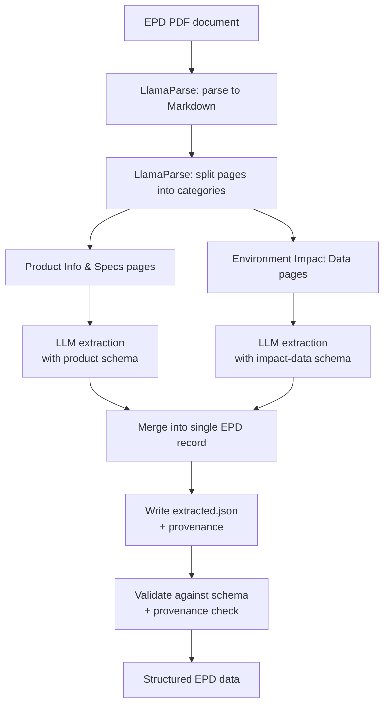

## **Overall strategy** - how did you approach extracting structured data from these documents?

The primary observation is to always check the PDF format. EPDs are dense, multi-page documents mixing free-text product descriptions with wide numeric tables of environmental impact data. Treating the whole document as one blob makes extraction harder and less accurate, so the strategy is to **split first, then extract**.

I chose LlamaParse as the parsing engine because it is purpose-built for document parsing, table reading, and page-level splitting. The overall flow is:

1. **Parse to Markdown** — upload the EPD PDF to LlamaParse and parse it into per-page Markdown. This gives us clean, structured text and tables per page instead of raw PDF layout.
2. **Split pages into two categories** — use LlamaParse's split feature to classify each page into one of two buckets:
   - **Product Info & Specs** — product name, manufacturer, declared unit, scope, product description, technical properties, biogenic carbon, etc.
   - **Environment Impact Data** — the LCA result tables (GWP, ODP, AP, EP, POCP, ADPE, ADPF, water use, etc.) and any module breakdowns (A1–A3, A4, A5, B1–B7, C1–C4, D).
3. **Run LLM extraction per category** — feed each category's pages to an LLM with a category-specific schema/prompt. Product Info uses a fixed schema (it is fairly standard across EPDs). Environment Impact Data uses a more flexible, table-oriented extraction that can adapt to the varying impact categories and modules each EPD reports.
4. **Merge & persist** — combine the two extracted JSON objects into a single EPD record, write to disk, and log provenance (page numbers) for downstream validation.

The key idea is **separation of concerns**: product metadata is relatively uniform and benefits from a strict schema, while environmental impact tables vary widely between EPDs (different modules, different impact categories, different units). By splitting the document first, each LLM extraction pass gets a focused, homogeneous context, which improves accuracy and lets us use the right schema strictness for each category. Provenance (page numbers from the split) is what makes the result auditable rather than a black-box guess.

## **Model and architecture** - what did you use, and why that over the alternatives?

The primary tool here is:

- LLM Model - Deppseek-V4-Pro by Ollama
- LlamaParse for Convert PDF to Markdwon and Split PDF Pages based on categories

The real reason why I use this tool is they are ease to use. Besides, it is also well known for accuracy.

The long context available in Deepseek V4 Pro also helps us to perform reasoning better during extraction

## **Accuracy** - how do you know the extracted data is correct? What could go wrong and how did you handle it?

One of the way to improve the data accuracy here is every number/figure in the environment impact data have the page number as the source.

Besides, we also get an excerpt of text to ensure we can trace it if required.

## **Research and process** - what did you try, what did you question, what did you find? We want to see the thinking, not just the conclusion.

I initially tried LlamaCloud Extract (single-pass extraction with one big JSON schema over the whole document) and ran into two problems:

1. **Missing data** — a lot of values were silently dropped during extraction, especially inside dense impact tables.
2. **Schema rigidity** — every EPD is different. The environmental impact data varies (different modules reported, different impact categories, different units). Forcing a single fixed schema across all EPDs either misses fields that a particular EPD reports, or includes fields that don't apply.

The split-then-extract strategy addresses both: by separating Product Info (uniform, strict schema) from Environment Impact Data (variable, flexible extraction), each LLM pass gets a cleaner, more homogeneous context, and we avoid trying to fit every EPD into one rigid schema.
