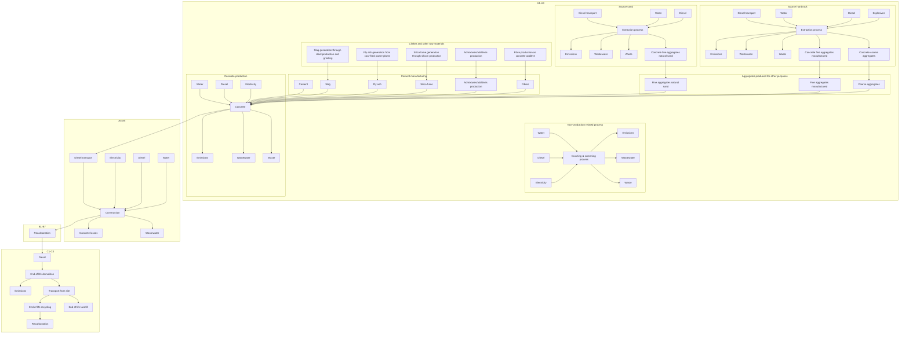
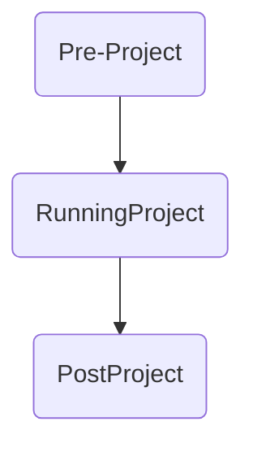

<PAGE>1<PAGE>
Hanson HEIDELBERGCEMENT Group logo

# P252080

**Hutchinson Builders - Aliro Warehouse**

**Queensland - Brisbane**

## Environmental Product Declaration

**In Accordance with**: Environdec c-PCR-003 ABC, ABC elements (EN 16757), ISO 14025 and EN15804:A2
**Programme Operator**: EPD International AB
**Regional Programme**: EPD Australasia

An EPD should provide current information and may be updated if conditions change. The stated validity is therefore subject to the continued registration and publication at www.environdec.com.

**EPD Registration Number**: EPD-IES-0014769:001
**Date of Publication**: 2024-08-26
**Valid Until**: 2029-08-26
**Date of Version**: 1.0 2024-08-26

Hanson decorative graphic

EPD AUSTRALASIA logo

ECO PLATFORM EPD VERIFIED logo

EPD THE INTERNATIONAL EPD SYSTEM logo

Photograph of a woman leaning against a concrete wall using a tablet

<PAGE>2<PAGE>
Hanson & Sustainability 3
Life Cycle & Processes 9
Product Environmental Performance 15
References 23

Photograph of two workers in high-visibility shirts planting saplings in a field under a clear blue sky

<PAGE>3<PAGE>
# Hanson & Sustainability

Hanson HEIDELBERGCEMENT Group logo

<PAGE>4<PAGE>
Hanson HEIDELBERGCEMENT Group logo

# Global Expertise
# Local Experience

Map of Australia showing Hanson locations across various states and territories

Using world-class technologies and service platforms, we supply a comprehensive range of high-quality concrete, aggregates and sand products. We also produce road base, asphalt, and sustainable and recycled materials.

We are backed by Heidelberg Materials - one of the world’s largest building materials companies focused on developing materials to build our future.

At the centre of our actions lies our responsibility for the environment.

**Our Mission:**

## Leading change with our customers to build a sustainable future.

<PAGE>5<PAGE>
# Our 5 Sustainability Pillars

| \*\*CO₂ Emissions\*\*                                                                                                              | \*\*Sustainable Products\*\*                                                                                                                                                         | \*\*Biodiversity\*\*                                                                                                                         | \*\*Water\*\*                                                                                                            | \*\*Corporate Social Responsibility\*\*                                                                                 |
| ---------------------------------------------------------------------------------------------------------------------------------- | ------------------------------------------------------------------------------------------------------------------------------------------------------------------------------------ | -------------------------------------------------------------------------------------------------------------------------------------------- | ------------------------------------------------------------------------------------------------------------------------ | ----------------------------------------------------------------------------------------------------------------------- |
| CO2 emissions icon                                                                                                                 | Recycling symbol icon                                                                                                                                                                | Bird on a branch icon                                                                                                                        | Water drop with circular arrows icon                                                                                     | Hands holding a seedling icon                                                                                           |
| To reduce our CO₂ emissions by improving our product performance and increasing operational efficiencies in our plants and fleets. | To improve our product sustainability by continuously increasing the use of alternative resources as substitutes for natural materials, and promoting our sustainable product range. | To preserve and enhance the natural environment where we operate and create habitat through implementation of biodiversity management plans. | To increase water efficiency by implementing water conservation plans aimed at improving water capture, storage and use. | To provide ongoing, meaningful community benefit by increasing diversity, social procurement, and community engagement. |

<PAGE>6<PAGE>
# Orange square icon Introducing the enrich - 30 / 40 / 50 Range

Our enrich-30/40/50 range has all the properties you expect of standard concrete, with a **guaranteed minimum of 30%, 40% or 50% carbon reduction.**

And we can provide **reporting based on the actual deliveries of the project.**

## Reporting options include:

* **Pre-Project (simulated)**

* **During Project**

* **Post-Project**

* **EPD (project-specific)**

# enrich-30
# enrich-40
# enrich-50

Photograph of a Hanson concrete truck in a city setting with skyscrapers in the background

<PAGE>7<PAGE>
# Orange square icon Introducing ECOTERA®

## The Challenge with Low Carbon Concrete

\* Historically substituting materials in concrete mix design to lower the carbon content effects performance

- Slow early strength development

- Effect on Workability and Setting Time

## The Solution

\* A concrete that has:

- **High Performance**

- **Low Carbon** – 30% to 50% reduction

ECOTERA logo

Photograph of construction workers pouring concrete onto a rebar grid

<PAGE>8<PAGE>
# Orange square icon ECOTERA® - High Performance Low Carbon Concrete

ECOTERA HIGH PERFORMANCE LOW CARBON CONCRETE logo

Photograph of modern buildings with lush green balconies against a blue sky

## A unique and innovative product:

* **Low Carbon Concrete** 30% to 50% reduction in CO2

* **Early age strength** equivalent to standard post-tensioned concrete

* **Lower shrinkage** than standard concrete – up to 50% improvement

* **Improved Flexural Strength** up to 50% improvement

Requires **no additional safety requirements** compared to standard concrete - pump, place and finish within standard WHS requirements.

The mix can be tailored to meet your specific requirements.

| Cloud icon                                             | Shield icon                                                                                | Shrinkage icon                                                               |
| ------------------------------------------------------ | ------------------------------------------------------------------------------------------ | ---------------------------------------------------------------------------- |
| \*\*Low Carbon Concrete\*\*                            | \*\*Early Age Strength\*\*                                                                 | \*\*Lower Shrinkage\*\*                                                      |
| Up to 50% CO2 reduction compared to standard concrete. | Early age strength equivalent to standard post-tensioned concrete for faster construction. | Lower shrinkage than standard concrete. Tested in accordance with AS1012.13, |

<PAGE>9<PAGE>
# Life Cycle & Processes

Construction site with workers, cranes, and concrete pump trucks

<PAGE>10<PAGE>
# Product EPD Process

**Declared Unit is 1m3 of Concrete**

* The process is used to produce an accurate estimation at all stages of the product life cycle from cradle to grave. Estimation at each stage is based on actual data which is a combination of both current and prior year average consumption per declared unit.

* This EPD Process is certified using GCCA international modelling of energy use and environmental impact to obtain a suitable estimation for products manufactured.

* Pre-defined cement and clinker data provided by the GCCA tool are used only where no better (supplier/source specific) information is available.

**Life Cycle Assessment Tool**

* For the purposes of creating this Environmental Product Declaration (EPD), the Global Cement & Concrete Association (GCCA) concrete EPD tool v. 4.2 (short: GCCA tool) has been employed.

* Assumptions & Limitations

* This is a project-specific EPD.

* All modelling assumptions adopted from the GCCA Tool.

**EPDs are created under either of 2 streams:**

* Generic Stream - The class of product modelled is used for a particular geographical region using averaged data across operations.

* Project-specific stream – Models the manufacture of specific products required for a particular project being delivered from specific plant(s) using weighted average data where relevant and possible. Reports created after the completion of a project offer the highest accuracy, including all mix variations for each delivery.

* Raw material (inbound) transport distances is the previous year's travel distance average weighted according to deliveries across operations.

* Concrete mixes are assumed to use an equal amount of site fuel and energy and responsible for an equal amount of waste flows.

* Agreed mixes are used to calculate the BOMs. Production is assumed to be equal across all plants included in the study.

* The project-specific travel distances from the main plant to the construction site were applied.

* Water usage in operations is averaged over the full geographic region of study.

**The main data categories include:**

* The average bill of materials (BOM) for the concrete mix selected in the range of concrete plants specified including their average raw material travel distance, or the calculated BOM based on actual delivered materials incl. travel distances (average or specific) for the producing plants.

* Grid purchased electricity mixes is based on the specific state's energy mix from OpenNEM. For this project, energy mix was sourced from coal and peat (65.8%), gas (7.3%), solar (20.7%), wind (4.0%), hydro (2.0%), and biomass (0.2%). The electricity emission (GWP-GHG) is 0.83 kg CO2e/kWh.

* The average fuel, water and energy consumption per declared unit between those plants;

* Travel for materials sources internationally included from shipping origin.

* Plant production waste based on a nationally calculated figure;

* Reference Service Life (RSL) is set to 50 years as per default. It's based on the lowest exposure class A1 & A2 (AS 3600:2018 "Concrete Structures") in relatively benign environments.

* Recarbonation of concrete is determined through pre-defined values within GCCA tool for the type of construction project, where known; and,

* End of life recycling is based upon industry data.

<PAGE>11<PAGE>
# Product EPD Process icon Product EPD Process

| Bill of Materials                    | Low Level \[%] | High Level \[%] |
| ------------------------------------ | -------------- | --------------- |
| Cement                               | 4              | 15              |
| Supplementary Cementitious Materials | 2              | 7               |
| Aggregates                           | 73             | 84              |
| Water                                | 6              | 8               |
| Admixtures                           | 0              | <1              |
| Reinforcements                       | 0              | <2              |

The materials (by mass%) contained in the project mixes are summarized in the table above.

## By-Products, Recycled Materials & Allocations

The following materials are the product of waste streams of other industrial processes:

### Fly ash

* A by-product of coal-fired power stations, fly ash is considered to carry no environmental impact for the purposes of this EPD.

### Ground Granulated Blast Furnace Slag (GGBFS)

* Blast furnace slag is a by-product of steel production that is dried and ground for use in concrete production. To duly allocate the environmental impacts, economic allocation has been employed.

### Silica fume

* As a by-product of silicon production, silica fume is considered to carry no environmental impact for the purposes of this EPD.

### Recycled concrete aggregate

* A component of the boarder category of construction and demolition waste, environmental impacts are allocated on the basis of reprocessing the material following delivery to the recycling facility.

### Manufactured Sand

* A by-product of processing coarse aggregate. This manufactured sand is a direct replacement for natural sand and prevents the need to extract natural resources.

### Packaging

* This concrete is not produced with any packaging, instead delivered directly to site immediately following production.

## Hazard information related to concrete placement

* GHS classifications
  - Skin Corrosion Category 1
  - Serious Eye Damage –Category 1
  - Skin Sensitisation Category 1
  - Specific Target Organ Toxicity (Repeated Exposure) Category 2

* Hazard Statement(s)
  - H302 –Harmful if swallowed
  - P280 –Wear protective gloves/clothing/eye protection.
  - H314 –Causes severe skin burns and eye damage
  - H317 –May cause an allergic skin reaction
  - H318 – Causes serious eye damage
  - H373 –May cause damage to lungs by inhalation (dust from dried product)

In Accordance with Environdec c-PCR-003 Concrete, concrete elements (EN 16757), ISO 14025 and EN15804:A2

<PAGE>12<PAGE>
# Product Lifecycle Stages icon Product Lifecycle Stages

| Product Stage Raw Material Supply A1 | Product Stage Transport A2 | Product Stage Manufacturing A3 | Construction Stage Transport A4 | Construction Stage Construction/installation process A5 | Use Stage Use B1 | Use Stage Maintenance incl. transport B2 | Use Stage Repair incl. transport B3 | Use Stage Replacement incl. transport B4 | Use Stage Refurbishment incl. transport B5 | Use Stage Operational Energy Use B6 | Use Stage Operational Water Use B7 | End of Life Stage De-construction & demolition C1 | End of Life Stage Transport C2 | End of Life Stage Re-use recycling C3 | End of Life Stage Final Disposal C4 | Benefits & loadsfor the nextproduct system Reuse, Recovery Recycling D1 |
| -------------------------------------------- | ---------------------------------- | -------------------------------------- | --------------------------------------- | --------------------------------------------------------------- | ------------------------ | ------------------------------------------------ | ------------------------------------------- | ------------------------------------------------ | -------------------------------------------------- | ------------------------------------------- | ------------------------------------------ | --------------------------------------------------------- | -------------------------------------- | --------------------------------------------- | ------------------------------------------- | ------------------------------------------------------------------------------- |
| \[yes]                                       | \[yes]                             | \[yes]                                 | \[yes]                                  | \[yes]                                                          | \[yes]                   | \[yes]                                           | \[yes]                                      | \[yes]                                           | \[yes]                                             | \[yes]                                      | \[yes]                                     | \[yes]                                                    | \[yes]                                 | \[yes]                                        | \[yes]                                      | \[yes]                                                                          |

* All stages of the product lifecycle have been considered for this EPD – cradle to grave. By its nature, there are some stages of the lifecycle that are not applicable to the concrete product.

* The scenario applied for the use stage assumes that under normal use, no maintenance repair or replacement of the product during its service life is required. As a result, the values are displayed as zero.

* Those stages that, due to practicality, cannot be assessed accurately draw on default values of the underlying GCCA tool.

* For Project-specific EPDs, allocation is determined by the supplying plants with estimates as to the likely volume to be delivered from each. Where existing and sufficient data exists, historical data will be used to make this determination.

<PAGE>13<PAGE>
# Product Lifecycle Stages icon Product Lifecycle Stages

**KEY:**
<mark>A1-A3</mark>
<mark>A4-A5</mark>
<mark>B1-B7</mark>
<mark>C1-C4</mark>
System

* The lifecycle model and system boundary is the same for both Generic and Project-specific concrete EPDs, as detailed in the graphic.

* All stages of the lifecycle, from quarry to recycling are covered by the EPD.

## ▪ Cut-off rules

The cut-off threshold for the LCA study was flows contributing less than 1% for any individual input included in the LCA. No flows were deliberately excluded due to this threshold, however particularly minor impacts (e. g. packaging of chemical admixtures) were not considered. Cut off will occur only when data, or reliable estimates, are not practical to source. The contribution of capital goods (production equipment and infrastructure) and personnel are non-attributable and excluded for the system boundary.

<PAGE>14<PAGE>
# Product Data Sources icon Product Data Sources

| LCA Stage                       | Item                                           | Source                                                                                                                                                                                                                                                                                                                  | Timing                                                                                                                                          | Data Quality      |
| ------------------------------- | ---------------------------------------------- | ----------------------------------------------------------------------------------------------------------------------------------------------------------------------------------------------------------------------------------------------------------------------------------------------------------------------- | ----------------------------------------------------------------------------------------------------------------------------------------------- | ----------------- |
| Product Description             | Product description and density                | ERP report Bill of Materials and material specific data                                                                                                                                                                                                                                                                 | Upon EPD creation                                                                                                                               | High, Primary     |
| A1-3 Materials                  | Raw Materials                                  | ERP report BOM and Mix design compilation used in conjunction with material template Note. Upstream process for raw materials utilise data from ecoinvent 3.5. Cement and Clinker details to be provided by cement producer or, where not available, GCCA Tool default data used in conjunction with ecoinvent 3.5. | Upon EPD creation                                                                                                                               | High, Secondary   |
| A1-3 Materials                  | Inbound travel (raw materials)                 | ERP report 2. Inbound Travel drawing from actual deliveries from sources to operations. Where delivery data not available, travel calculated based on Google Maps. Train travel (only for operations around Melbourne) calculated by actual Google Maps distance.                                               | Full prior year data, average per delivery Actual travel distances between source and operation.                                            | High, Primary     |
| A1-3 Materials                  | Allocation Factor (for secondary co products): | Slag: AusLCI Fly Ash & Silica fume: no allocation as they are industrial by-products.                                                                                                                                                                                                                               | Upon EPD creation                                                                                                                               | Secondary, Medium |
| A1-3 Manufacturing              | Plant Energy and Fuel Consumption              | ERP Report 3. Concrete Energy Use, drawing on actual invoiced usage.                                                                                                                                                                                                                                                    | Full prior year data, average per metre                                                                                                         | Primary, High     |
| A1-3 Manufacturing              | Electricity Energy Sources                     | Sourced from OpenNEM https\://opennem.org.au; Australian Energy Market Operator. Excludes imports.                                                                                                                                                                                                                      | Full year prior data, state-based, percentages                                                                                                  | Secondary, High   |
| A1-3 Waste Management           | Waste and waste water                          | Waste water volume set to 9L per 1 m³                                                                                                                                                                                                                                                                                   | Static                                                                                                                                          | Secondary, Medium |
| A4-5 Construction               | Outbound Travel                                | For generic EPDs: ERP report 5. Outbound travel drawing from actual deliveries from operations to customer sites. Where data not available, travel calculated based on Google Maps. For project-specific EPDs: The project-specific travel distances from the main plant to the construction site was applied.      | Generic EPD: Full prior year data, average per delivery. Project-specific EPD: Actual travel distances between plant and construction site. | Primary, High     |
| B. Use                          | Re-carbonation                                 | Default GCCA Tool settings                                                                                                                                                                                                                                                                                              | NA                                                                                                                                              | Proxy, Medium     |
| C. End of Life Demolition       | Demolition                                     | Default GCCA Tool settings                                                                                                                                                                                                                                                                                              | NA                                                                                                                                              | Proxy, Medium     |
| C. End of Life Transport        | Transport                                      | Default GCCA Tool settings                                                                                                                                                                                                                                                                                              | NA                                                                                                                                              | Proxy, Medium     |
| C. End of Life Waste Processing | Recycling Rate at EOL                          | Masonry materials recycling rate obtained from annual National Waste Report published (e. g. for National Waste Report 2022, page 41, figure 29) National Waste Reports                                                                                                                                             | Prior year National Waste Report if available. If not, then latest available                                                                    | Proxy, Medium     |
| C. End of Life Disposal         | Disposal Rate at EOL                           | Disposal rate inverse of masonry materials recycling rate obtained from annual National Waste Report published National Waste Reports                                                                                                                                                                               | Prior year National Waste Report if available. If not, then latest available                                                                    | Proxy, Medium     |
| D Benefits and Loads            |                                                | Default GCCA Tool settings                                                                                                                                                                                                                                                                                              | NA                                                                                                                                              | NA                |
| General                         | General                                        | EcoInvent database used by the GCCA tool Note: This covers environmental information for all raw materials and energy sources. Cement, where data is available, employs specific raw material and energy data for the product manufacture and for each component draws on Eco Invent Data.                          | NA                                                                                                                                              | Secondary, High   |

<PAGE>15<PAGE>
# Product Environmental Performance

Construction workers leveling wet concrete on a high-rise building site with city skyscrapers in the background.

<PAGE>16<PAGE>
# Product Environmental Performance

| **Comment** | All information about goal and scope necessary for results interpretation are present in the latest version of the “LCA Model” report, available in GCCA’s Industry EPD Tool.                                                                                                                                                                                                                                                          |
| ----------- | -------------------------------------------------------------------------------------------------------------------------------------------------------------------------------------------------------------------------------------------------------------------------------------------------------------------------------------------------------------------------------------------------------------------------------------- |
|             | The removals and emissions associated with biogenic carbon content of i) the product and ii) the packaging are not significant or even not relevant in the sector. The only limitation is the uptake of CO₂ in A1-A3 (e.g. biobased insulation materials in precast elements or biobased packaging materials) and reemission in A5 (packaging end-of-life) or C3-C4 (product end-of-life). This does not affect the GWP-tot indicator. |
|             | The tool does not calculate the ‘Radioactive waste disposed’ indicator, it is considered not to be significant for the sector.                                                                                                                                                                                                                                                                                                         |

| **Core Environmental Impact Indicators** | **GWP-GHG** (Global Warming Potential, GHG) • **GWP-tot** (Global Warming Potential total) • **GWP-fos** (Global Warming Potential fossil fuels) • **GWP-bio** (Global Warming Potential biogenic) • **GWP-luc** (Global Warming Potential land use and land use change) • **ODP** (Depletion potential of the stratospheric ozone layer) • **AP** (Acidification potential, Accumulated Exceedance) • **EP-fw** (Eutrophication potential, freshwater) • **EP-mar** (Eutrophication potential, fraction of nutrients reaching marine end compartment) • **EP-ter** (Eutrophication potential, Accumulated Exceedance) • **POCP** (Formation potential of tropospheric ozone) • **ADPE** (Abiotic depletion potential for non- fossil resources) • **ADPF** (Abiotic depletion for fossil resources potential) • **WDP** (Water (user) deprivation potential, deprivation-weighted water consumption) |
| ---------------------------------------- | ------------------------------------------------------------------------------------------------------------------------------------------------------------------------------------------------------------------------------------------------------------------------------------------------------------------------------------------------------------------------------------------------------------------------------------------------------------------------------------------------------------------------------------------------------------------------------------------------------------------------------------------------------------------------------------------------------------------------------------------------------------------------------------------------------------------------------------------------------------------------------------------------------------- |

<PAGE>17<PAGE>
# Product Environmental Performance

| **Additional Environmental Impact Indicators** | **PM** (Potential incidence of disease due to PM emissions) • **IRP** (Potential Human exposure efficiency relative to U235) • **ETP** (Potential Comparative Toxic Unit for ecosystems) • **HTPC** (Potential Comparative Toxic Unit for humans - cancer) • **HTPNC** (Potential Comparative Toxic Unit for humans - non-cancer) • **SQP** (Potential soil quality index)                                                                                                                                                                                                                                                                                                                                   |
| ---------------------------------------------- | ------------------------------------------------------------------------------------------------------------------------------------------------------------------------------------------------------------------------------------------------------------------------------------------------------------------------------------------------------------------------------------------------------------------------------------------------------------------------------------------------------------------------------------------------------------------------------------------------------------------------------------------------------------------------------------------------------------ |
| **Parameters Describing Resource Use**         | **PERE** (Use of renewable primary energy excluding renewable primary energy resources used as raw materials) • **PERM** (Use of renewable primary energy resources used as raw materials) • **PERT** (Total use of renewable primary energy resources) • **PENRE** (Use of non renewable primary energy excluding non-renewable primary energy resources used as raw materials) • **PENRM** (Use of non-renewable primary energy resources used as raw materials) • **PENRT** (Total use of non-renewable primary energy resources) • **SM** (Use of secondary materials) • **RSF** (Use of renewable secondary fuels) • **NRSF** (Use of non-renewable secondary fuels) • **NFW** (Net use of fresh water) |
| **Waste Categories**                           | **HWD** (Hazardous waste disposed) • **NHWD** (Non-hazardous waste disposed) • **RWD** (Radioactive waste disposed)                                                                                                                                                                                                                                                                                                                                                                                                                                                                                                                                                                                          |
| **Output Flows**                               | **CRU** (Components for re-use) • **MFR** (Materials for recycling) • **MER** (Materials for energy recovery) • **EE** (Exported energy)                                                                                                                                                                                                                                                                                                                                                                                                                                                                                                                                                                     |
| **Extra Indicators**                           | **CC** (Emissions from calcination and removals from carbonation) • **CWRS** (Emissions from combustion of waste from renewable sources used in production processes) • **CWNRS** (Emissions from combustion of waste from non-renewable sources used in production processes) • **GWP-prod** (Removals and emissions associated with biogenic carbon content of the bio-based product) • **GWP-pack** (Removals and emissions associated with biogenic carbon content of the bio-based packaging)                                                                                                                                                                                                           |

<PAGE>18<PAGE>
# Product Environmental Performance

* The EPD values presented are indicative of local material performance at the time of publishing and are subject to change based on material availability and seasonal factors.

| Product Identification | EPD Registration Number | Compressive strength \[MPa]     | GP Content¹ \[kg/m3] | CO₂ Reference² \[kg/m3] | CO₂ Reduction³ \[%] | GWP-tot⁴ \[kg CO₂ eq./m³] | Application |
| ---------------------- | ----------------------- | ------------------------------- | -------------------- | ----------------------- | ------------------- | ------------------------- | ----------- |
| BN402BO31              | EPD-IES-0014761:001     | 40                              | 337                  | 467                     | 19%                 | 378                       | Slabs       |
| BN402BS32              | EPD-IES-0014762:001     | 40                              | 342                  | 467                     | 18%                 | 382                       | Slabs       |
| BN402DD36              | EPD-IES-0014763:001     | 40                              | 340                  | 467                     | 19%                 | 380                       | Slabs       |
| GE322SM30              | EPD-IES-0014764:001     | 32                              | 126                  | 390                     | 46%                 | 213                       | Footings    |
| GE322XI41              | EPD-IES-0014765:001     | 32                              | 129                  | 390                     | 37%                 | 246                       | Footings    |
| GE402AA22              | EPD-IES-0014766:001     | 40                              | 344                  | 467                     | 31%                 | 321                       | Slabs       |
| KM0G1AA22              | EPD-IES-0014767:001     | No guaranteed breaking strength | 160                  | N/A                     | N/A                 | 179                       | Kerb        |
| P202080                | EPD-IES-0014768:001     | 20                              | 97                   | 311                     | 61%                 | 124                       | General use |
| P252080                | EPD-IES-0014769:001     | 25                              | 98                   | 340                     | 63%                 | 127                       | General use |
| P3220100               | EPD-IES-0014770:001     | 32                              | 116                  | 390                     | 64%                 | 143                       | General use |
| P322080                | EPD-IES-0014771:001     | 32                              | 113                  | 390                     | 64%                 | 140                       | General use |
| P402080                | EPD-IES-0014772:001     | 40                              | 139                  | 467                     | 64%                 | 168                       | General use |
| SAC322100              | EPD-IES-0014773:001     | 32                              | 199                  | 390                     | 49%                 | 198                       | Slabs       |
| SAC32280               | EPD-IES-0014774:001     | 32                              | 193                  | 390                     | 51%                 | 193                       | Slabs       |
| SAP252100              | EPD-IES-0014775:001     | 25                              | 178                  | 340                     | 47%                 | 180                       | Slabs       |
| SAP25280               | EPD-IES-0014776:001     | 25                              | 172                  | 340                     | 49%                 | 175                       | Slabs       |
| SAP322100              | EPD-IES-0014777:001     | 32                              | 202                  | 390                     | 49%                 | 201                       | Slabs       |
| SAP32280               | EPD-IES-0014778:001     | 32                              | 196                  | 390                     | 50%                 | 196                       | Slabs       |
| SAP40280               | EPD-IES-0014779:001     | 40                              | 238                  | 467                     | 50%                 | 235                       | Slabs       |

1GP = General Portland Cement, does not include SCMs.

2See Appendix for detailed explanation.

3Calculation: {1 - (GWP-tot - CO2 Reference)} / (CO2 reference).

4GWP-tot: Covers A1-A3 only. More detailed information is provided in the following mix-specific tables.

<PAGE>19<PAGE>
# Product Environmental Performance icon Product Environmental Performance

* The EPD values presented are indicative of local material performance at the time of publishing and are subject to change based on material availability and seasonal factors.

GLOBAL WARMING POTENTIAL1

| COMPRESSIVE STRENGTH \[MPA] | CO2 Baseline (simulated) | enrich-30 | enrich-40 | enrich-50 | Project Mixes           |
| --------------------------- | ------------------------ | --------- | --------- | --------- | ----------------------- |
| 0                           |                          |           |           |           |                         |
| 10                          |                          |           |           |           |                         |
| 20                          | 310                      | 220       | 190       | 160       | 125, 160                |
| 25                          | 350                      | 250       | 215       | 180       | 125, 180                |
| 32                          | 420                      | 300       | 260       | 210       | 140, 195, 205, 215, 245 |
| 40                          | 510                      | 380       | 320       | 250       | 170, 320, 380           |
| 50                          | 580                      | 410       | 345       | 290       |                         |
| 60                          | 585                      | 415       | 345       | 295       |                         |
| 70                          | 625                      | 440       | 370       | 315       |                         |
| 80                          | 655                      | 460       | 390       | 330       |                         |
| 90                          | 675                      | 475       | 405       | 340       |                         |
| 100                         | 690                      | 485       | 410       | 345       |                         |
| 110                         |                          |           |           |           |                         |

1GWP-tot: Covers A1-A3 only. More detailed information is provided in the following mix-specific tables.

2CO2 Baseline (simulated) is based on the Green Star Mat–4 Concrete Credit User Guide (2012). Detailed explanation is provided in the appendix.

3Plotting style: Scatter plot of values with smooth lines & markers.

<PAGE>20<PAGE>
# Product Environmental Performance icon Product Environmental Performance

| Product Identification  | P252080                                                                        |
| ----------------------- | ------------------------------------------------------------------------------ |
| EPD Registration Number | EPD-IES-0014769:001                                                            |
| Production Site(S)      | Brisbane                                                                       |
| Compressive Strength    | 25                                                                             |
| Density                 | 2480 kg/m³                                                                     |
| Reference Service Life  | 50 Years                                                                       |
| Recycling Rate At Eol   | 78%                                                                            |
| Declared Unit           | 1 m3                                                                           |
| Scope                   | A1-A3 + A4-A5 + B1-B7 + C1-C4 + D, cradle-to-grave                             |
| Methodology             | GCCA’s Industry EPD Tool for Cement and Concrete (V4.2), International version |
| Reference Year          | 2023                                                                           |

<PAGE>21<PAGE>
# Product Environmental Performance icon Product Environmental Performance

**EPD Registration Number**: EPD-IES-0014769:001

## Core Environmental Impact Indicators

|         |                         | A1-A3    | A4       | A5        | B1        | B2       | B3       | B4       | B5       | B6       | B7       | C1       | C2       | C3       | C4       | D        |
| ------- | ----------------------- | -------- | -------- | --------- | --------- | -------- | -------- | -------- | -------- | -------- | -------- | -------- | -------- | -------- | -------- | -------- |
| GWP-GHG | kg CO₂ eq.              | 1.27E+02 | 2.45E+00 | 9.95E+00  | -2.65E+00 | 0.00E+00 | 0.00E+00 | 0.00E+00 | 0.00E+00 | 0.00E+00 | 0.00E+00 | 8.99E+00 | 8.85E+00 | 5.24E+00 | 2.79E+00 | 6.14E+00 |
| GWP-tot | kg CO₂ eq.              | 1.27E+02 | 2.45E+00 | 9.95E+00  | -2.65E+00 | 0.00E+00 | 0.00E+00 | 0.00E+00 | 0.00E+00 | 0.00E+00 | 0.00E+00 | 8.99E+00 | 8.85E+00 | 5.24E+00 | 2.79E+00 | 6.14E+00 |
| GWP-fos | kg CO₂ eq.              | 1.26E+02 | 2.45E+00 | 9.94E+00  | -2.65E+00 | 0.00E+00 | 0.00E+00 | 0.00E+00 | 0.00E+00 | 0.00E+00 | 0.00E+00 | 8.99E+00 | 8.84E+00 | 5.21E+00 | 2.79E+00 | 6.11E+00 |
| GWP-bio | kg CO₂ eq.              | 4.62E-02 | 9.59E-04 | 4.35E-03  | 0.00E+00  | 0.00E+00 | 0.00E+00 | 0.00E+00 | 0.00E+00 | 0.00E+00 | 0.00E+00 | 1.60E-03 | 6.32E-03 | 1.89E-02 | 1.84E-03 | 1.89E-02 |
| GWP-luc | kg CO₂ eq.              | 2.92E-02 | 8.29E-04 | 3.31E-03  | 0.00E+00  | 0.00E+00 | 0.00E+00 | 0.00E+00 | 0.00E+00 | 0.00E+00 | 0.00E+00 | 1.13E-03 | 5.14E-03 | 1.44E-02 | 1.50E-03 | 1.44E-02 |
| ODP     | kg CFC 11 eq.           | 6.34E-06 | 4.67E-07 | 1.30E-06  | 0.00E+00  | 0.00E+00 | 0.00E+00 | 0.00E+00 | 0.00E+00 | 0.00E+00 | 0.00E+00 | 1.62E-06 | 1.49E-06 | 3.64E-07 | 9.09E-07 | 3.64E-07 |
| AP      | mol H+ eq.              | 6.10E-01 | 1.27E-02 | 8.94E-02  | 0.00E+00  | 0.00E+00 | 0.00E+00 | 0.00E+00 | 0.00E+00 | 0.00E+00 | 0.00E+00 | 9.42E-02 | 5.34E-02 | 3.85E-02 | 2.67E-02 | 3.85E-02 |
| EP-fw   | kg P eq.                | 2.62E-02 | 1.83E-04 | 2.01E-03  | 0.00E+00  | 0.00E+00 | 0.00E+00 | 0.00E+00 | 0.00E+00 | 0.00E+00 | 0.00E+00 | 4.02E-04 | 1.18E-03 | 3.00E-03 | 3.27E-04 | 3.00E-03 |
| EP-mar  | kg N eq.                | 1.96E-03 | 1.59E-05 | 6.85E-04  | 0.00E+00  | 0.00E+00 | 0.00E+00 | 0.00E+00 | 0.00E+00 | 0.00E+00 | 0.00E+00 | 3.34E-05 | 8.74E-05 | 2.08E-04 | 3.09E-05 | 2.08E-04 |
| EP-ter  | mol N eq.               | 1.40E+00 | 4.54E-02 | 3.30E-01  | 0.00E+00  | 0.00E+00 | 0.00E+00 | 0.00E+00 | 0.00E+00 | 0.00E+00 | 0.00E+00 | 4.44E-01 | 1.88E-01 | 7.19E-02 | 9.58E-02 | 7.19E-02 |
| POCP    | kg NMVOC eq.            | 3.87E-01 | 1.37E-02 | 9.11E-02  | 0.00E+00  | 0.00E+00 | 0.00E+00 | 0.00E+00 | 0.00E+00 | 0.00E+00 | 0.00E+00 | 1.22E-01 | 5.50E-02 | 2.03E-02 | 2.81E-02 | 2.03E-02 |
| ADPE    | kg Sb eq.               | 1.78E-04 | 4.57E-06 | 7.27E-06  | 0.00E+00  | 0.00E+00 | 0.00E+00 | 0.00E+00 | 0.00E+00 | 0.00E+00 | 0.00E+00 | 2.66E-06 | 1.56E-05 | 4.48E-06 | 3.04E-06 | 4.48E-06 |
| ADPF    | MJ, net calorific value | 9.99E+02 | 3.86E+01 | 1.28E+02  | 0.00E+00  | 0.00E+00 | 0.00E+00 | 0.00E+00 | 0.00E+00 | 0.00E+00 | 0.00E+00 | 1.30E+02 | 1.32E+02 | 7.48E+01 | 7.77E+01 | 7.48E+01 |
| WDP     | m³ world eq. deprived   | 7.59E+01 | 2.84E-01 | -1.38E+00 | 0.00E+00  | 0.00E+00 | 0.00E+00 | 0.00E+00 | 0.00E+00 | 0.00E+00 | 0.00E+00 | 7.67E-01 | 1.14E+00 | 1.05E+00 | 3.75E+00 | 1.05E+00 |

## Parameters Describing Resource Use

|       |                         | A1-A3    | A4       | A5       | B1       | B2       | B3       | B4       | B5       | B6       | B7       | C1       | C2       | C3       | C4       | D        |
| ----- | ----------------------- | -------- | -------- | -------- | -------- | -------- | -------- | -------- | -------- | -------- | -------- | -------- | -------- | -------- | -------- | -------- |
| PERE  | MJ, net calorific value | 4.49E+01 | 1.12E+00 | 5.48E+00 | 0.00E+00 | 0.00E+00 | 0.00E+00 | 0.00E+00 | 0.00E+00 | 0.00E+00 | 0.00E+00 | 7.59E-01 | 4.82E+00 | 8.18E+00 | 2.02E+00 | 8.18E+00 |
| PERM  | MJ, net calorific value | 0.00E+00 | 0.00E+00 | 0.00E+00 | 0.00E+00 | 0.00E+00 | 0.00E+00 | 0.00E+00 | 0.00E+00 | 0.00E+00 | 0.00E+00 | 0.00E+00 | 0.00E+00 | 0.00E+00 | 0.00E+00 | 0.00E+00 |
| PERT  | MJ, net calorific value | 4.49E+01 | 1.12E+00 | 5.48E+00 | 0.00E+00 | 0.00E+00 | 0.00E+00 | 0.00E+00 | 0.00E+00 | 0.00E+00 | 0.00E+00 | 7.59E-01 | 4.82E+00 | 8.18E+00 | 2.02E+00 | 8.18E+00 |
| PENRE | MJ, net calorific value | 1.01E+03 | 3.86E+01 | 1.28E+02 | 0.00E+00 | 0.00E+00 | 0.00E+00 | 0.00E+00 | 0.00E+00 | 0.00E+00 | 0.00E+00 | 1.30E+02 | 1.32E+02 | 7.48E+01 | 7.77E+01 | 7.48E+01 |
| PENRM | MJ, net calorific value | 0.00E+00 | 0.00E+00 | 0.00E+00 | 0.00E+00 | 0.00E+00 | 0.00E+00 | 0.00E+00 | 0.00E+00 | 0.00E+00 | 0.00E+00 | 0.00E+00 | 0.00E+00 | 0.00E+00 | 0.00E+00 | 0.00E+00 |
| PENRT | MJ, net calorific value | 1.01E+03 | 3.86E+01 | 1.28E+02 | 0.00E+00 | 0.00E+00 | 0.00E+00 | 0.00E+00 | 0.00E+00 | 0.00E+00 | 0.00E+00 | 1.30E+02 | 1.32E+02 | 7.48E+01 | 7.77E+01 | 7.48E+01 |
| SM    | kg                      | 1.37E+02 | 0.00E+00 | 1.37E+00 | 0.00E+00 | 0.00E+00 | 0.00E+00 | 0.00E+00 | 0.00E+00 | 0.00E+00 | 0.00E+00 | 0.00E+00 | 0.00E+00 | 0.00E+00 | 0.00E+00 | 0.00E+00 |
| RSF   | MJ, net calorific value | 1.92E+00 | 0.00E+00 | 1.92E-02 | 0.00E+00 | 0.00E+00 | 0.00E+00 | 0.00E+00 | 0.00E+00 | 0.00E+00 | 0.00E+00 | 0.00E+00 | 0.00E+00 | 0.00E+00 | 0.00E+00 | 0.00E+00 |
| NRSF  | MJ, net calorific value | 3.19E+01 | 0.00E+00 | 3.19E-01 | 0.00E+00 | 0.00E+00 | 0.00E+00 | 0.00E+00 | 0.00E+00 | 0.00E+00 | 0.00E+00 | 0.00E+00 | 0.00E+00 | 0.00E+00 | 0.00E+00 | 0.00E+00 |
| NFW   | m³                      | 2.19E+00 | 8.51E-03 | 1.18E-01 | 0.00E+00 | 0.00E+00 | 0.00E+00 | 0.00E+00 | 0.00E+00 | 0.00E+00 | 0.00E+00 | 1.99E-02 | 3.53E-02 | 4.25E-02 | 8.74E-02 | 4.25E-02 |

<PAGE>22<PAGE>
# Product Environmental Performance icon Product Environmental Performance

**EPD Registration Number**: EPD-IES-0014769:001

## Additional Environmental Impact Indicators

|       |                   | A1-A3    | A4       | A5       | B1       | B2       | B3       | B4       | B5       | B6       | B7       | C1       | C2       | C3       | C4       | D        |
| ----- | ----------------- | -------- | -------- | -------- | -------- | -------- | -------- | -------- | -------- | -------- | -------- | -------- | -------- | -------- | -------- | -------- |
| PM    | Disease incidence | 5.40E-06 | 2.26E-07 | 1.67E-06 | 0.00E+00 | 0.00E+00 | 0.00E+00 | 0.00E+00 | 0.00E+00 | 0.00E+00 | 0.00E+00 | 2.45E-06 | 8.25E-07 | 3.44E-07 | 4.98E-07 | 3.44E-07 |
| IRP   | kBq U235 eq.      | 3.68E+02 | 2.03E-01 | 4.23E+00 | 0.00E+00 | 0.00E+00 | 0.00E+00 | 0.00E+00 | 0.00E+00 | 0.00E+00 | 0.00E+00 | 6.08E-01 | 7.56E-01 | 8.03E-01 | 3.59E-01 | 8.03E-01 |
| ETP   | CTUe              | 3.66E+02 | 8.15E+00 | 7.39E+00 | 0.00E+00 | 0.00E+00 | 0.00E+00 | 0.00E+00 | 0.00E+00 | 0.00E+00 | 0.00E+00 | 1.76E+00 | 2.31E+01 | 1.57E+00 | 1.47E+00 | 1.57E+00 |
| HTPC  | CTUh              | 6.96E-07 | 1.57E-08 | 1.89E-07 | 0.00E+00 | 0.00E+00 | 0.00E+00 | 0.00E+00 | 0.00E+00 | 0.00E+00 | 0.00E+00 | 6.36E-08 | 1.00E-07 | 6.22E-08 | 2.44E-08 | 6.22E-08 |
| HTPNC | CTUh              | 9.87E-06 | 4.39E-07 | 8.87E-07 | 0.00E+00 | 0.00E+00 | 0.00E+00 | 0.00E+00 | 0.00E+00 | 0.00E+00 | 0.00E+00 | 2.46E-07 | 1.39E-06 | 2.87E-07 | 1.56E-07 | 2.87E-07 |
| SQP   | dimensionless     | 8.28E+02 | 6.85E+01 | 3.77E+01 | 0.00E+00 | 0.00E+00 | 0.00E+00 | 0.00E+00 | 0.00E+00 | 0.00E+00 | 0.00E+00 | 7.71E+00 | 2.15E+02 | 6.11E+01 | 1.45E+02 | 6.11E+01 |

## Other Environmental Information Describing Waste Categories

|      |    | A1-A3    | A4       | A5       | B1       | B2       | B3       | B4       | B5       | B6       | B7       | C1       | C2       | C3       | C4       | D        |
| ---- | -- | -------- | -------- | -------- | -------- | -------- | -------- | -------- | -------- | -------- | -------- | -------- | -------- | -------- | -------- | -------- |
| HWD  | kg | 0.00E+00 | 0.00E+00 | 0.00E+00 | 0.00E+00 | 0.00E+00 | 0.00E+00 | 0.00E+00 | 0.00E+00 | 0.00E+00 | 0.00E+00 | 0.00E+00 | 0.00E+00 | 0.00E+00 | 0.00E+00 | 0.00E+00 |
| NHWD | kg | 4.08E-02 | 0.00E+00 | 6.78E+00 | 0.00E+00 | 0.00E+00 | 0.00E+00 | 0.00E+00 | 0.00E+00 | 0.00E+00 | 0.00E+00 | 0.00E+00 | 0.00E+00 | 0.00E+00 | 6.77E+02 | 0.00E+00 |
| RWD  | kg | 0.00E+00 | 0.00E+00 | 0.00E+00 | 0.00E+00 | 0.00E+00 | 0.00E+00 | 0.00E+00 | 0.00E+00 | 0.00E+00 | 0.00E+00 | 0.00E+00 | 0.00E+00 | 0.00E+00 | 0.00E+00 | 0.00E+00 |

## Environmental Information Describing Output Flows

|     |    | A1-A3    | A4       | A5       | B1       | B2       | B3       | B4       | B5       | B6       | B7       | C1       | C2       | C3       | C4       | D        |
| --- | -- | -------- | -------- | -------- | -------- | -------- | -------- | -------- | -------- | -------- | -------- | -------- | -------- | -------- | -------- | -------- |
| CRU | kg | 0.00E+00 | 0.00E+00 | 0.00E+00 | 0.00E+00 | 0.00E+00 | 0.00E+00 | 0.00E+00 | 0.00E+00 | 0.00E+00 | 0.00E+00 | 0.00E+00 | 0.00E+00 | 0.00E+00 | 0.00E+00 | 0.00E+00 |
| MFR | kg | 0.00E+00 | 0.00E+00 | 1.80E+01 | 0.00E+00 | 0.00E+00 | 0.00E+00 | 0.00E+00 | 0.00E+00 | 0.00E+00 | 0.00E+00 | 0.00E+00 | 0.00E+00 | 1.80E+03 | 0.00E+00 | 1.80E+03 |
| MER | kg | 0.00E+00 | 0.00E+00 | 0.00E+00 | 0.00E+00 | 0.00E+00 | 0.00E+00 | 0.00E+00 | 0.00E+00 | 0.00E+00 | 0.00E+00 | 0.00E+00 | 0.00E+00 | 0.00E+00 | 0.00E+00 | 0.00E+00 |
| EE  | kg | 0.00E+00 | 0.00E+00 | 0.00E+00 | 0.00E+00 | 0.00E+00 | 0.00E+00 | 0.00E+00 | 0.00E+00 | 0.00E+00 | 0.00E+00 | 0.00E+00 | 0.00E+00 | 0.00E+00 | 0.00E+00 | 0.00E+00 |

## Extra Indicators

|          |            | A1-A3    | A4       | A5       | B1        | B2       | B3       | B4       | B5       | B6       | B7       | C1       | C2       | C3        | C4       | D        |
| -------- | ---------- | -------- | -------- | -------- | --------- | -------- | -------- | -------- | -------- | -------- | -------- | -------- | -------- | --------- | -------- | -------- |
| CC       | kg CO₂ eq. | 4.63E+01 | 0.00E+00 | 4.04E-01 | -2.65E+00 | 0.00E+00 | 0.00E+00 | 0.00E+00 | 0.00E+00 | 0.00E+00 | 0.00E+00 | 0.00E+00 | 0.00E+00 | -8.96E-01 | 0.00E+00 | 0.00E+00 |
| CWRS     | kg CO₂ eq. | 2.40E-03 | 0.00E+00 | 2.40E-05 | 0.00E+00  | 0.00E+00 | 0.00E+00 | 0.00E+00 | 0.00E+00 | 0.00E+00 | 0.00E+00 | 0.00E+00 | 0.00E+00 | 0.00E+00  | 0.00E+00 | 0.00E+00 |
| CWNRS    | kg CO₂ eq. | 2.70E+00 | 0.00E+00 | 2.70E-02 | 0.00E+00  | 0.00E+00 | 0.00E+00 | 0.00E+00 | 0.00E+00 | 0.00E+00 | 0.00E+00 | 0.00E+00 | 0.00E+00 | 0.00E+00  | 0.00E+00 | 0.00E+00 |
| GWP-prod | kg CO₂     | 0.00E+00 | 0.00E+00 | 0.00E+00 | 0.00E+00  | 0.00E+00 | 0.00E+00 | 0.00E+00 | 0.00E+00 | 0.00E+00 | 0.00E+00 | 0.00E+00 | 0.00E+00 | 0.00E+00  | 0.00E+00 | 0.00E+00 |
| GWP-pack | kg CO₂     | 0.00E+00 | 0.00E+00 | 0.00E+00 | 0.00E+00  | 0.00E+00 | 0.00E+00 | 0.00E+00 | 0.00E+00 | 0.00E+00 | 0.00E+00 | 0.00E+00 | 0.00E+00 | 0.00E+00  | 0.00E+00 | 0.00E+00 |

<PAGE>23<PAGE>
# References

Hanson HEIDELBERGCEMENT Group logo

<PAGE>24<PAGE>
# Program Information icon Program Information

| EPD Owner                                                                     | Hanson Construction Materials Pty Ltd L14, 35 Clarence St, Sydney NSW 2000 Phone: 1300 136 464 Online: hanson.com.au                                                                                                                                                   | Hanson HEIDELBERGCEMENT Group logo                                                   |
| ----------------------------------------------------------------------------- | ---------------------------------------------------------------------------------------------------------------------------------------------------------------------------------------------------------------------------------------------------------------------------------- | ------------------------------------------------------------------------------------ |
| Programme Operator                                                            | EPD International AB Box 210 60 SE-100 31 Stockholm Sweden Online: www\.environdec.com Email: info\@environdec.com                                                                                                                                                         | THE INTERNATIONAL EPD SYSTEM logo                                                    |
| Regional Programme                                                            | EPD Australasia, 315a Hardy St, Nelson 7010 New Zealand Online: epd-australasia.com Email: info\@epd-australasia.com                                                                                                                                                       | AUSTRALASIA EPD logo                                                                 |
| Process EPD Certified By                                                      | Katherine McFeaters  Epsten Group, Inc. 101 Marietta St. NW, Suite 2600, Atlanta, Georgia 30303, USA www\.epstengroup.com Accredited by: A2LA, Certificate #3142.03                                                                                            | Katherine McFeaters signature epstengroup Environmental Product Declaration logo |
| Product Category Rules                                                        | CEN standard EN 15804:A2 (PCR 2019:14 Construction Products, Version 1.3.4) served as the core PCR. Environdec c-PCR-003 Concrete, concrete elements (EN 16757:2023) served as sub-PCR.                                                                                        |                                                                                      |
| EN 15804 PCR Review                                                           | The Technical Committee of the International EPD®System. Chair: Claudia A. Peña. The review panel may be contacted via info\@environdec.com.                                                                                                                                   |                                                                                      |
| EPD Registration Number                                                       | EPD-IES-0014769:001                                                                                                                                                                                                                                                                |                                                                                      |
| Independent Verification of the Declaration and Data, According to ISO 14025: | \[x] EPD process certification \[ ] EPD verification                                                                                                                                                                                                                           |                                                                                      |
| Valid From                                                                    | 2024-08-26                                                                                                                                                                                                                                                                         |                                                                                      |
| Valid To                                                                      | 2029-08-26                                                                                                                                                                                                                                                                         |                                                                                      |
| Version                                                                       | 1.0 2024-08-26                                                                                                                                                                                                                                                                     |                                                                                      |
| Description of Version Differences (if NOT VERSION 1.0)                       | N/A                                                                                                                                                                                                                                                                                |                                                                                      |
| Geographical Scope                                                            | Queensland - Brisbane                                                                                                                                                                                                                                                              |                                                                                      |
| Important Notes                                                               | EPDs within the same product category but from different programmes may not be comparable. EPDs of construction products may not be comparable if they do not comply with EN 15804.  The EPD Owner maintains full ownership, liability and responsibility for the EPD. |                                                                                      |
| Product Group Classification                                                  | UN CPC 88 - Concrete, cement and plaster article manufacturing services                                                                                                                                                                                                            |                                                                                      |
| ANZSIC Classification                                                         | 2033 Ready Mix Concrete Manufacturing                                                                                                                                                                                                                                              |                                                                                      |

<PAGE>25<PAGE>
# References

1) Australian Life Cycle Assessment Society. (2015). Australian Life Cycle Inventory Database Initiative. Retrieved from http://www.auslci.com.au

2) National Waste Report. (2022). https://www.dcceew.gov.au/environment/protection/waste/publications/national-waste-reports. Canberra: Department of Climate Change, Energy, the Environment and Water.

3) Ecoinvent. (2018, August 23). ecoinvent 3.5 (database). Retrieved from https://www.ecoinvent.org/database/older-versions/ecoinvent-35/ecoinvent-35.html

4) EPD International. (2024). General Programme Instructions for the International EPD® System v5.0. Retrieved from envirodec.com

5) EPD Australasia Regional Annex (2024) – Version 4.2 Retrieved from epd-australasia.com

6) European Committee for Standardisation (CEN). (2022). EN 16757:2022: Sustainability of construction works - Environmental product declarations - Product Category Rules for concrete and concrete elements.

7) European Committee for Standardisation (CEN). (2017, February). EN 16908:2017: Cement and building lime - Environmental Product Declarations - Product Category Rules complementary to EN 15804. Brussels.

8) European Committee for Standardisation (CEN). (2019). EN 15804:2012+A2:2019: Sustainability of construction works - Environmental product declarations - Core rules for the product category of construction products. Brussels.

9) Google. (n.d.). Google Maps. Retrieved from https://www.google.com.au/maps/

10) International Organization for Standardization. (2015). ISO14020 Environmental Labels and Declarations - General Principles.

11) International Organization for Standardization. (2017). ISO14025 Environmental Labels and Declarations - Type III Environmental Declarations - Principles and Procedures.

12) International Organization for Standardization. (2020). ISO 14044 Environmental Management - Life Cycle Assessment - Requirements and Guidelines.

13) McConnell, D., Holmes a Court, S., Tan, S., & Cubrilovic, N. (2022). OpenNEM. Retrieved 2023, from https://opennem.org.au/

14) Quantis. (2023). GCCA's Industry EPD Tool for Cement and Concrete. Retrieved from [https://concrete-epd-tool.org/](https://concrete-epd-tool.org/)

15) Green Star Mat–4 Concrete Credit User Guide (2012). Retrieved from Mat-4 (gbca.org.au)

<PAGE>26<PAGE>
# BUILDING COMMUNITY

Aerial photograph of a suburban neighborhood at sunset

FIND OUT MORE

Instagram icon

Facebook icon

YouTube icon

Photograph of a building exterior

Hanson HEIDELBERGCEMENT Group logo

hanson.com.au | 1300 136 464

<PAGE>27<PAGE>
# CO₂ Baseline

## CO₂ Baseline(simulated): 40 MPa

* Due to the lack of an industry wide CO₂ baseline, we simulated our own baseline mixes:

    * Based on the Green Star Mat–4 Concrete Credit User Guide (2012)

    * Cement reference values were added to the GCCA concrete EPD tool

    * Default values (Australia specific)

* The background information (incl. assumptions, generic mix designs) can be downloaded here: [https://hanson.com.au/background-gs-benchmarks.zip](https://hanson.com.au/background-gs-benchmarks.zip)

CONTRIBUTION OF EACH LIFE-CYCLE STAGE
GWP-tot [kg CO₂ eq.]

| Stage                                    | Value |
| ---------------------------------------- | ----- |
| Product Stage inc materials and batching | 466.8 |
| Delivery and Construction Stage          | 34.4  |
| Use Stage                                | 0.0   |
| Waste & Recycling                        | 31.4  |
| Total                                    | 532.6 |

GWP-tot [kg CO₂ eq.]
For Materials (A1-A3)

| Material          | Percentage |
| ----------------- | ---------- |
| Cement            | 94%        |
| Aggregates & Sand | 5%         |
| Others            | 1%         |

| Material          | Quantity | Travel Distance             |
| ----------------- | -------- | --------------------------- |
| Cement            | 440 kg   | Truck: 100 km, Rail: 100 km |
| Aggregates & Sand | 1821 kg  | Truck: 90 km                |
| Water             | 197 L    |                             |
| Admixtures        | 3 L      | Truck: 100 km, Rail: 600 km |

<PAGE>28<PAGE>
# CO2 icon CO2 Service Offer

CO2 is set to become a crucial budgeting currency in the construction sector. As such, it must be managed accordingly. Most provided embodied carbon emission data out there is based on estimates and typically handed over to the customer before a project starts.

At Hanson, we believe there’s a better way to communicate carbon values, which also eliminates the current gap of carbon monitoring options during the construction phase in the market:

1) **Pre-project:** Predicting - We can provide you indicative CO2 values for your specific project with our 3rd party verified CO2 calculator (targeted & fast & reliable).

2) **Running project:** Monitoring - You get regular updates of your deliveries and how you track towards your carbon targets (no more surprises).

3) **Post-project:** Verification - You’ll receive a final report and a project-specific EPD based on actual deliveries (highest accuracy).

