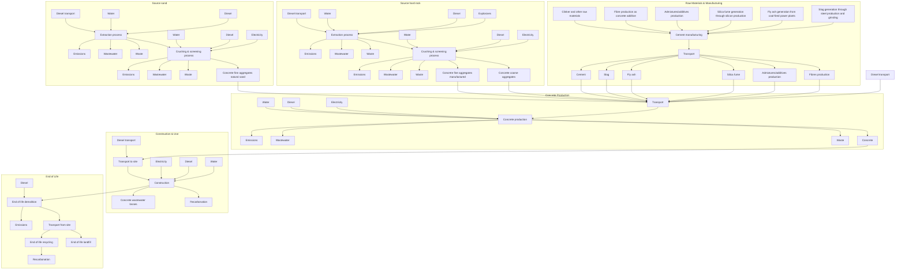
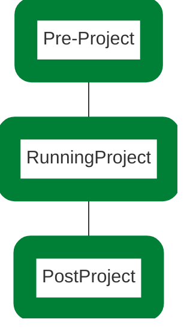

<PAGE>1<PAGE>
# GE322LPF2

# Hutchinson Builders - Woolworths Doolandella

# QUEENSLAND - BRISBANE

## Environmental Product Declaration

In Accordance with Environdec c-PCR-003 Concrete, concrete elements (EN 16757:2023), ISO 14025 and EN15804:A2

**Programme Operator**: EPD International AB

**Regional Programme**: EPD Australasia

An EPD should provide current information and may be updated or depublished if conditions change. To find the latest version of the EPD and to confirm its validity, see www.environdec.com.

**EPD Registration Number**: EPD-IES-0014785:001

**Date of Publication**: 2024-11-19

**Valid Until**: 2029-11-19

**Date of Version**: 1.0 2024-11-19

ECO PLATFORM EPD VERIFIED logo

EPD THE INTERNATIONAL EPD SYSTEM logo

<PAGE>2<PAGE>
Photograph of two workers in high-visibility clothing standing next to a Heidelberg Materials cement mixer truck

# Contents

1. **Heidelberg Materials story**

2. **Life cycle and process**

3. **Product environmental performance**

4. **References**

<PAGE>3<PAGE>
Photograph of Heidelberg Materials employees in high-visibility gear standing in front of a green and white cement mixer truck with the company logo.

Heidelberg Materials

# Heidelberg Materials Australia

<PAGE>4<PAGE>
# Who is Heidelberg Materials?

Heidelberg Materials is one of the world’s largest building materials companies focused on producing materials to build our future.

World map showing Heidelberg Materials' global presence

Globe icon

50 countries

Employees icon

51,000 employees

Location pin icon

3,000 locations

Factory icon

Leading market positions in cement, aggregates and ready-mixed concrete.

Euro currency icon

Revenue in 2023 – 21.2 Billion Euro

<PAGE>5<PAGE>
# Global expertise, Local experience

With more than 4,000 employees across 300 sites, we have an extensive production and logistics network across Australia.

We think global and act local - we benefit from global research and development enhanced by national collaboration to offer a comprehensive range of high-quality concrete, aggregates, road base, sand and asphalt products. We also produce a wide range of sustainable and recycled construction materials for civil construction and infrastructure projects.

We are driven by excellence and high performance and together we will shape Australia’s construction materials industry building a legacy for generations to come.

<PAGE>6<PAGE>
# Our sustainability charter

Photograph of Phil Schacht, Chief Executive of Heidelberg Materials Australia

Heidelberg Materials Australia are leaders in the building and construction industry, however we never take it for granted. We help to build the infrastructure of communities by working with them and being a part of them. While we are known for our "we'll make it happen" attitude, we are conscious of our socio-economic and environmental impacts.

One of our strategic goals is to drive operational excellence and innovation, which means we are always looking for new ways of working to help preserve and protect our planet's natural resources.

Heidelberg Materials sustainability commitments 2030 serve as a guiding principle for our sustainability strategy.

The strategy is comprised of four strategic pillars and supports initiatives that focus on CO2 Emissions, Sustainable Products, Biodiversity, Water and Corporate Social Responsibility.

To realise these sustainability goals, individual plans will be developed for our operations, addressing their unique sustainability challenges. We will also build sustainability targets into everyone's roles, recruit sustainability champions and invest in resources and projects that support our sustainability plans. Our plans and commitments align directly with each of our core values: Care, Collaboration and Ownership.

Committing to these goals as a team is an important part of being a truly sustainable business.

I look forward to working together to realise better outcomes for our people, our communities and our planet.

signature: Phil Schacht

Phil Schacht
Chief Executive
Heidelberg Materials Australia

<PAGE>7<PAGE>
Two workers in high-visibility orange and blue safety gear, including hard hats and gloves, standing in front of an industrial facility.

# Life Cycle and Process

<PAGE>8<PAGE>
# Product EPD Process

**Declared Unit is 1m³ of Concrete**

* The process is used to produce an accurate estimation at all stages of the product life cycle from cradle to grave. Estimation at each stage is based on actual data which is a combination of both current and prior year average consumption per declared unit.

* This EPD Process is certified using GCCA international modelling of energy use and environmental impact to obtain a suitable estimation for products manufactured.

* Pre-defined cement and clinker data provided by the GCCA tool are used only where no better (supplier/source specific) information is available.

## Life Cycle Assessment Tool

* For the purposes of creating this Environmental Product Declaration (EPD), the Global Cement & Concrete Association (GCCA) concrete EPD tool v. 4.2 (short: GCCA tool) has been employed.

## Assumptions & Limitations

* This is a project-specific EPD.

* All modelling assumptions adopted from the GCCA Tool.

* Raw material (inbound) transport distances is the previous year’s travel distance average weighted according to deliveries across operations.

## EPDs are created under either of 2 streams:

* Generic Stream - The class of product modelled is used for a particular geographical region using averaged data across operations.

* Project-specific stream – Models the manufacture of specific products required for a particular project being delivered from specific plant(s) using weighted average data where relevant and possible. Reports created after the completion of a project offer the highest accuracy, including all mix variations for each delivery.

* Concrete mixes are assumed to use an equal amount of site fuel and energy and responsible for an equal amount of waste flows.

* Agreed mixes are used to calculate the BOMs. Production is assumed to be equal across all plants included in the study. Concrete plants in the study include: Jindalee, Coopers Plains, Ipswich

* The project-specific travel distances for diesel truck from the main plant to the construction site were applied. Truck type of >32 tonne was assumed to be fully utilized travelling to construction site with empty returns.

## The main data categories include:

* The average bill of materials (BOM) for the concrete mix selected in the range of concrete plants specified including their average raw material travel distance, or the calculated BOM based on actual delivered materials incl. travel distances (average or specific) for the producing plants.

* The average fuel, water and energy consumption per declared unit between those plants;

* Plant production waste based on a nationally calculated figure;

* Water usage in operations is averaged over the full geographic region of study.

* Grid purchased electricity mixes is based on the specific state’s energy mix from OpenNEM. For this project, energy mix was sourced from coal and peat (66%), gas (7%), solar (21%), wind (4%), hydro (2%), and biomass (<1%). The electricity emission (GWP-GHG) is 0.83 kg CO2e/kWh.

* Travel for materials sources internationally included from shipping origin.

* Recarbonation of concrete is determined through pre-defined values within GCCA tool for the type of construction project (-3.167644102 kg CO2 eq./ m³ at Stage B, -1.069641016 kg CO2 eq./ m³ at Stage C3, and -2.722027046 kg CO2 eq./ m³ at Stage C4), where known; and,

* Reference Service Life (RSL) is set to 50 years as per default. It's based on the lowest exposure class A1 & A2 (AS 3600:2018 "Concrete Structures") in relatively benign environments.

* End of life recycling is based upon industry data.

<PAGE>9<PAGE>
# Product EPD Process

| Bill of Materials                    | Low Level \[%] | High Level \[%] |
| ------------------------------------ | -------------- | --------------- |
| Cement                               | 4              | 13              |
| Supplementary Cementitious Materials | 0              | 13              |
| Aggregates                           | 59             | 86              |
| Water                                | 7              | 15              |
| Admixtures                           | 0              | <1              |
| Reinforcements                       | 0              | <1              |

The materials (by mass%) contained in Hutchinson Builders - Woolworths Doolandella mixes are summarized in the table above.

## Hazard information related to concrete placement

GHS classifications

* Skin Corrosion Category 1

* Serious Eye Damage -Category 1

* Skin Sensitisation Category 1

* Specific Target Organ Toxicity (Repeated Exposure) Category 2

Hazard Statement(s)

* H302 -Harmful if swallowed

* P280 -Wear protective gloves/clothing/eye protection.

* H314 -Causes severe skin burns and eye damage

* H317 -May cause an allergic skin reaction

* H318 - Causes serious eye damage

* H373 -May cause damage to lungs by inhalation (dust from dried product)

## By-Products, Recycled Materials & Allocations

Co-products would be allocated via economic allocations and then normalized based on BOM. The following materials are the product of waste streams of other industrial processes:

### Fly ash

* A by-product of coal-fired power stations, fly ash is considered to carry no environmental impact for the purposes of this EPD, hence an economic allocation of $0 has been applied to fly ash. The only burdens are of transport to manufacturing sites.

### Ground Granulated Blast Furnace Slag (GGBFS)

* Blast furnace slag is a by-product of steel production that is dried and ground for use in concrete production. To duly allocate the environmental impacts, economic allocation has been employed.

### Silica fume

* As a by-product of silicon production, silica fume is considered to carry no environmental burden for the purposes of this EPD.

### Recycled concrete aggregate

* A component of the boarder category of construction and demolition waste, environmental impacts are allocated on the basis of reprocessing the material following delivery to the recycling facility.

### Manufactured Sand

* A by-product of processing coarse aggregate. This manufactured sand is a direct replacement for natural sand and prevents the need to extract natural resources.

### Packaging

* This concrete is not produced with any packaging, instead delivered directly to site immediately following production.

In Accordance with Environdec c-PCR-003 Concrete, concrete elements (EN 16757), ISO 14025 and EN15804:A2

<page_number>
9
</page_number>

Heidelberg Materials logo

<PAGE>10<PAGE>
# Product Lifecycle Stages

| Product Stage Raw Material Supply | Product Stage Transport | Product Stage Manufacturing | Construction Stage Transport | Construction Stage Construction/installation process | Use Stage Use | Use Stage Maintenance incl. transport | Use Stage Repair incl. transport | Use Stage Replacement incl. transport | Use Stage Refurbishment incl. transport | Use Stage Operational Energy Use | Use Stage Operational Water Use | End of Life Stage De-construction & demolition | End of Life Stage Transport | End of Life Stage Re-use recycling | End of Life Stage Final Disposal | Benefits & loads for the next product system Reuse, Recovery Recycling | Benefits & loads for the next product system Reuse, Recovery Recycling |
| ------------------------------------- | --------------------------- | ------------------------------- | -------------------------------- | -------------------------------------------------------- | ----------------- | ----------------------------------------- | ------------------------------------ | ----------------------------------------- | ------------------------------------------- | ------------------------------------ | ----------------------------------- | -------------------------------------------------- | ------------------------------- | -------------------------------------- | ------------------------------------ | -------------------------------------------------------------------------- | -------------------------------------------------------------------------- |
| **Module**                            | A1                          | A2                              | A3                               | A4                                                       | A5                | B1                                        | B2                                   | B3                                        | B4                                          | B5                                   | B6                                  | B7                                                 | C1                              | C2                                     | C3                                   | C4                                                                         | D                                                                          |
| **Modules declared**                  | X                           | X                               | X                                | X                                                        | X                 | X                                         | X                                    | X                                         | X                                           | X                                    | X                                   | X                                                  | X                               | X                                      | X                                    | X                                                                          | X                                                                          |
| **Geography**                         | GLO                         | GLO                             | AU                               | AU                                                       | AU                | AU                                        | AU                                   | AU                                        | AU                                          | AU                                   | AU                                  | AU                                                 | AU                              | AU                                     | AU                                   | AU                                                                         | AU                                                                         |
| **Specific data**                     | 77%                         |                                 |                                  |                                                          |                   |                                           |                                      |                                           |                                             |                                      |                                     |                                                    |                                 |                                        |                                      |                                                                            |                                                                            |
| **Variation products**                | Not Relevant                |                                 |                                  |                                                          |                   |                                           |                                      |                                           |                                             |                                      |                                     |                                                    |                                 |                                        |                                      |                                                                            |                                                                            |
| **Variation sites**                   | <10%                        |                                 |                                  |                                                          |                   |                                           |                                      |                                           |                                             |                                      |                                     |                                                    |                                 |                                        |                                      |                                                                            |                                                                            |

* All stages of the product lifecycle have been considered for this EPD – cradle to grave. By its nature, there are some stages of the lifecycle that are not applicable to the concrete product.

* The scenario applied for the use stage assumes that under normal use, no maintenance repair or replacement of the product during its service life is required. As a result, the values are displayed as zero.

* Those stages that, due to practicality, cannot be assessed accurately draw on default values of the underlying GCCA tool.

* For Project-specific EPDs, allocation is determined by the supplying plants with estimates as to the likely volume to be delivered from each. Where existing and sufficient data exists, historical data will be used to make this determination.

Heidelberg Materials logo

<PAGE>11<PAGE>
# Product Lifecycle Stages

* The lifecycle model and system boundary is the same for both Generic and Project-specific concrete EPDs, as detailed in the graphic.

* All stages of the lifecycle, from quarry to recycling are covered by the EPD.

## Cut-off rules

The cut-off threshold for the LCA study was flows contributing less than 1% for any individual input included in the LCA. No flows were deliberately excluded due to this threshold, however particularly minor impacts (e. g. packaging of chemical admixtures) were not considered. Cut off will occur only when data, or reliable estimates, are not practical to source. The contribution of capital goods (production equipment and infrastructure) and personnel are non-attributable and excluded for the system boundary.

Heidelberg Materials logo

<PAGE>12<PAGE>
# Product Data Sources

| LCA Stage                 | Item                                           | Source                                                                                                                                                                                                                                                                                                                                                                                                                                                                                                                                                                                                                               | Timing                                                                                                                                               | Data Source | Data Quality Geographical | Data Quality Technical | Data Quality Time |
| ------------------------- | ---------------------------------------------- | ------------------------------------------------------------------------------------------------------------------------------------------------------------------------------------------------------------------------------------------------------------------------------------------------------------------------------------------------------------------------------------------------------------------------------------------------------------------------------------------------------------------------------------------------------------------------------------------------------------------------------------ | ---------------------------------------------------------------------------------------------------------------------------------------------------- | ----------- | ----------------------------- | -------------------------- | --------------------- |
| **Product Description**   | Product description and density                | ERP report Bill of Materials and material specific data                                                                                                                                                                                                                                                                                                                                                                                                                                                                                                                                                                              | Upon EPD creation                                                                                                                                    | Primary     | Very good                     | Very good                  | Very good             |
| **A1-3 Materials**        | Raw Materials                                  | ERP report BOM and Mix design compilation used in conjunction with material template  Note. Upstream process for raw materials utilise data from ecoinvent 3.5. Specific cement EPD data by the cement manufacturer was used if available. Published cement EPDs were used to create concrete EPDs.  In the rare case that specific cement data was not possible, region-specific default cement and clinker values (default values provided by the GCCA tool) would have been used. This would be reflected in “Specific data.”                                                                                     | Upon EPD creation                                                                                                                                    | Secondary   | Very good                     | Good                       | Very good             |
| **A1-3 Materials**        | Inbound travel (raw materials)                 | ERP report 2. Inbound Travel drawing from actual deliveries from sources to operations.  Where delivery data not available, travel calculated based on Google Maps.  Train travel (only for operations around Melbourne) calculated by actual Google Maps distance.                                                                                                                                                                                                                                                                                                                                                  | Full prior year data, average per delivery  Actual travel distances between source and operation.                                            | Primary     | Very good                     | Good                       | Very good             |
| **A1-3 Materials**        | Allocation Factor (for secondary co products): | Slag: AusLCI  Fly Ash & Silica fume: no allocation as they are industrial by-products.                                                                                                                                                                                                                                                                                                                                                                                                                                                                                                                                       | Upon EPD creation                                                                                                                                    | Secondary   | Very good                     | Good                       | Very good             |
| **1-3 Manufacturing**     | Plant Energy and Fuel Consumption              | ERP Report 3. Concrete Energy Use, drawing on actual invoiced usage.                                                                                                                                                                                                                                                                                                                                                                                                                                                                                                                                                                 | Full prior year data, average per cubic metre                                                                                                        | Primary     | Very good                     | Very good                  | Very good             |
| **A1-3 Manufacturing**    | Electricity Energy Sources                     | Sourced from OpenNEM https\://opennem.org.au; Australian Energy Market Operator. Excludes imports.                                                                                                                                                                                                                                                                                                                                                                                                                                                                                                                                   | Full year prior data, state-based, percentages                                                                                                       | Secondary   | Very good                     | Very good                  | Very good             |
| **A1-3 Waste Management** | Waste and waste water                          | Waste water volume set to 9L per 1 m³                                                                                                                                                                                                                                                                                                                                                                                                                                                                                                                                                                                                | Static                                                                                                                                               | Secondary   | Very good                     | Good                       | Very good             |
| **A4-5 Construction**     | Outbound Travel                                | For generic EPDs: ERP report 5. Outbound travel drawing from actual deliveries from operations to customer sites. Where data not available, travel calculated based on Google Maps.  For project-specific EPDs: The project-specific travel distances from the main plant to the construction site was applied.  For both scenarios, diesel truck is used to transport deliveries to customer site/s. A5 uses default GCCA Tool settings for: 2.8 kWh electricity, 1.7 L diesel in building machine, 669 kg water, and 0.7 m³ wastewater. Note that internal concrete losses are at \~1% (based on internal reports) | Generic EPD: Full prior year data, average per delivery.  Project-specific EPD: Actual travel distances between plant and construction site. | Primary     | Very good                     | Good                       | Very good             |
| **B. Use**                | Re-carbonation                                 | Default GCCA Tool settings                                                                                                                                                                                                                                                                                                                                                                                                                                                                                                                                                                                                           | NA                                                                                                                                                   | Proxy       | Good                          | Good                       | Very good             |

<PAGE>13<PAGE>
# Product Data Sources

| LCA Stage                           | Item                  | Source                                                                                                                                                                                                                                                                                              | Timing                                                                       | Data Source | Data Quality Geographical | Data Quality Technical | Data Quality Time |
| ----------------------------------- | --------------------- | --------------------------------------------------------------------------------------------------------------------------------------------------------------------------------------------------------------------------------------------------------------------------------------------------- | ---------------------------------------------------------------------------- | ----------- | ----------------------------- | -------------------------- | --------------------- |
| C. End of Life Demolition       | Demolition            | Default GCCA Tool settings (2.674 L diesel in building machine, 0.0365 mg PM2.5, 0.184 mg PM10, 0.139 mg PM>10). PM refers to particulate matter.                                                                                                                                                   | NA                                                                           | Proxy       | Good                          | Good                       | Very good             |
| C. End of Life Transport        | Transport             | Default GCCA Tool settings                                                                                                                                                                                                                                                                          | NA                                                                           | Proxy       | Good                          | Good                       | Very good             |
| C. End of Life Waste Processing | Recycling Rate at EOL | Masonry materials recycling rate obtained from annual National Waste Report published (e. g. for National Waste Report 2022, page 41, figure 29). Referenced recycling rate is used in industry as closest to concrete-specific value.  National Waste Reports                              | Prior year National Waste Report if available. If not, then latest available | Proxy       | Good                          | Good                       | Very good             |
| C. End of Life Disposal         | Disposal Rate at EOL  | Disposal rate inverse of masonry materials recycling rate obtained from annual National Waste Report published  National Waste Reports                                                                                                                                                      | Prior year National Waste Report if available. If not, then latest available | Proxy       | Good                          | Good                       | Very good             |
| D Benefits and Loads                |                       | Default GCCA Tool settings                                                                                                                                                                                                                                                                          | NA                                                                           | NA          | NA                            | NA                         | NA                    |
| General                             | General               | EcoInvent database used by the GCCA tool  Note: This covers environmental information for all raw materials and energy sources. Cement, where data is available, employs specific raw material and energy data for the product manufacture and for each component draws on Eco Invent Data. | NA                                                                           | Secondary   | Very good                     | Good                       | Very good             |

<PAGE>14<PAGE>
Photograph of concrete test samples on shelves with a green overlay and the Heidelberg Materials logo

# Product environmental performance

Heidelberg Materials

<PAGE>15<PAGE>
# Product Environmental Performance

| \*\*Comment\*\* | All information about goal and scope necessary for results interpretation are present in the latest version of the “LCA Model” report, available in GCCA’s Industry EPD Tool.  Declared GWP-GHG results for modules A1-A3 are <10%.  The estimated impact results are only relative statements, which do not indicate the endpoints of the impact categories, exceeding threshold values, safety margins and/or risks. Since Module C is included in the EPD, the use of Module A1-A3 results without considering the results of Module C is discouraged.  EF3.0 based EN15804+A2 impact assessment methodology has been is used for the GWP indicators.  The removals and emissions associated with biogenic carbon content of i) the product and ii) the packaging are not significant or even not relevant in the sector. The only limitation is the uptake of CO₂ in A1-A3 (e.g. biobased insulation materials in precast elements or biobased packaging materials) and reemission in A5 (packaging end-of-life) or C3-C4 (product end-of-life). This does not affect the GWP-tot indicator.  The tool does not calculate the ‘Radioactive waste disposed’ indicator, it is considered not to be significant for the sector. |
| --------------- | ------------------------------------------------------------------------------------------------------------------------------------------------------------------------------------------------------------------------------------------------------------------------------------------------------------------------------------------------------------------------------------------------------------------------------------------------------------------------------------------------------------------------------------------------------------------------------------------------------------------------------------------------------------------------------------------------------------------------------------------------------------------------------------------------------------------------------------------------------------------------------------------------------------------------------------------------------------------------------------------------------------------------------------------------------------------------------------------------------------------------------------------------------------------------------------------------------------------------------------------------------------------------ |

| \*\*Core Environmental Impact Indicators\*\* | \*\*GWP-GHG\*\* (Global Warming Potential, GHG) • \*\*GWP-tot\*\* (Global Warming Potential total) • \*\*GWP-fos\*\* (Global Warming Potential fossil fuels) • \*\*GWP-bio\*\* (Global Warming Potential biogenic) • \*\*GWP-luc\*\* (Global Warming Potential land use and land use change) • \*\*ODP\*\* (Depletion potential of the stratospheric ozone layer) • \*\*AP\*\* (Acidification potential, Accumulated Exceedance) • \*\*EP-fw\*\* (Eutrophication potential, freshwater) • \*\*EP-mar\*\* (Eutrophication potential, fraction of nutrients reaching marine end compartment) • \*\*EP-ter\*\* (Eutrophication potential, Accumulated Exceedance) • \*\*POCP\*\* (Formation potential of tropospheric ozone) • \*\*ADPE¹\*\* (Abiotic depletion potential for non- fossil resources) • \*\*ADPF¹\*\* (Abiotic depletion for fossil resources potential) • \*\*WDP¹\*\* (Water (user) deprivation potential, deprivation-weighted water consumption) |
| -------------------------------------------- | ---------------------------------------------------------------------------------------------------------------------------------------------------------------------------------------------------------------------------------------------------------------------------------------------------------------------------------------------------------------------------------------------------------------------------------------------------------------------------------------------------------------------------------------------------------------------------------------------------------------------------------------------------------------------------------------------------------------------------------------------------------------------------------------------------------------------------------------------------------------------------------------------------------------------------------------------------------------- |

1 The results of this environmental impact indicator shall be used with care as the uncertainties of the results are high and as there is limited experience with the indicator.

<PAGE>16<PAGE>
# Product Environmental Performance

| Additional Environmental Impact Indicators | **PM** (Potential incidence of disease due to PM emissions) • **IRP²** (Potential Human exposure efficiency relative to U235) • **ETP¹** (Potential Comparative Toxic Unit for ecosystems) • **HTPC¹** (Potential Comparative Toxic Unit for humans - cancer) • **HTPNC¹** (Potential Comparative Toxic Unit for humans - non-cancer) • **SQP¹** (Potential soil quality index)                                                                                                                                                                                                                                                                                                                              |
| ------------------------------------------ | ------------------------------------------------------------------------------------------------------------------------------------------------------------------------------------------------------------------------------------------------------------------------------------------------------------------------------------------------------------------------------------------------------------------------------------------------------------------------------------------------------------------------------------------------------------------------------------------------------------------------------------------------------------------------------------------------------------ |
| Parameters Describing Resource Use         | **PERE** (Use of renewable primary energy excluding renewable primary energy resources used as raw materials) • **PERM** (Use of renewable primary energy resources used as raw materials) • **PERT** (Total use of renewable primary energy resources) • **PENRE** (Use of non renewable primary energy excluding non-renewable primary energy resources used as raw materials) • **PENRM** (Use of non-renewable primary energy resources used as raw materials) • **PENRT** (Total use of non-renewable primary energy resources) • **SM** (Use of secondary materials) • **RSF** (Use of renewable secondary fuels) • **NRSF** (Use of non-renewable secondary fuels) • **NFW** (Net use of fresh water) |
| Waste Categories                           | **HWD** (Hazardous waste disposed) • **NHWD** (Non-hazardous waste disposed) • **RWD** (Radioactive waste disposed)                                                                                                                                                                                                                                                                                                                                                                                                                                                                                                                                                                                          |
| Output Flows                               | **CRU** (Components for re-use) • **MFR** (Materials for recycling) • **MER** (Materials for energy recovery) • **EE** (Exported energy)                                                                                                                                                                                                                                                                                                                                                                                                                                                                                                                                                                     |
| Extra Indicators                           | **CC¹** (Emissions from calcination and removals from carbonation) • **CWRS** (Emissions from combustion of waste from renewable sources used in production processes) • **CWNRS** (Emissions from combustion of waste from non-renewable sources used in production processes) • **GWP-prod** (Removals and emissions associated with biogenic carbon content of the bio-based product) • **GWP-pack** (Removals and emissions associated with biogenic carbon content of the bio-based packaging)                                                                                                                                                                                                          |

1 The results of this environmental impact indicator shall be used with care as the uncertainties of the results are high and as there is limited experience with the indicator.

2 This impact category deals mainly with the eventual impact of low dose ionizing radiation on human health of the nuclear fuel cycle. It does not consider effects due to possible nuclear accidents, occupational exposure nor due to radioactive waste disposal in underground facilities. Potential ionizing radiation from the soil, from radon and from some construction materials is also not measured by this indicator.

<PAGE>17<PAGE>
# Product Environmental Performance

| Product identification  | GE322LPF2                                                                      |
| ----------------------- | ------------------------------------------------------------------------------ |
| EPD Registration Number | EPD-IES-0014785:001                                                            |
| Production site(s)      | Brisbane                                                                       |
| Compressive strength    | 32                                                                             |
| Density                 | 2355.5 kg/m³                                                                   |
| Reference service life  | 50 Years                                                                       |
| Recycling Rate At EoL   | 78%                                                                            |
| Declared unit           | 1 m³                                                                           |
| Scope                   | A1-A3 + A4-A5 + B1-B7 + C1-C4 + D, cradle-to-grave                             |
| Methodology             | GCCA’s Industry EPD Tool for Cement and Concrete (V4.2), International version |
| Reference Year          | 2023                                                                           |

<PAGE>18<PAGE>
# Product Environmental Performance

**EPD Registration Number**: EPD-IES-0014785:001

## Core environmental impact indicators

|         |                         | A1-A3    | A 4      | A 5       | B1        | B2                     | B3       | B4       | B5       | B6       | B7       | C1       | C2       | C3       | C4       | D         |
| ------- | ----------------------- | -------- | -------- | --------- | --------- | ---------------------- | -------- | -------- | -------- | -------- | -------- | -------- | -------- | -------- | -------- | --------- |
| GWP-GHG | kg CO₂ eq.              | 1.45E+02 | 3.41E+00 | 1.01E+01  | -3.17E+00 | 0.00E+00               | 0.00E+00 | 0.00E+00 | 0.00E+00 | 0.00E+00 | 0.00E+00 | 8.99E+00 | 9.03E+00 | 5.19E+00 | 2.85E+00 | -1.41E+01 |
| GWP-tot | kg CO₂ eq.              | 1.45E+02 | 3.41E+00 | 1.01E+01  | -3.17E+00 | 0.00E+00               | 0.00E+00 | 0.00E+00 | 0.00E+00 | 0.00E+00 | 0.00E+00 | 8.99E+00 | 9.03E+00 | 5.19E+00 | 2.85E+00 | -1.41E+01 |
| GWP-fos | kg CO₂ eq.              | 1.45E+02 | 3.41E+00 | 1.01E+01  | -3.17E+00 | 0.00E+00               | 0.00E+00 | 0.00E+00 | 0.00E+00 | 0.00E+00 | 0.00E+00 | 8.99E+00 | 9.01E+00 | 5.16E+00 | 2.84E+00 | -1.40E+01 |
| GWP-bio | kg CO₂ eq.              | 4.83E-02 | 1.33E-03 | 4.38E-03  | 0.00E+00  | 0.00E+00               | 0.00E+00 | 0.00E+00 | 0.00E+00 | 0.00E+00 | 0.00E+00 | 1.60E-03 | 6.45E-03 | 1.93E-02 | 1.88E-03 | -5.65E-02 |
| GWP-luc | kg CO₂ eq.              | 3.21E-02 | 1.15E-03 | 3.34E-03  | 0.00E+00  | 0.00E+00               | 0.00E+00 | 0.00E+00 | 0.00E+00 | 0.00E+00 | 0.00E+00 | 1.13E-03 | 5.24E-03 | 1.47E-02 | 1.53E-03 | -2.45E-02 |
| ODP     | kg CFC 11 eq.           | 6.63E-06 | 6.49E-07 | 1.30E-06  | 0.00E+00  | 0.00E+00               | 0.00E+00 | 0.00E+00 | 0.00E+00 | 0.00E+00 | 0.00E+00 | 1.62E-06 | 1.52E-06 | 3.71E-07 | 9.27E-07 | -9.57E-07 |
| AP      | mol H+ eq.              | 6.89E-01 | 1.76E-02 | 9.03E-02  | 0.00E+00  | 0.00E+00               | 0.00E+00 | 0.00E+00 | 0.00E+00 | 0.00E+00 | 0.00E+00 | 9.42E-02 | 5.45E-02 | 3.93E-02 | 2.73E-02 | -9.94E-02 |
| EP-fw   | kg P eq.                | 3.01E-02 | 2.54E-04 | 2.05E-03  | 0.00E+00  | 0.00E+00               | 0.00E+00 | 0.00E+00 | 0.00E+00 | 0.00E+00 | 0.00E+00 | 4.02E-04 | 1.21E-03 | 3.06E-03 | 3.34E-04 | -5.88E-03 |
| EP-mar  | kg N eq.                | 2.23E-03 | 2.21E-05 | 6.88E-04  | 0.00E+00  | 0.00E+00               | 0.00E+00 | 0.00E+00 | 0.00E+00 | 0.00E+00 | 0.00E+00 | 3.34E-05 | 8.91E-05 | 2.12E-04 | 3.15E-05 | -3.81E-04 |
| EP-ter  | mol N eq.               | 1.54E+00 | 6.31E-02 | 3.32E-01  | 0.00E+00  | 0.00E+00               | 0.00E+00 | 0.00E+00 | 0.00E+00 | 0.00E+00 | 0.00E+00 | 4.44E-01 | 1.92E-01 | 7.34E-02 | 9.77E-02 | -2.48E-01 |
| POCP    | kg NMVOC eq.            | 4.24E-01 | 1.90E-02 | 9.15E-02  | 0.00E+00  | 0.00E+00               | 0.00E+00 | 0.00E+00 | 0.00E+00 | 0.00E+00 | 0.00E+00 | 1.22E-01 | 5.61E-02 | 2.07E-02 | 2.87E-02 | -6.28E-02 |
| ADPE    | kg Sb eq.               | 1.80E-04 | 6.35E-06 | 7.31E-06  | 0.00E+00  | 0.00E+00               | 0.00E+00 | 0.00E+00 | 0.00E+00 | 0.00E+00 | 0.00E+00 | 2.66E-06 | 1.59E-05 | 4.57E-06 | 3.10E-06 | -1.60E-04 |
| ADPF    | MJ, net calorific value | 1.10E+03 | 5.36E+01 | 1.29E+02  | 0.00E+00  | \[hm\_slide2] 0.00E+00 | 0.00E+00 | 0.00E+00 | 0.00E+00 | 0.00E+00 | 0.00E+00 | 1.30E+02 | 1.34E+02 | 7.63E+01 | 7.92E+01 | -1.61E+02 |
| WDP     | m³ world eq. deprived   | 7.54E+01 | 3.95E-01 | -1.38E+00 | 0.00E+00  | 0.00E+00               | 0.00E+00 | 0.00E+00 | 0.00E+00 | 0.00E+00 | 0.00E+00 | 7.67E-01 | 1.17E+00 | 1.07E+00 | 3.83E+00 | -2.73E+01 |

## Parameters describing resource use

|       |                         | A1-A3    | A4       | A5       | B1       | B2       | B3       | B4       | B5       | B6       | B7       | C1       | C2       | C3       | C4       | D         |
| ----- | ----------------------- | -------- | -------- | -------- | -------- | -------- | -------- | -------- | -------- | -------- | -------- | -------- | -------- | -------- | -------- | --------- |
| PERE  | MJ, net calorific value | 4.81E+01 | 1.55E+00 | 5.52E+00 | 0.00E+00 | 0.00E+00 | 0.00E+00 | 0.00E+00 | 0.00E+00 | 0.00E+00 | 0.00E+00 | 7.59E-01 | 4.92E+00 | 8.34E+00 | 2.06E+00 | -1.32E+01 |
| PERM  | MJ, net calorific value | 0.00E+00 | 0.00E+00 | 0.00E+00 | 0.00E+00 | 0.00E+00 | 0.00E+00 | 0.00E+00 | 0.00E+00 | 0.00E+00 | 0.00E+00 | 0.00E+00 | 0.00E+00 | 0.00E+00 | 0.00E+00 | 0.00E+00  |
| PERT  | MJ, net calorific value | 4.81E+01 | 1.55E+00 | 5.52E+00 | 0.00E+00 | 0.00E+00 | 0.00E+00 | 0.00E+00 | 0.00E+00 | 0.00E+00 | 0.00E+00 | 7.59E-01 | 4.92E+00 | 8.34E+00 | 2.06E+00 | -1.32E+01 |
| PENRE | MJ, net calorific value | 1.11E+03 | 5.36E+01 | 1.29E+02 | 0.00E+00 | 0.00E+00 | 0.00E+00 | 0.00E+00 | 0.00E+00 | 0.00E+00 | 0.00E+00 | 1.30E+02 | 1.34E+02 | 7.63E+01 | 7.92E+01 | -1.61E+02 |
| PENRM | MJ, net calorific value | 0.00E+00 | 0.00E+00 | 0.00E+00 | 0.00E+00 | 0.00E+00 | 0.00E+00 | 0.00E+00 | 0.00E+00 | 0.00E+00 | 0.00E+00 | 0.00E+00 | 0.00E+00 | 0.00E+00 | 0.00E+00 | 0.00E+00  |
| PENRT | MJ, net calorific value | 1.11E+03 | 5.36E+01 | 1.29E+02 | 0.00E+00 | 0.00E+00 | 0.00E+00 | 0.00E+00 | 0.00E+00 | 0.00E+00 | 0.00E+00 | 1.30E+02 | 1.34E+02 | 7.63E+01 | 7.92E+01 | -1.61E+02 |
| SM    | kg                      | 1.63E+02 | 0.00E+00 | 1.63E+00 | 0.00E+00 | 0.00E+00 | 0.00E+00 | 0.00E+00 | 0.00E+00 | 0.00E+00 | 0.00E+00 | 0.00E+00 | 0.00E+00 | 0.00E+00 | 0.00E+00 | 0.00E+00  |
| RSF   | MJ, net calorific value | 2.29E+00 | 0.00E+00 | 2.29E-02 | 0.00E+00 | 0.00E+00 | 0.00E+00 | 0.00E+00 | 0.00E+00 | 0.00E+00 | 0.00E+00 | 0.00E+00 | 0.00E+00 | 0.00E+00 | 0.00E+00 | 0.00E+00  |
| NRSF  | MJ, net calorific value | 3.81E+01 | 0.00E+00 | 3.81E-01 | 0.00E+00 | 0.00E+00 | 0.00E+00 | 0.00E+00 | 0.00E+00 | 0.00E+00 | 0.00E+00 | 0.00E+00 | 0.00E+00 | 0.00E+00 | 0.00E+00 | 0.00E+00  |
| NFW   | m³                      | 2.14E+00 | 1.18E-02 | 1.18E-01 | 0.00E+00 | 0.00E+00 | 0.00E+00 | 0.00E+00 | 0.00E+00 | 0.00E+00 | 0.00E+00 | 1.99E-02 | 3.60E-02 | 4.34E-02 | 8.92E-02 | -6.53E-01 |

<PAGE>19<PAGE>
# Product Environmental Performance

**EPD Registration Number**: EPD-IES-0014785:001

## Additional environmental impact indicators

|       |                   | A1-A3    | A4       | A5       | B1       | B2       | B3       | B4       | B5       | B6       | B7       | C1       | C2       | C3       | C4       | D         |
| ----- | ----------------- | -------- | -------- | -------- | -------- | -------- | -------- | -------- | -------- | -------- | -------- | -------- | -------- | -------- | -------- | --------- |
| PM    | Disease incidence | 5.84E-06 | 3.14E-07 | 1.67E-06 | 0.00E+00 | 0.00E+00 | 0.00E+00 | 0.00E+00 | 0.00E+00 | 0.00E+00 | 0.00E+00 | 2.45E-06 | 8.41E-07 | 3.51E-07 | 5.09E-07 | -1.17E-06 |
| IRP   | kBq U235 eq.      | 4.38E+02 | 2.82E-01 | 4.93E+00 | 0.00E+00 | 0.00E+00 | 0.00E+00 | 0.00E+00 | 0.00E+00 | 0.00E+00 | 0.00E+00 | 6.08E-01 | 7.71E-01 | 8.19E-01 | 3.66E-01 | -1.32E+00 |
| ETP   | CTUe              | 4.25E+02 | 1.13E+01 | 8.02E+00 | 0.00E+00 | 0.00E+00 | 0.00E+00 | 0.00E+00 | 0.00E+00 | 0.00E+00 | 0.00E+00 | 1.76E+00 | 2.36E+01 | 1.60E+00 | 1.50E+00 | -6.80E+00 |
| HTPC  | CTUh              | 7.64E-07 | 2.18E-08 | 1.89E-07 | 0.00E+00 | 0.00E+00 | 0.00E+00 | 0.00E+00 | 0.00E+00 | 0.00E+00 | 0.00E+00 | 6.36E-08 | 1.02E-07 | 6.35E-08 | 2.49E-08 | -3.36E-07 |
| HTPNC | CTUh              | 1.08E-05 | 6.10E-07 | 8.99E-07 | 0.00E+00 | 0.00E+00 | 0.00E+00 | 0.00E+00 | 0.00E+00 | 0.00E+00 | 0.00E+00 | 2.46E-07 | 1.41E-06 | 2.92E-07 | 1.59E-07 | -2.00E-06 |
| SQP   | dimensionless     | 8.35E+02 | 9.52E+01 | 3.81E+01 | 0.00E+00 | 0.00E+00 | 0.00E+00 | 0.00E+00 | 0.00E+00 | 0.00E+00 | 0.00E+00 | 7.71E+00 | 2.19E+02 | 6.24E+01 | 1.48E+02 | -2.11E+02 |

## Other environmental information describing waste categories

|      |    | A1-A3    | A4       | A5       | B1       | B2       | B3       | B4       | B5       | B6       | B7       | C1       | C2       | C3       | C4       | D        |
| ---- | -- | -------- | -------- | -------- | -------- | -------- | -------- | -------- | -------- | -------- | -------- | -------- | -------- | -------- | -------- | -------- |
| HWD  | kg | 0.00E+00 | 0.00E+00 | 0.00E+00 | 0.00E+00 | 0.00E+00 | 0.00E+00 | 0.00E+00 | 0.00E+00 | 0.00E+00 | 0.00E+00 | 0.00E+00 | 0.00E+00 | 0.00E+00 | 0.00E+00 | 0.00E+00 |
| NHWD | kg | 4.87E-02 | 0.00E+00 | 5.16E+00 | 0.00E+00 | 0.00E+00 | 0.00E+00 | 0.00E+00 | 0.00E+00 | 0.00E+00 | 0.00E+00 | 0.00E+00 | 0.00E+00 | 0.00E+00 | 5.16E+02 | 0.00E+00 |
| RWD  | kg | 0.00E+00 | 0.00E+00 | 0.00E+00 | 0.00E+00 | 0.00E+00 | 0.00E+00 | 0.00E+00 | 0.00E+00 | 0.00E+00 | 0.00E+00 | 0.00E+00 | 0.00E+00 | 0.00E+00 | 0.00E+00 | 0.00E+00 |

## Environmental information describing output flows

|     |    | A1-A3    | A4       | A5       | B1       | B2       | B3       | B4       | B5       | B6       | B7       | C1       | C2       | C3       | C4       | D        |
| --- | -- | -------- | -------- | -------- | -------- | -------- | -------- | -------- | -------- | -------- | -------- | -------- | -------- | -------- | -------- | -------- |
| CRU | kg | 0.00E+00 | 0.00E+00 | 0.00E+00 | 0.00E+00 | 0.00E+00 | 0.00E+00 | 0.00E+00 | 0.00E+00 | 0.00E+00 | 0.00E+00 | 0.00E+00 | 0.00E+00 | 0.00E+00 | 0.00E+00 | 0.00E+00 |
| MFR | kg | 0.00E+00 | 0.00E+00 | 1.84E+01 | 0.00E+00 | 0.00E+00 | 0.00E+00 | 0.00E+00 | 0.00E+00 | 0.00E+00 | 0.00E+00 | 0.00E+00 | 0.00E+00 | 1.84E+03 | 0.00E+00 | 0.00E+00 |
| MER | kg | 0.00E+00 | 0.00E+00 | 0.00E+00 | 0.00E+00 | 0.00E+00 | 0.00E+00 | 0.00E+00 | 0.00E+00 | 0.00E+00 | 0.00E+00 | 0.00E+00 | 0.00E+00 | 0.00E+00 | 0.00E+00 | 0.00E+00 |
| EE  | kg | 0.00E+00 | 0.00E+00 | 0.00E+00 | 0.00E+00 | 0.00E+00 | 0.00E+00 | 0.00E+00 | 0.00E+00 | 0.00E+00 | 0.00E+00 | 0.00E+00 | 0.00E+00 | 0.00E+00 | 0.00E+00 | 0.00E+00 |

## Extra indicators

|          |            | A1-A3    | A4       | A5       | B1        | B2       | B3       | B4       | B5       | B6       | B7       | C1       | C2       | C3        | C4       | D        |
| -------- | ---------- | -------- | -------- | -------- | --------- | -------- | -------- | -------- | -------- | -------- | -------- | -------- | -------- | --------- | -------- | -------- |
| CC       | kg CO₂ eq. | 5.52E+01 | 0.00E+00 | 4.83E-01 | -3.17E+00 | 0.00E+00 | 0.00E+00 | 0.00E+00 | 0.00E+00 | 0.00E+00 | 0.00E+00 | 0.00E+00 | 0.00E+00 | -1.07E+00 | 0.00E+00 | 0.00E+00 |
| CWRS     | kg CO₂ eq. | 2.87E-03 | 0.00E+00 | 2.87E-05 | 0.00E+00  | 0.00E+00 | 0.00E+00 | 0.00E+00 | 0.00E+00 | 0.00E+00 | 0.00E+00 | 0.00E+00 | 0.00E+00 | 0.00E+00  | 0.00E+00 | 0.00E+00 |
| CWNRS    | kg CO₂ eq. | 3.23E+00 | 0.00E+00 | 3.23E-02 | 0.00E+00  | 0.00E+00 | 0.00E+00 | 0.00E+00 | 0.00E+00 | 0.00E+00 | 0.00E+00 | 0.00E+00 | 0.00E+00 | 0.00E+00  | 0.00E+00 | 0.00E+00 |
| GWP-prod | kg CO₂     | 0.00E+00 | 0.00E+00 | 0.00E+00 | 0.00E+00  | 0.00E+00 | 0.00E+00 | 0.00E+00 | 0.00E+00 | 0.00E+00 | 0.00E+00 | 0.00E+00 | 0.00E+00 | 0.00E+00  | 0.00E+00 | 0.00E+00 |
| GWP-pack | kg CO₂     | 0.00E+00 | 0.00E+00 | 0.00E+00 | 0.00E+00  | 0.00E+00 | 0.00E+00 | 0.00E+00 | 0.00E+00 | 0.00E+00 | 0.00E+00 | 0.00E+00 | 0.00E+00 | 0.00E+00  | 0.00E+00 | 0.00E+00 |

<PAGE>20<PAGE>
# Product Environmental Performance

The EPD values presented are indicative of local material performance at the time of publishing and are subject to change based on material availability and seasonal factors.

| Product Identification | EPD Registration Number | Compressive strength \[MPa] | A1-A3 GWP-tot¹ \[kg CO₂ eq./m³] | Full Lifecycle GWP-tot¹ \[kg CO₂ eq./m³] | Application             |
| ---------------------- | ----------------------- | --------------------------- | ------------------------------- | ---------------------------------------- | ----------------------- |
| CM201AJ53              | EPD-IES-0014780:001     | 20                          | 131                             | 153                                      | Block wall              |
| CM251AF41              | EPD-IES-0014781:001     | 25                          | 145                             | 166                                      | General works           |
| GE252VW12              | EPD-IES-0014782:001     | 25                          | 129                             | 152                                      | General works           |
| GE252WA06              | EPD-IES-0014783:001     | 25                          | 127                             | 149                                      | General works           |
| GE322LPE8              | EPD-IES-0014784:001     | 32                          | 141                             | 164                                      | General works           |
| GE322LPF2              | EPD-IES-0014785:001     | 32                          | 145                             | 167                                      | General works           |
| GE401VC95              | EPD-IES-0014786:001     | 40                          | 180                             | 203                                      | General works           |
| GE402AHTK              | EPD-IES-0014787:001     | 40                          | 166                             | 189                                      | Slabs                   |
| GE402AJAW              | EPD-IES-0014788:001     | 40                          | 243                             | 264                                      | Slabs                   |
| GE402AJBH              | EPD-IES-0014789:001     | 40                          | 243                             | 264                                      | Internal polished slabs |
| GE402AZRH              | EPD-IES-0014790:001     | 40                          | 244                             | 265                                      | Internal polished slabs |
| GE402ZGR3              | EPD-IES-0014791:001     | 40                          | 170                             | 194                                      | Slabs                   |
| GE501AU08              | EPD-IES-0014792:001     | 50                          | 261                             | 282                                      | General works           |
| P4020120               | EPD-IES-0014793:001     | 40                          | 173                             | 196                                      | General works           |
| SS0GSAA14              | EPD-IES-0014794:001     | No guarenteed strength      | 109                             | 122                                      | Back filling            |
| SYP40SF35              | EPD-IES-0014795:001     | 40                          | 297                             | 317                                      | Pump priming            |
| ZLIQ5                  | EPD-IES-0014796:001     | No guarenteed strength      | 138                             | 148                                      | Back filling            |
| ZWP40210               | EPD-IES-0014797:001     | 40                          | 286                             | 307                                      | Internal Slabs          |

1More detailed information is provided in the mix-specific tables and assumptions covered in Life Cycles & Processes section.

<PAGE>21<PAGE>
Photograph of workers in high-visibility gear walking towards a large yellow mining vehicle in a quarry, with the Heidelberg Materials logo and the word "References" overlaid.

Heidelberg Materials

# References

<PAGE>22<PAGE>
| EPD Owner                                                                     | Heidelberg Materials Australia Pty Ltd L14, 35 Clarence St, Sydney NSW 2000 Phone: 1300 136 464 Online: www\.heidelbergmaterials.com.au                                                                                                                                | Heidelberg Materials logo                                                           |
| ----------------------------------------------------------------------------- | ---------------------------------------------------------------------------------------------------------------------------------------------------------------------------------------------------------------------------------------------------------------------------------- | ----------------------------------------------------------------------------------- |
| Programme Operator                                                            | EPD International AB Box 210 60 SE-100 31 Stockholm Sweden Online: www\.environdec.com Email: info\@environdec.com                                                                                                                                                         | EPD THE INTERNATIONAL EPD SYSTEM logo                                               |
| Regional Programme                                                            | EPD Australasia Limited, 315a Hardy St, Nelson 7010 New Zealand Online: epd-australasia.com Email: info\@epd-Australasia.com                                                                                                                                               | AUSTRALASIA EPD logo                                                                |
| Process EPD Certified By                                                      | Megan Blizzard  Epsten Group, Inc. 101 Marietta St. NW, Suite 2600, Atlanta, Georgia 30303, USA www\.epstengroup.com Accredited by: A2LA, Certificate #3142.03                                                                                                 | \[signature: Megan Blizzard] epstengroup Environmental Product Declaration logo |
| Product Category Rules                                                        | CEN standard EN 15804:A2 (PCR 2019:14 Construction Products, Version 1.3.4) served as the core PCR. Environdec c-PCR-003 Concrete, concrete elements (EN 16757:2023) served as sub-PCR.                                                                                        |                                                                                     |
| EN 15804 PCR Review                                                           | The Technical Committee of the International EPD®System. Chair: Claudia A. Peña. The review panel may be contacted via info\@environdec.com.                                                                                                                                   |                                                                                     |
| EPD Registration Number                                                       | EPD-IES-0014785:001                                                                                                                                                                                                                                                                |                                                                                     |
| Independent Verification of the Declaration and Data, According to ISO 14025: | \[x] EPD process certification \[ ] EPD verification                                                                                                                                                                                                                           |                                                                                     |
| Valid From                                                                    | 2024-11-19                                                                                                                                                                                                                                                                         |                                                                                     |
| Valid To                                                                      | 2029-11-19                                                                                                                                                                                                                                                                         |                                                                                     |
| Version                                                                       | 1.0 2024-11-19                                                                                                                                                                                                                                                                     |                                                                                     |
| Description of Version Differences (if NOT VERSION 1.0)                       | N/A                                                                                                                                                                                                                                                                                |                                                                                     |
| Geographical Scope                                                            | QUEENSLAND - BRISBANE                                                                                                                                                                                                                                                              |                                                                                     |
| Important Notes                                                               | EPDs within the same product category but from different programmes may not be comparable. EPDs of construction products may not be comparable if they do not comply with EN 15804.  The EPD Owner maintains full ownership, liability and responsibility for the EPD. |                                                                                     |
| Product Group Classification                                                  | UN CPC 88 - Concrete, cement and plaster article manufacturing services                                                                                                                                                                                                            |                                                                                     |
| ANZSIC Classification                                                         | 2033 Ready Mix Concrete Manufacturing                                                                                                                                                                                                                                              |                                                                                     |

<PAGE>23<PAGE>
# References

1) Australian Life Cycle Assessment Society. (2015). Australian Life Cycle Inventory Database Initiative. Retrieved from http://www.auslci.com.au

2) National Waste Report. (2022). https://www.dcceew.gov.au/environment/protection/waste/publications/national-waste-reports. Canberra: Department of Climate Change, Energy, the Environment and Water.

3) Ecoinvent. (2023, Nov 23). ecoinvent 3.5 (database). Retrieved from https://ecoinvent.org

4) EPD International. (2024). General Programme Instructions for the International EPD® System v5.0. Retrieved from envirodec.com

5) EPD Australasia Regional Annex (2024) – Version 4.2 Retrieved from epd-australasia.com

6) European Committee for Standardisation (CEN). (2022). EN 16757:2022: Sustainability of construction works - Environmental product declarations - Product Category Rules for concrete and concrete elements.

7) European Committee for Standardisation (CEN). (2017, February). EN 16908:2017: Cement and building lime - Environmental Product Declarations - Product Category Rules complementary to EN 15804. Brussels.

8) European Committee for Standardisation (CEN). (2019). EN 15804:2012+A2:2019: Sustainability of construction works - Environmental product declarations - Core rules for the product category of construction products. Brussels.

9) Google. (n.d.). Google Maps. Retrieved from https://www.google.com.au/maps/

10) International Organization for Standardization. (2015). ISO14020 Environmental Labels and Declarations - General Principles.

11) International Organization for Standardization. (2017). ISO14025 Environmental Labels and Declarations - Type III Environmental Declarations - Principles and Procedures.

12) International Organization for Standardization. (2020). ISO 14044 Environmental Management - Life Cycle Assessment - Requirements and Guidelines.

13) McConnell, D., Holmes a Court, S., Tan, S., & Cubrilovic, N. (2022). OpenNEM. Retrieved 2023, from https://opennem.org.au/

14) Quantis. (2024). GCCA's Industry EPD Tool for Cement and Concrete. Retrieved from https://concrete-epd-tool.org/

15) Green Star Mat–4 Concrete Credit User Guide (2012). Retrieved from Mat-4 (gbca.org.au)

<PAGE>24<PAGE>
# CO₂ service offer

CO₂ is set to become a crucial budgeting currency in the construction sector. As such, it must be managed accordingly. Most provided embodied carbon emission data out there is based on estimates and typically handed over to the customer before a project starts.

At Heidelberg Materials Australia, we believe there’s a better way to communicate carbon values, which also eliminates the current gap of carbon monitoring options during the construction phase in the market:

1) **Pre-project:** Predicting - We can provide you indicative CO₂ values for your specific project with our 3rd party verified CO₂ calculator (targeted & fast & reliable).

2) **Running project:** Monitoring - You get regular updates of your deliveries and how you track towards your carbon targets (no more surprises).

3) **Post-project:** Verification - You’ll receive a final report and a project-specific EPD based on actual deliveries (highest accuracy).

