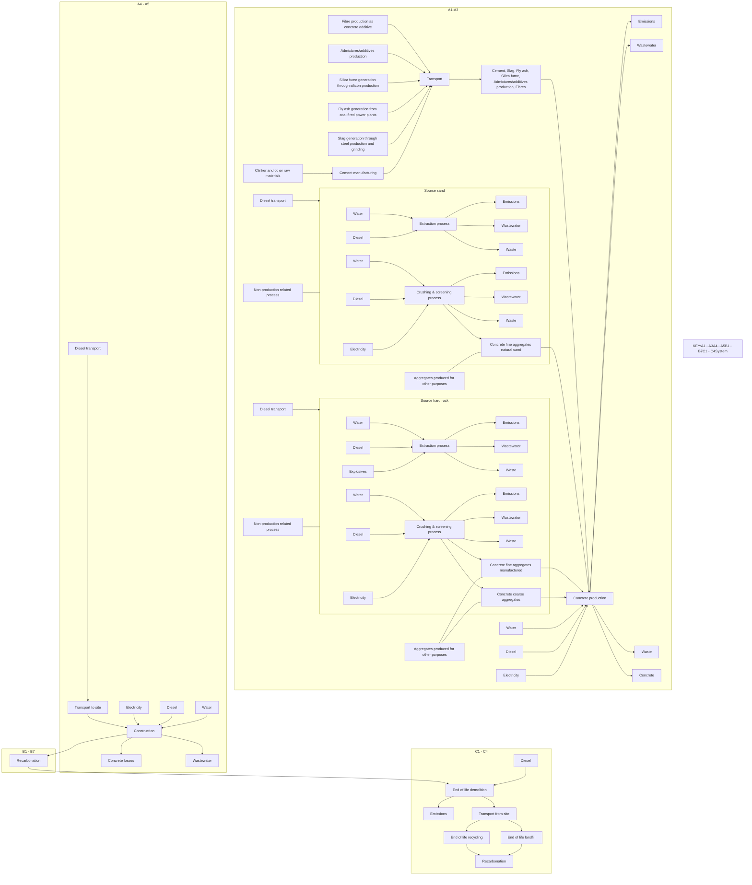
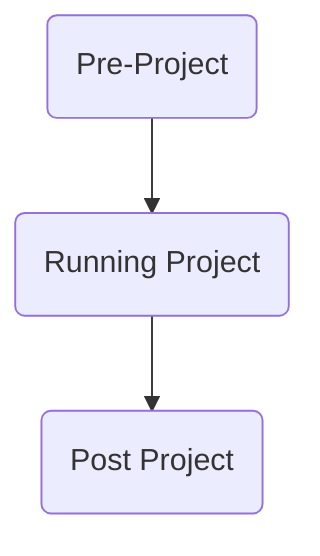

<PAGE>1<PAGE>
Hymix logo

# HyLo-50 Normal-Class 25 MPa

Generic EPD - Gold Coast Region

**QUEENSLAND - GOLD COAST**

Environmental Product Declaration

In Accordance with Environdec c-PCR-003 Concrete, concrete elements (EN 16757:2023), ISO 14025 and EN15804:A2

**Programme Operator**: EPD International AB
**Regional Programme**: EPD Australasia

An EPD should provide current information and may be updated or depublished if conditions change. To find the latest version of the EPD and to confirm its validity, see www.environdec.com.

**EPD Registration Number**: EPD-IES-0014958:001
**Date of Publication**: 2024-11-19
**Valid Until**: 2029-11-19
**Date of Version**: v.1 2024-11-19

Hymix icon EPD Australasia logo EPD logo ECO PLATFORM EPD VERIFIED logo EPD THE INTERNATIONAL EPD SYSTEM logo

<PAGE>2<PAGE>
# Contents

Hymix & Sustainability 5

Life Cycle & Processes 8

Product Environmental Performance 15

References 25

Photograph of a family sitting by a swimming pool on a concrete patio

<PAGE>3<PAGE>
# About Hymix

For over 50 years, Hymix has lead the industry in innovative concrete solutions. From domestic pool surrounds and driveways, to residential, commercial and large infrastructure developments Hymix supports projects of all scales.

## Our promise

At Hymix, we want to be the most trusted concrete supplier in Australia; earning that trust means that we need to do a few things, really well. So these are our promises to you and the foundation for us to build trusting and long term partnerships.

1. Prior to and during pours we’ll put the effort in to get to know you and the nuances of your particular project. Where required, we’ll offer the benefit of our 50 plus years of experience.

2. We’ll supply high quality concrete alongside inspiring decorative concrete products that you and your customers can rely on to perform, now, and into the future.

3. Through continuous training, we’ll ensure that our employees can take the time to do the job right. And that means doing it safely. And we’ll remember that time is money, so we’ll do everything within our power to keep your projects moving. That means being realistic with our delivery times from the outset and making sure that you get total visibility of your orders progress, where and when you need it.

Man leaning against a kitchen counter in a modern home with decorative concrete flooring

<PAGE>4<PAGE>
# Hymix

## We want to be the most trusted concrete supplier in Australia

For over 50 years, Hymix has led the industry in innovative concrete solutions. From domestic pool surrounds and driveways to residential, commercial and large infrastructure developments Hymix supports projects of all scales.

We're passionate about creating sustainable concrete products for a better world. Our company is united by the belief that for an organisation to flourish long into the future, it must focus its energy and resources on innovation, people, environment, and ethical governance. We are driven by long-term benefits, not quick wins.

Photograph of a smiling worker in a hard hat and high-visibility vest at a construction site with a concrete mixer truck in the background

<PAGE>5<PAGE>
# Hymix & Sustainability

A man and a young girl playing with toy cars on a polished concrete floor.

<PAGE>6<PAGE>
# Our Sustainability Charter

Photograph of Phil Schacht

The Heidelberg Materials Australia group of companies are leaders in the heavy construction materials industry. However, we never take it for granted. We help to build the infrastructure of communities by working with them and being a part of them. While we are known for our "we'll make it happen" attitude, we are conscious of our socio-economic and environmental impacts.

To realise these sustainability goals, individual plans will be developed for our operations, addressing their unique sustainability challenges. We will also build sustainability targets into everyone's roles, recruit sustainability champions and invest in resources and projects that support our sustainability plans. Our plans and commitments align directly with each of our core values: Care, Collaboration and Ownership.

One of our strategic goals is to drive operational excellence and innovation, which means we are always looking for new ways of working to help preserve and protect our planet's natural resources.

Committing to these goals as a team is an important part of being a truly sustainable business.

Heidelberg Materials sustainability commitments 2030 serve as a guiding principle for our sustainability strategy.

I look forward to working together to realise better outcomes for our people, our communities and our planet.

The strategy is comprised of four strategic pillars and supports initiatives that focus on CO2 Emissions, Sustainable Products, Biodiversity, Water and Corporate Social Responsibility.

Signature of Phil Schacht

Phil Schacht
Chief Executive
Heidelberg Materials Australia

**"Driven by excellence and high performance, together we will shape Australia's construction materials industry, building a legacy for generations to come"**

<PAGE>7<PAGE>
# Sustainability Policy

To be the most trusted concrete supplier in Australia goes beyond people and products – we need to manage our business sustainably.

We believe companies that succeed in the future will be those that continuously invest in people, innovation, environment and ethical governance – and focus on delivering long-term benefits, not just immediate goals.

Every day we engage with employees, local communities and stakeholders to drive sustainable work practices. Our Sustainability policy (right) is embedded into our company strategy and drives action on the ground.

Leveraging the UN Sustainable Development Goals, our commitment to sustainability is encapsulated in the six policy topics, outlined to the right.

Economic strength and innovation icon

**Driving economic strength and innovation**

We will ensure sustainable profitability through the effective management of all processes and resources and the continuing innovation of products and services.

* We adopt a systematic and integrated approach to all aspects of our business and are committed to complying with AS4801/ISO45001, ISO9001, ISO14001, NHVAS accreditation supported by a continuous improvement culture.

* We continue to invest in innovation and development to improve the sustainable performance of our products designed to meet the needs of our customers.

Circular economy icon

**Enabling a circular economy**

We conserve our natural reserves by increasing our portfolio of products that include recycled materials & by-products.

* Use of natural materials alternatives will be increased by expanding the footprint and broadening the product range.

* The waste management hierarchy will be implemented in our operations to minimize waste disposal.

Occupational health and safety icon

**Achieving excellence in occupational health and safety**

We are committed to continuously enhancing the occupational health, safety & wellbeing of our employees, contractors and communities. For further information see our policies on Risk Management and Health & Safety.

Good neighbour icon

**Being a good neighbour**

We are committed to supporting the social and economic development of our neighbouring communities and ensuring transparent communication with all our stakeholders.

* All operations will engage positively & transparently with their communities. This includes but is not limited to 1) supporting local businesses; and 2) engaging in one hour per year of volunteering per full time equivalent employee.

Environmental outcomes icon

**Enhancing our environmental outcomes**

We are committed to fulfilling our share of the global responsibility to keep temperature rise below 2°C, and we will continue to reduce our impacts on air, land and water.

* Products will be measured as to their embodied carbon and action will be taken to reduce the impact of products on a unit rate basis with the aim of reducing our product carbon footprint by 30% by 2030 compared with 1990 performance.

* Operations will have an after-use plan that considers the needs of local communities & the environment. Where the site is in a nature conservation area, the after-use plan will include a biodiversity management section that aims to have a net positive biodiversity impact.

* For further information see our policies on energy, environment and water.

Compliance and transparency icon

**Ensuring compliance and creating transparency**

We adhere to international human rights, anti-corruption and labour standards and co-operate pro-actively in an open and transparent manner with all our stakeholders.

* Hymix does not engage in modern slavery of any form & will not engage with organisations that do.

* National sustainability performance measures will be implemented for the purposes of performance improvement. Hymix will be transparent about its sustainability performance.

* For further information see our Anti-corruption Guideline, Supplier Code of Conduct, Inclusion & Diversity Policy and Human Rights Position.

<PAGE>8<PAGE>
# Life Cycles & Processes

Photograph of a worker named Trevor wearing a Hymix hard hat and safety gear in front of a cement mixer truck

<PAGE>9<PAGE>
# Product EPD Process

**Declared Unit is 1m³ of Concrete**

The process is used to produce an accurate estimation at all stages of the product life cycle from cradle to grave. Estimation at each stage is based on actual data which is a combination of both current and prior year average consumption per declared unit.

* This EPD Process is certified using GCCA international modelling of energy use and environmental impact to obtain a suitable estimation for products manufactured.

* Pre-defined cement and clinker data provided by the GCCA tool are used only where no better (supplier/source specific) information is available.

**Life Cycle Assessment Tool**

For the purposes of creating this Environmental Product Declaration (EPD), the Global Cement & Concrete Association (GCCA) concrete EPD tool v. 5.0 (short: GCCA tool) has been employed.

**Assumptions & Limitations**

* This is a generic EPD.

* All modelling assumptions adopted from the GCCA Tool.

* The geographical scope involves QUEENSLAND - GOLD COAST.

* Raw material (inbound) transport distances is the previous year’s travel distance average weighted according to deliveries across operations.

* For generic EPDs travel for diesel truck from concrete production site to customer site was set to 20 km default. Longer or shorter travel distances will have minor effects on the overall CO₂ values. Concrete plants in the study include: Labrador, Stapylton, and Burleigh, Truck type of >32 tonne was assumed to be fully utilized travelling to construction site with empty returns.

* Travel distance for fuel from depots to operations was set to 78 km.

* Concrete mixes are assumed to use an equal amount of site fuel and energy and responsible for an equal amount of waste flows.

* Production is assumed to be equal across all plants included in the study for the calculation of the bill of materials.

* Water usage in operations is averaged over the entire state.

* Grid purchased electricity mixes is based on the specific state’s energy mix from OpenNEM. For this project, energy mix was sourced from coal and peat (66%), gas (7%), solar (21%), wind (4%), hydro (2%), and biomass (<1%). The electricity emission (GWP-GHG) is 0.85 kg CO₂e/kWh.

* Travel for materials sources internationally included from shipping origin.

* Reference Service Life (RSL) is set to 50 years as per default. It's based on the lowest exposure class A1 & A2 (AS 3600:2018 "Concrete Structures") in relatively benign environments.

**EPDs are created under either of 2 streams:**

* Generic Stream - The class of product modelled is used for a particular geographical region using averaged data across operations.

* Project-specific stream – Models the manufacture of specific products required for a particular project being delivered from specific plant(s) using weighted average data where relevant and possible. Reports created after the completion of a project offer the highest accuracy, including all mix variations for each delivery.

**The main data categories include:**

* The average bill of materials (BOM) for the concrete mix selected in the range of concrete plants specified including their average raw material travel distance, or the calculated BOM based on actual delivered materials incl. travel distances (average or specific) for the producing plants.

* The average fuel, water and energy consumption per declared unit between those plants;

* Plant production waste based on a nationally calculated figure;

* Recarbonation of concrete is determined through pre-defined values within GCCA tool for the type of construction project (-3.28 kg CO₂ eq./ m³ at Stage B, -1.11 kg CO₂ eq./ m³ at Stage C3, and -2.82 kg CO₂ eq./ m³ at Stage C4), where known; and,

* End of life recycling is based upon industry data.

<PAGE>10<PAGE>
# Product Content Declaration

The materials (by mass%) contained in Generic EPD - Gold Coast Region mixes are summarized in the table below.

| Bill of Materials                    | Low Level \[%] | High Level \[%] |
| ------------------------------------ | -------------- | --------------- |
| Cement                               | 4              | 18              |
| Supplementary Cementitious Materials | 0              | 12              |
| Aggregates                           | 61             | 87              |
| Water                                | 3              | 12              |
| Admixtures                           | 0              | <1              |
| Reinforcements                       | 0              | <1              |

## Hazard information related to concrete placement

GHS classifications

* Skin Corrosion Category 1

* Serious Eye Damage –Category 1

* Skin Sensitisation Category 1

* Specific Target Organ Toxicity (Repeated Exposure) Category 2

## Hazard Statement(s)

* H302 –Harmful if swallowed

* P280 –Wear protective gloves/clothing/eye protection.

* H314 –Causes severe skin burns and eye damage

* H317 –May cause an allergic skin reaction

* H318 –Causes serious eye damage

* H373 –May cause damage to lungs by inhalation (dust from dried product)

## By-Products, Recycled Materials & Allocations

Co-products would be allocated via economic allocations and then normalized based on BOM. The following materials are the product of waste streams of other industrial processes:

<u>Fly ash</u>

* A by-product of coal-fired power stations, fly ash is considered to carry no environmental impact for the purposes of this EPD, hence an economic allocation of $0 has been applied to fly ash. The only burdens are of transport to manufacturing sites.

<u>Ground Granulated Blast Furnace Slag (GGBFS)</u>

* Blast furnace slag is a by-product of steel production that is dried and ground for use in concrete production. To duly allocate the environmental impacts, economic allocation has been employed.

<u>Silica fume</u>

* As a by-product of silicon production, silica fume is considered to carry no environmental burden for the purposes of this EPD.

<u>Recycled concrete aggregate</u>

* A component of the boarder category of construction and demolition waste, environmental impacts are allocated on the basis of reprocessing the material following delivery to the recycling facility.

<u>Manufactured Sand</u>

* A by-product of processing coarse aggregate. This manufactured sand is a direct replacement for natural sand and prevents the need to extract natural resources.

## Packaging

This concrete is not produced with any packaging, instead delivered directly to site immediately following production.

<PAGE>11<PAGE>
# Product Life Cycle Stages

| Module             | Product Stage Raw Material Supply A1 | Product Stage Transport A2 | Product Stage Manufacturing A3 | Construction Stage Transport A4 | Construction Stage Construction/installation process A5 | Use Stage Use B1 | Use Stage Maintenance incl. transport B2 | Use Stage Repair incl. transport B3 | Use Stage Replacement incl. transport B4 | Use Stage Refurbishment incl. transport B5 | Use Stage Operational Energy Use B6 | Use Stage Operational Water Use B7 | End of Life Stage De-construction & demolition C1 | End of Life Stage Transport C2 | End of Life Stage Re-use recycling C3 | End of Life Stage Final Disposal C4 | Benefits \&loads forthe nextproductsystem Reuse, Recovery Recycling D |
| ------------------ | -------------------------------------------- | ---------------------------------- | -------------------------------------- | --------------------------------------- | --------------------------------------------------------------- | ------------------------ | ------------------------------------------------ | ------------------------------------------- | ------------------------------------------------ | -------------------------------------------------- | ------------------------------------------- | ------------------------------------------ | --------------------------------------------------------- | -------------------------------------- | --------------------------------------------- | ------------------------------------------- | ----------------------------------------------------------------------------- |
| Modules declared   | X                                            | X                                  | X                                      | X                                       | X                                                               | X                        | X                                                | X                                           | X                                                | X                                                  | X                                           | X                                          | X                                                         | X                                      | X                                             | X                                           | X                                                                             |
| Geography          | GLO                                          | GLO                                | AU                                     | AU                                      | AU                                                              | AU                       | AU                                               | AU                                          | AU                                               | AU                                                 | AU                                          | AU                                         | AU                                                        | AU                                     | AU                                            | AU                                          | AU                                                                            |
| Specific data      | 81%                                          |                                    |                                        |                                         |                                                                 |                          |                                                  |                                             |                                                  |                                                    |                                             |                                            |                                                           |                                        |                                               |                                             |                                                                               |
| Variation products | <10%                                         |                                    |                                        |                                         |                                                                 |                          |                                                  |                                             |                                                  |                                                    |                                             |                                            |                                                           |                                        |                                               |                                             |                                                                               |
| Variation sites    | <10%                                         |                                    |                                        |                                         |                                                                 |                          |                                                  |                                             |                                                  |                                                    |                                             |                                            |                                                           |                                        |                                               |                                             |                                                                               |

All stages of the product lifecycle have been considered for this EPD – cradle to grave. By its nature, there are some stages of the lifecycle that are not applicable to the concrete product.

The scenario applied for the use stage assumes that under normal use, no maintenance repair or replacement of the product during its service life is required. As a result, the values are displayed as zero.

Those stages that, due to practicality, cannot be assessed accurately draw on default values of the underlying GCCA tool.

For Project-specific EPDs, allocation is determined by the supplying plants with estimates as to the likely volume to be delivered from each. Where existing and sufficient data exists, historical data will be used to make this determination.

<PAGE>12<PAGE>
# Product LCA & System Boundary

* The lifecycle model and system boundary is the same for both Generic and Project-specific concrete EPDs, as detailed in the graphic.

* All stages of the lifecycle, from quarry to recycling are covered by the EPD.

## Cut-off rules

* The cut-off threshold for the LCA study was flows contributing less than 1% for any individual input included in the LCA. No flows were deliberately excluded due to this threshold, however particularly minor impacts (e. g. packaging of chemical admixtures) were not considered. Cut off will occur only when data, or reliable estimates, are not practical to source. The contribution of capital goods (production equipment and infrastructure) and personnel are non-attributable and excluded for the system boundary.

<PAGE>13<PAGE>
# Product LCA & System Boundary

| LCA Stage             | Item                                           | Source                                                                                                                                                                                                                                                                                                                                                                                                                                                                                                                                                                                                                               | Timing                                                                                                                                               | Data Source | Data Quality Geographical | Data Quality Technical | Data Quality Time |
| --------------------- | ---------------------------------------------- | ------------------------------------------------------------------------------------------------------------------------------------------------------------------------------------------------------------------------------------------------------------------------------------------------------------------------------------------------------------------------------------------------------------------------------------------------------------------------------------------------------------------------------------------------------------------------------------------------------------------------------------ | ---------------------------------------------------------------------------------------------------------------------------------------------------- | ----------- | ----------------------------- | -------------------------- | --------------------- |
| Product Description   | Product description and density                | ERP report Bill of Materials and material specific data                                                                                                                                                                                                                                                                                                                                                                                                                                                                                                                                                                              | Upon EPD creation                                                                                                                                    | Primary     | Very good                     | Very good                  | Very good             |
| A1-3 Materials        | Raw Materials                                  | ERP report BOM and Mix design compilation used in conjunction with material template  Note. Upstream process for raw materials utilise data from ecoinvent 3.10. Specific cement EPD data by the cement manufacturer was used if available. Published cement EPDs were used to create concrete EPDs.  In the rare case that specific cement data was not possible, region-specific default cement and clinker values (default values provided by the GCCA tool) would have been used. This would be reflected in "Specific data."                                                                                    | Upon EPD creation                                                                                                                                    | Secondary   | Very good                     | Good                       | Very good             |
| A1-3 Materials        | Inbound travel (raw materials)                 | ERP report 2. Inbound Travel drawing from actual deliveries from sources to operations.  Where delivery data not available, travel calculated based on Google Maps.  Train travel (only for operations around Melbourne) calculated by actual Google Maps distance.                                                                                                                                                                                                                                                                                                                                                  | Full prior year data, average per delivery  Actual travel distances between source and operation.                                            | Primary     | Very good                     | Good                       | Very good             |
| A1-3 Materials        | Allocation Factor (for secondary co products): | Slag: AusLCI  Fly Ash & Silica fume: no allocation as they are industrial by-products.                                                                                                                                                                                                                                                                                                                                                                                                                                                                                                                                       | Upon EPD creation                                                                                                                                    | Secondary   | Very good                     | Good                       | Very good             |
| A1-3 Manufacturing    | Plant Energy and Fuel Consumption              | ERP Report 3. Concrete Energy Use, drawing on actual invoiced usage.                                                                                                                                                                                                                                                                                                                                                                                                                                                                                                                                                                 | Full prior year data, average per cubic metre                                                                                                        | Primary     | Very good                     | Very good                  | Very good             |
| A1-3 Manufacturing    | Electricity Energy Sources                     | Sourced from OpenNEM https\://opennem.org.au; Australian Energy Market Operator. Excludes imports.                                                                                                                                                                                                                                                                                                                                                                                                                                                                                                                               | Full year prior data, state-based, percentages                                                                                                       | Secondary   | Very good                     | Very good                  | Very good             |
| A1-3 Waste Management | Waste and wastewater                           | Wastewater volume set to 9L per 1 m³                                                                                                                                                                                                                                                                                                                                                                                                                                                                                                                                                                                                 | Static                                                                                                                                               | Secondary   | Very good                     | Good                       | Very good             |
| A4-5 Construction     | Outbound Travel                                | For generic EPDs: ERP report 5. Outbound travel drawing from actual deliveries from operations to customer sites. Where data not available, travel calculated based on Google Maps.  For project-specific EPDs: The project-specific travel distances from the main plant to the construction site was applied.  For both scenarios, diesel truck is used to transport deliveries to customer site/s. A5 uses default GCCA Tool settings for: 2.8 kWh electricity, 1.7 L diesel in building machine, 669 kg water, and 0.7 m³ wastewater. Note that internal concrete losses are at \~1% (based on internal reports) | Generic EPD: Full prior year data, average per delivery.  Project-specific EPD: Actual travel distances between plant and construction site. | Primary     | Very good                     | Good                       | Very good             |
| B. Use                | Re-carbonation                                 | Default GCCA Tool settings                                                                                                                                                                                                                                                                                                                                                                                                                                                                                                                                                                                                           | NA                                                                                                                                                   | Proxy       | Good                          | Good                       | Very good,            |

Hymix logo

<PAGE>14<PAGE>
# Product LCA & System Boundary

| LCA Stage                           | Item                  | Source                                                                                                                                                                                                                                                                                              | Timing                                                                       | Data Source | Data Quality Geographical | Data Quality Technical | Data Quality Time |
| ----------------------------------- | --------------------- | --------------------------------------------------------------------------------------------------------------------------------------------------------------------------------------------------------------------------------------------------------------------------------------------------- | ---------------------------------------------------------------------------- | ----------- | ----------------------------- | -------------------------- | --------------------- |
| C. End of Life Demolition       | Demolition            | Default GCCA Tool settings (2.674 L diesel in building machine, 0.0365 mg PM2.5, 0.184 mg PM10, 0.139 mg PM>10). PM refers to particulate matter.                                                                                                                                                   | NA                                                                           | Proxy       | Good                          | Good                       | Very good,            |
| C. End of Life Transport        | Transport             | Default GCCA Tool settings                                                                                                                                                                                                                                                                          | NA                                                                           | Proxy       | Good                          | Good                       | Very good             |
| C. End of Life Waste Processing | Recycling Rate at EOL | Masonry materials recycling rate obtained from annual National Waste Report published (e. g. for National Waste Report 2022, page 41, figure 29). Referenced recycling rate is used in industry as closest to concrete-specific value.  National Waste Reports                              | Prior year National Waste Report if available. If not, then latest available | Proxy       | Good                          | Good                       | Very good             |
| C. End of Life Disposal         | Disposal Rate at EOL  | Disposal rate inverse of masonry materials recycling rate obtained from annual National Waste Report published  National Waste Reports                                                                                                                                                      | Prior year National Waste Report if available. If not, then latest available | Proxy       | Good                          | Good                       | Very good             |
| D Benefits and Loads                |                       | Default GCCA Tool settings                                                                                                                                                                                                                                                                          | NA                                                                           | NA          | NA                            | NA                         | NA                    |
| General                             | General               | Ecoinvent database used by the GCCA tool  Note: This covers environmental information for all raw materials and energy sources. Cement, where data is available, employs specific raw material and energy data for the product manufacture and for each component draws on Eco Invent Data. | NA                                                                           | Secondary   | Very good                     | Good                       | Very good             |

<PAGE>15<PAGE>
# Product Environmental Performance

<PAGE>16<PAGE>
# Product Environmental Performance

| Comment                              | All information about goal and scope necessary for results interpretation are present in the latest version of the “LCA Model” report, available in GCCA’s Industry EPD Tool.  Declared GWP-GHG results for modules A1-A3 are <10%.  The estimated impact results are only relative statements, which do not indicate the endpoints of the impact categories, exceeding threshold values, safety margins and/or risks. Since Module C is included in the EPD, the use of Module A1-A3 results without considering the results of Module C is discouraged.  EF3.0 based EN15804+A2 impact assessment methodology has been is used for the GWP indicators.  The removals and emissions associated with biogenic carbon content of i) the product and ii) the packaging are not significant or even not relevant in the sector. The only limitation is the uptake of CO₂ in A1-A3 (e.g. biobased insulation materials in precast elements or bio based packaging materials) and reemission in A5 (packaging end-of-life) or C3-C4 (product end-of-life). This does not affect the GWP-tot indicator.  The tool does not calculate the ‘Radioactive waste disposed’ indicator, it is considered not to be significant for the sector. |
| ------------------------------------ | ------------------------------------------------------------------------------------------------------------------------------------------------------------------------------------------------------------------------------------------------------------------------------------------------------------------------------------------------------------------------------------------------------------------------------------------------------------------------------------------------------------------------------------------------------------------------------------------------------------------------------------------------------------------------------------------------------------------------------------------------------------------------------------------------------------------------------------------------------------------------------------------------------------------------------------------------------------------------------------------------------------------------------------------------------------------------------------------------------------------------------------------------------------------------------------------------------------------------------------------------------------------------- |
| Core environmental impact indicators | GWP-GHG (Global Warming Potential, GHG) • GWP-tot (Global Warming Potential total) • GWP-fos (Global Warming Potential fossil fuels) • GWP-bio (Global Warming Potential biogenic) • GWP-luc (Global Warming Potential land use and land use change) • ODP (Depletion potential of the stratospheric ozone layer) • AP (Acidification potential, Accumulated Exceedance) • EP-fw (Eutrophication potential, freshwater) • EP-mar (Eutrophication potential, fraction of nutrients reaching marine end compartment) • EP-ter (Eutrophication potential, Accumulated Exceedance) • POCP (Formation potential of tropospheric ozone) • ADPE (Abiotic depletion potential for non- fossil resources) • ADPF (Abiotic depletion for fossil resources potential) • WDP (Water (user) deprivation potential, deprivation-weighted water consumption)                                                                                                                                                                                                                                                                                                                                                                                                                             |

1 The results of this environmental impact indicator shall be used with care as the uncertainties of the results are high and a s there is limited experience with the indicator.

<PAGE>17<PAGE>
# Product Environmental Performance

| Additional environmental impact indicators | **PM** (Potential incidence of disease due to PM emissions) • **IRP²** (Potential Human exposure efficiency relative to U235) • **ETP¹** (Potential Comparative Toxic Unit for ecosystems) • **HTPC¹** (Potential Comparative Toxic Unit for humans - cancer) • **HTPNC¹** (Potential Comparative Toxic Unit for humans - non-cancer) • **SQP¹** (Potential soil quality index)                                                                                                                                                                                                                                                                                                                              |
| ------------------------------------------ | ------------------------------------------------------------------------------------------------------------------------------------------------------------------------------------------------------------------------------------------------------------------------------------------------------------------------------------------------------------------------------------------------------------------------------------------------------------------------------------------------------------------------------------------------------------------------------------------------------------------------------------------------------------------------------------------------------------ |
| Parameters describing resource use         | **PERE** (Use of renewable primary energy excluding renewable primary energy resources used as raw materials) • **PERM** (Use of renewable primary energy resources used as raw materials) • **PERT** (Total use of renewable primary energy resources) • **PENRE** (Use of non renewable primary energy excluding non-renewable primary energy resources used as raw materials) • **PENRM** (Use of non-renewable primary energy resources used as raw materials) • **PENRT** (Total use of non-renewable primary energy resources) • **SM** (Use of secondary materials) • **RSF** (Use of renewable secondary fuels) • **NRSF** (Use of non-renewable secondary fuels) • **NFW** (Net use of fresh water) |
| Waste categories                           | **HWD** (Hazardous waste disposed) • **NHWD** (Non-hazardous waste disposed) • **RWD** (Radioactive waste disposed)                                                                                                                                                                                                                                                                                                                                                                                                                                                                                                                                                                                          |
| Output flows                               | **CRU** (Components for re-use) • **MFR** (Materials for recycling) • **MER** (Materials for energy recovery) • **EE** (Exported energy)                                                                                                                                                                                                                                                                                                                                                                                                                                                                                                                                                                     |
| Extra indicators                           | **CC¹** (Emissions from calcination and removals from carbonation) • **CWRS** (Emissions from combustion of waste from renewable sources used in production processes) • **CWNRS** (Emissions from combustion of waste from non-renewable sources used in production processes) • **GWP-prod** (Removals and emissions associated with biogenic carbon content of the bio-based product) • **GWP-pack** (Removals and emissions associated with biogenic carbon content of the bio-based packaging)                                                                                                                                                                                                          |

1 The results of this environmental impact indicator shall be used with care as the uncertainties of the results are high and as there is limited experience with the indicator.

2 This impact category deals mainly with the eventual impact of low dose ionizing radiation on human health of the nuclear fuel cycle. It does not consider effects due to possible nuclear accidents, occupational exposure nor due to radioactive waste disposal in underground facilities. Potential ionizing radiation from the soil, from radon and from some construction materials is also not measured by this indicator.

<PAGE>18<PAGE>
# Product Environmental Performance

| Product identification  | HyLo-50 Normal-Class 25 MPa                                                    |
| ----------------------- | ------------------------------------------------------------------------------ |
| EPD Registration Number | EPD-IES-0014958:001                                                            |
| Production site(s)      | Gold Coast                                                                     |
| Compressive strength    | 25                                                                             |
| Density                 | 2315 kg/m³                                                                     |
| Reference service life  | 50 Years                                                                       |
| Recycling Rate At EoL   | 78%                                                                            |
| Declared unit           | 1 m³                                                                           |
| Scope                   | A1-A3 + A4-A5 + B1-B7 + C1-C4 + D, cradle-to-grave                             |
| Methodology             | GCCA’s Industry EPD Tool for Cement and Concrete (V5.0), International version |
| Reference Year          | 2023                                                                           |

<PAGE>19<PAGE>
# Product Environmental Performance

**EPD Registration Number**: EPD-IES-0014958:001

## Core environmental impact indicators

|         |                         | A1-A3    | A4       | A5       | B 1       | B 2      | B 3                       | B 4      | B 5      | B 6      | B 7      | C 1      | C 2      | C 3      | C 4      | D         |
| ------- | ----------------------- | -------- | -------- | -------- | --------- | -------- | ------------------------- | -------- | -------- | -------- | -------- | -------- | -------- | -------- | -------- | --------- |
| GWP-GHG | kg CO₂ eq.              | 1.41E+02 | 4.95E+00 | 1.07E+01 | -3.28E+00 | 0.00E+00 | 0.00E+00                  | 0.00E+00 | 0.00E+00 | 0.00E+00 | 0.00E+00 | 9.64E+00 | 1.01E+01 | 4.44E+00 | 3.19E+00 | -1.31E+01 |
| GWP-tot | kg CO₂ eq.              | 1.41E+02 | 4.95E+00 | 1.07E+01 | -3.28E+00 | 0.00E+00 | 0.00E+00                  | 0.00E+00 | 0.00E+00 | 0.00E+00 | 0.00E+00 | 9.64E+00 | 1.01E+01 | 4.44E+00 | 3.19E+00 | -1.31E+01 |
| GWP-fos | kg CO₂ eq.              | 1.41E+02 | 4.95E+00 | 1.07E+01 | -3.28E+00 | 0.00E+00 | 0.00E+00                  | 0.00E+00 | 0.00E+00 | 0.00E+00 | 0.00E+00 | 9.63E+00 | 1.00E+01 | 4.42E+00 | 3.19E+00 | -1.30E+01 |
| GWP-bio | kg CO₂ eq.              | 2.70E-02 | 8.93E-04 | 6.78E-03 | 0.00E+00  | 0.00E+00 | 0.00E+00                  | 0.00E+00 | 0.00E+00 | 0.00E+00 | 0.00E+00 | 8.57E-04 | 2.15E-03 | 3.49E-03 | 8.61E-04 | -1.60E-02 |
| GWP-luc | kg CO₂ eq.              | 2.17E-02 | 2.01E-03 | 2.59E-03 | 0.00E+00  | 0.00E+00 | 0.00E+00                  | 0.00E+00 | 0.00E+00 | 0.00E+00 | 0.00E+00 | 8.36E-04 | 4.83E-03 | 6.79E-03 | 1.64E-03 | -1.03E-02 |
| ODP     | kg CFC 11 eq.           | 1.63E-06 | 7.72E-08 | 2.14E-07 | 0.00E+00  | 0.00E+00 | 0.00E+00                  | 0.00E+00 | 0.00E+00 | 0.00E+00 | 0.00E+00 | 1.47E-07 | 1.46E-07 | 4.22E-08 | 9.21E-08 | -1.06E-07 |
| A P     | mol H+ eq.              | 6.12E-01 | 2.06E-02 | 8.65E-02 | 0.00E+00  | 0.00E+00 | 0.00E+00                  | 0.00E+00 | 0.00E+00 | 0.00E+00 | 0.00E+00 | 8.69E-02 | 5.23E-02 | 3.05E-02 | 2.26E-02 | -8.23E-02 |
| EP-fw   | kg P eq.                | 2.25E-02 | 1.27E-04 | 6.69E-04 | 0.00E+00  | 0.00E+00 | \[hymix\_slide2] 0.00E+00 | 0.00E+00 | 0.00E+00 | 0.00E+00 | 0.00E+00 | 9.17E-05 | 3.37E-04 | 7.49E-04 | 8.63E-05 | -1.18E-03 |
| EP-mar  | kg N eq.                | 5.25E-02 | 7.51E-03 | 3.03E-02 | 0.00E+00  | 0.00E+00 | 0.00E+00                  | 0.00E+00 | 0.00E+00 | 0.00E+00 | 0.00E+00 | 4.03E-02 | 1.96E-02 | 7.07E-03 | 8.60E-03 | -1.95E-02 |
| EP-ter  | mol N eq.               | 1.42E+00 | 8.18E-02 | 3.32E-01 | 0.00E+00  | 0.00E+00 | 0.00E+00                  | 0.00E+00 | 0.00E+00 | 0.00E+00 | 0.00E+00 | 4.41E-01 | 2.13E-01 | 7.34E-02 | 9.40E-02 | -2.47E-01 |
| POCP    | kg NMVOC eq.            | 3.94E-01 | 2.99E-02 | 9.92E-02 | 0.00E+00  | 0.00E+00 | 0.00E+00                  | 0.00E+00 | 0.00E+00 | 0.00E+00 | 0.00E+00 | 1.32E-01 | 7.14E-02 | 2.20E-02 | 3.37E-02 | -6.70E-02 |
| ADPE    | kg Sb eq.               | 1.63E-04 | 1.39E-05 | 1.95E-05 | 0.00E+00  | 0.00E+00 | 0.00E+00                  | 0.00E+00 | 0.00E+00 | 0.00E+00 | 0.00E+00 | 3.53E-06 | 2.75E-05 | 2.90E-05 | 5.08E-06 | -6.91E-05 |
| ADPF    | MJ, net calorific value | 9.82E+02 | 7.23E+01 | 1.28E+02 | 0.00E+00  | 0.00E+00 | 0.00E+00                  | 0.00E+00 | 0.00E+00 | 0.00E+00 | 0.00E+00 | 1.26E+02 | 1.42E+02 | 7.14E+01 | 7.81E+01 | -1.56E+02 |
| WDP     | m³ world eq. deprived   | 2.62E+01 | 3.47E-01 | 9.66E-01 | 0.00E+00  | 0.00E+00 | 0.00E+00                  | 0.00E+00 | 0.00E+00 | 0.00E+00 | 0.00E+00 | 3.09E-01 | 8.27E-01 | 1.14E+00 | 2.19E-01 | -2.62E+01 |

## Parameters describing resource use

|       |                         | A1-A3    | A4       | A5       | B1       | B2       | B3       | B4       | B5       | B6       | B7       | C1       | C2       | C3       | C4       | D         |
| ----- | ----------------------- | -------- | -------- | -------- | -------- | -------- | -------- | -------- | -------- | -------- | -------- | -------- | -------- | -------- | -------- | --------- |
| PERE  | MJ, net calorific value | 2.66E+01 | 1.92E+00 | 5.30E+00 | 0.00E+00 | 0.00E+00 | 0.00E+00 | 0.00E+00 | 0.00E+00 | 0.00E+00 | 0.00E+00 | 7.59E-01 | 4.83E+00 | 8.19E+00 | 2.02E+00 | -1.30E+01 |
| PERM  | MJ, net calorific value | 0.00E+00 | 0.00E+00 | 0.00E+00 | 0.00E+00 | 0.00E+00 | 0.00E+00 | 0.00E+00 | 0.00E+00 | 0.00E+00 | 0.00E+00 | 0.00E+00 | 0.00E+00 | 0.00E+00 | 0.00E+00 | 0.00E+00  |
| PERT  | MJ, net calorific value | 2.66E+01 | 1.92E+00 | 5.30E+00 | 0.00E+00 | 0.00E+00 | 0.00E+00 | 0.00E+00 | 0.00E+00 | 0.00E+00 | 0.00E+00 | 7.59E-01 | 4.83E+00 | 8.19E+00 | 2.02E+00 | -1.30E+01 |
| PENRE | MJ, net calorific value | 4.69E+02 | 7.23E+01 | 1.23E+02 | 0.00E+00 | 0.00E+00 | 0.00E+00 | 0.00E+00 | 0.00E+00 | 0.00E+00 | 0.00E+00 | 1.26E+02 | 1.42E+02 | 7.14E+01 | 7.81E+01 | -1.56E+02 |
| PENRM | MJ, net calorific value | 0.00E+00 | 0.00E+00 | 0.00E+00 | 0.00E+00 | 0.00E+00 | 0.00E+00 | 0.00E+00 | 0.00E+00 | 0.00E+00 | 0.00E+00 | 0.00E+00 | 0.00E+00 | 0.00E+00 | 0.00E+00 | 0.00E+00  |
| PENRT | MJ, net calorific value | 4.69E+02 | 7.23E+01 | 1.23E+02 | 0.00E+00 | 0.00E+00 | 0.00E+00 | 0.00E+00 | 0.00E+00 | 0.00E+00 | 0.00E+00 | 1.26E+02 | 1.42E+02 | 7.14E+01 | 7.81E+01 | -1.56E+02 |
| SM    | kg                      | 1.68E+02 | 0.00E+00 | 1.68E+00 | 0.00E+00 | 0.00E+00 | 0.00E+00 | 0.00E+00 | 0.00E+00 | 0.00E+00 | 0.00E+00 | 0.00E+00 | 0.00E+00 | 0.00E+00 | 0.00E+00 | 0.00E+00  |
| RSF   | MJ, net calorific value | 2.37E+00 | 0.00E+00 | 2.37E-02 | 0.00E+00 | 0.00E+00 | 0.00E+00 | 0.00E+00 | 0.00E+00 | 0.00E+00 | 0.00E+00 | 0.00E+00 | 0.00E+00 | 0.00E+00 | 0.00E+00 | 0.00E+00  |
| NRSF  | MJ, net calorific value | 3.94E+01 | 0.00E+00 | 3.94E-01 | 0.00E+00 | 0.00E+00 | 0.00E+00 | 0.00E+00 | 0.00E+00 | 0.00E+00 | 0.00E+00 | 0.00E+00 | 0.00E+00 | 0.00E+00 | 0.00E+00 | 0.00E+00  |
| NFW   | m³                      | 1.78E+00 | 1.46E-02 | 1.14E-01 | 0.00E+00 | 0.00E+00 | 0.00E+00 | 0.00E+00 | 0.00E+00 | 0.00E+00 | 0.00E+00 | 1.99E-02 | 3.53E-02 | 4.26E-02 | 8.76E-02 | -6.41E-01 |

<PAGE>20<PAGE>
# Product Environmental Performance

**EPD Registration Number**: EPD-IES-0014958:001

## Additional environmental impact indicators

|       |                   | A1-A3    | A4       | A5       | B1       | B2       | B3       | B4       | B5       | B6       | B7       | C1       | C2       | C3       | C4       | D         |
| ----- | ----------------- | -------- | -------- | -------- | -------- | -------- | -------- | -------- | -------- | -------- | -------- | -------- | -------- | -------- | -------- | --------- |
| PM    | Disease incidence | 5.56E-06 | 5.07E-07 | 1.71E-06 | 0.00E+00 | 0.00E+00 | 0.00E+00 | 0.00E+00 | 0.00E+00 | 0.00E+00 | 0.00E+00 | 2.47E-06 | 1.10E-06 | 3.54E-07 | 5.13E-07 | -1.34E-06 |
| IRP   | kBq U235 eq.      | 4.50E+02 | 6.38E-02 | 4.69E+00 | 0.00E+00 | 0.00E+00 | 0.00E+00 | 0.00E+00 | 0.00E+00 | 0.00E+00 | 0.00E+00 | 5.65E-02 | 1.82E-01 | 6.81E-01 | 4.98E-02 | -1.12E+00 |
| ETP   | CTUe              | 1.19E+03 | 1.74E+01 | 1.77E+02 | 0.00E+00 | 0.00E+00 | 0.00E+00 | 0.00E+00 | 0.00E+00 | 0.00E+00 | 0.00E+00 | 1.79E+01 | 4.09E+01 | 1.76E+01 | 1.07E+01 | -8.35E+01 |
| HTPC  | CTUh              | 3.00E-06 | 2.48E-08 | 6.95E-08 | 0.00E+00 | 0.00E+00 | 0.00E+00 | 0.00E+00 | 0.00E+00 | 0.00E+00 | 0.00E+00 | 3.77E-08 | 6.45E-08 | 1.37E-08 | 1.44E-08 | -1.54E-07 |
| HTPNC | CTUh              | 6.15E-06 | 4.78E-08 | 1.17E-07 | 0.00E+00 | 0.00E+00 | 0.00E+00 | 0.00E+00 | 0.00E+00 | 0.00E+00 | 0.00E+00 | 1.72E-08 | 9.09E-08 | 4.98E-08 | 1.41E-08 | -1.05E-07 |
| SQP   | dimensionless     | 7.66E+02 | 7.28E+01 | 2.99E+01 | 0.00E+00 | 0.00E+00 | 0.00E+00 | 0.00E+00 | 0.00E+00 | 0.00E+00 | 0.00E+00 | 8.86E+00 | 1.32E+02 | 3.89E+01 | 1.54E+02 | -1.66E+02 |

## Other environmental information describing waste categories

|      |    | A1-A3    | A4       | A5       | B1       | B2       | B3       | B4       | B5       | B6       | B7       | C1       | C2       | C3       | C4       | D         |
| ---- | -- | -------- | -------- | -------- | -------- | -------- | -------- | -------- | -------- | -------- | -------- | -------- | -------- | -------- | -------- | --------- |
| HWD  | kg | 0.00E+00 | 0.00E+00 | 0.00E+00 | 0.00E+00 | 0.00E+00 | 0.00E+00 | 0.00E+00 | 0.00E+00 | 0.00E+00 | 0.00E+00 | 0.00E+00 | 0.00E+00 | 0.00E+00 | 0.00E+00 | 0.00E+00  |
| NHWD | kg | 5.03E-02 | 0.00E+00 | 5.08E+00 | 0.00E+00 | 0.00E+00 | 0.00E+00 | 0.00E+00 | 0.00E+00 | 0.00E+00 | 0.00E+00 | 0.00E+00 | 0.00E+00 | 0.00E+00 | 5.08E+02 | 0.00E+00  |
| RWD  | kg | 3.21E-04 | 1.56E-05 | 4.77E-05 | 0.00E+00 | 0.00E+00 | 0.00E+00 | 0.00E+00 | 0.00E+00 | 0.00E+00 | 0.00E+00 | 1.38E-05 | 4.49E-05 | 1.66E-04 | 1.22E-05 | -2.73E-04 |

## Environmental information describing output flows

|     |    | A1-A3    | A4       | A5       | B1       | B2       | B3       | B4       | B5       | B6       | B7       | C1       | C2       | C3       | C4       | D        |
| --- | -- | -------- | -------- | -------- | -------- | -------- | -------- | -------- | -------- | -------- | -------- | -------- | -------- | -------- | -------- | -------- |
| CRU | kg | 0.00E+00 | 0.00E+00 | 0.00E+00 | 0.00E+00 | 0.00E+00 | 0.00E+00 | 0.00E+00 | 0.00E+00 | 0.00E+00 | 0.00E+00 | 0.00E+00 | 0.00E+00 | 0.00E+00 | 0.00E+00 | 0.00E+00 |
| MFR | kg | 0.00E+00 | 0.00E+00 | 1.81E+01 | 0.00E+00 | 0.00E+00 | 0.00E+00 | 0.00E+00 | 0.00E+00 | 0.00E+00 | 0.00E+00 | 0.00E+00 | 0.00E+00 | 1.81E+03 | 0.00E+00 | 0.00E+00 |
| MER | kg | 0.00E+00 | 0.00E+00 | 0.00E+00 | 0.00E+00 | 0.00E+00 | 0.00E+00 | 0.00E+00 | 0.00E+00 | 0.00E+00 | 0.00E+00 | 0.00E+00 | 0.00E+00 | 0.00E+00 | 0.00E+00 | 0.00E+00 |
| EE  | kg | 0.00E+00 | 0.00E+00 | 0.00E+00 | 0.00E+00 | 0.00E+00 | 0.00E+00 | 0.00E+00 | 0.00E+00 | 0.00E+00 | 0.00E+00 | 0.00E+00 | 0.00E+00 | 0.00E+00 | 0.00E+00 | 0.00E+00 |

## Extra indicators

|          |            | A1-A3    | A4       | A5       | B1        | B2       | B3       | B4       | B5       | B6       | B7       | C1       | C2       | C3        | C4       | D        |
| -------- | ---------- | -------- | -------- | -------- | --------- | -------- | -------- | -------- | -------- | -------- | -------- | -------- | -------- | --------- | -------- | -------- |
| CC       | kg CO₂ eq. | 5.71E+01 | 0.00E+00 | 4.99E-01 | -3.28E+00 | 0.00E+00 | 0.00E+00 | 0.00E+00 | 0.00E+00 | 0.00E+00 | 0.00E+00 | 0.00E+00 | 0.00E+00 | -1.11E+00 | 0.00E+00 | 0.00E+00 |
| CWRS     | kg CO₂ eq. | 2.96E-03 | 0.00E+00 | 2.96E-05 | 0.00E+00  | 0.00E+00 | 0.00E+00 | 0.00E+00 | 0.00E+00 | 0.00E+00 | 0.00E+00 | 0.00E+00 | 0.00E+00 | 0.00E+00  | 0.00E+00 | 0.00E+00 |
| CWNRS    | kg CO₂ eq. | 3.34E+00 | 0.00E+00 | 3.34E-02 | 0.00E+00  | 0.00E+00 | 0.00E+00 | 0.00E+00 | 0.00E+00 | 0.00E+00 | 0.00E+00 | 0.00E+00 | 0.00E+00 | 0.00E+00  | 0.00E+00 | 0.00E+00 |
| GWP-prod | kg CO₂     | 0.00E+00 | 0.00E+00 | 0.00E+00 | 0.00E+00  | 0.00E+00 | 0.00E+00 | 0.00E+00 | 0.00E+00 | 0.00E+00 | 0.00E+00 | 0.00E+00 | 0.00E+00 | 0.00E+00  | 0.00E+00 | 0.00E+00 |
| GWP-pack | kg CO₂     | 0.00E+00 | 0.00E+00 | 0.00E+00 | 0.00E+00  | 0.00E+00 | 0.00E+00 | 0.00E+00 | 0.00E+00 | 0.00E+00 | 0.00E+00 | 0.00E+00 | 0.00E+00 | 0.00E+00  | 0.00E+00 | 0.00E+00 |

<PAGE>21<PAGE>
# Product Environmental Performance

* The EPD values presented are indicative of local material performance at the time of publishing and are subject to change based on material availability and seasonal factors.

| Product Identification                  | EPD Registration Number | Compressive strength \[MPa] | A1-A3 GWP-tot¹ \[kg CO2 eq./m3] | Full Lifecycle GWP-tot¹ \[kg CO2 eq./m3] | Application   |
| --------------------------------------- | ----------------------- | --------------------------- | ------------------------------- | ---------------------------------------- | ------------- |
| 25 MPa with 4.6 kg/m3 Blended Polyfibre | EPD-IES-0014957:001     | 25                          | 211                             | 247                                      | Footpath      |
| 32 MPa with 4.6 kg/m3 Blended Polyfibre | EPD-IES-0014960:001     | 32                          | 241                             | 276                                      | Footpath      |
| Burnish 40 MPa                          | EPD-IES-0014950:001     | 40                          | 296                             | 321                                      | Burnish       |
| Blockfill 20 MPa                        | EPD-IES-0014951:001     | 20                          | 145                             | 171                                      | Blockfill     |
| Blockfill 25 MPa                        | EPD-IES-0014952:001     | 25                          | 159                             | 184                                      | Blockfill     |
| Blockfill 32 MPa                        | EPD-IES-0014953:001     | 32                          | 180                             | 205                                      | Blockfill     |
| Blockfill 40 MPa                        | EPD-IES-0014954:001     | 40                          | 213                             | 240                                      | Blockfill     |
| High Workability 40 MPa                 | EPD-IES-0014982:001     | 40                          | 260                             | 286                                      | Column & Wall |
| High Workability 50 MPa                 | EPD-IES-0014983:001     | 50                          | 281                             | 307                                      | Column & Wall |
| High Workability 65 MPa                 | EPD-IES-0014984:001     | 65                          | 330                             | 354                                      | Column & Wall |
| High Workability 70 MPa                 | EPD-IES-0014985:001     | 70                          | 347                             | 371                                      | Column & Wall |
| High Workability 80 MPa                 | EPD-IES-0014986:001     | 80                          | 391                             | 415                                      | Column & Wall |
| High Workability 90 MPa                 | EPD-IES-0014987:001     | 90                          | 413                             | 436                                      | Column & Wall |
| High Workability 100 MPa                | EPD-IES-0014981:001     | 100                         | 408                             | 431                                      | Column & Wall |
| HyColour 25 MPa                         | EPD-IES-0014971:001     | 25                          | 177                             | 202                                      | Decorative    |
| HyColour 32 MPa                         | EPD-IES-0014972:001     | 32                          | 208                             | 232                                      | Decorative    |
| HyColour 40 MPa                         | EPD-IES-0014973:001     | 40                          | 251                             | 277                                      | Decorative    |
| HyGrade 20 MPa                          | EPD-IES-0015002:001     | 20                          | 168                             | 193                                      | Slab          |
| HyGrade 25 MPa                          | EPD-IES-0015003:001     | 25                          | 185                             | 209                                      | Slab          |
| HyGrade 32 MPa                          | EPD-IES-0015004:001     | 32                          | 214                             | 238                                      | Slab          |

1More detailed information is provided in the mix-specific tables and assumptions covered in Life Cycles & Processes section

<PAGE>22<PAGE>
# Product Environmental Performance

* The EPD values presented are indicative of local material performance at the time of publishing and are subject to change based on material availability and seasonal factors.

| Number \[MPa] \[kg \[kg               | CO eq./m³] CO2 eq./m3] | \[kg CO eq./m³] \[kg CO2 eq./m3] |
| ------------------------------------- | ---------------------- | -------------------------------- |
|                                       | 2                      | 2                                |
| EPD-IES-0015005:001 4 0               | 258                    | 284 Slab                         |
| EPD-IES-0015006:001 5 0               | 320                    | 344 Slab                         |
| EPD-IES-0014974:001 2 5               | 196                    | 220 Decorative                   |
| EPD-IES-0014975:001 3 2               | 214                    | 238 Decorative                   |
| EPD-IES-0014976:001 3 2               | 220                    | 244 Decorative                   |
| EPD-IES-0014977:001 4 0               | 261                    | 286 Decorative                   |
| EPD-IES-0015007:001 2 5               | 254                    | 277 Shotcrete                    |
| EPD-IES-0015008:001 3 2               | 260                    | 282 Shotcrete                    |
| EPD-IES-0015009:001 4 0               | 303                    | 327 Shotcrete                    |
| EPD-IES-0014955:001 2 0               | 160                    | 185 General                      |
| EPD-IES-0014959:001 2 5               | 183                    | 207 General                      |
| EPD-IES-0014961:001 3 2               | 211                    | 235 General                      |
| EPD-IES-0014968:001 4 0               | 257                    | 283 General                      |
| EPD-IES-0014969:001 5 0               | 329                    | 353 General                      |
| EPD-IES-0014956:001 2 0               | 128                    | 155 General                      |
| EPD-IES-0014958:001 2 5               | 141                    | 167 General                      |
| EPD-IES-0014962:001 3 2               | 166                    | 192 General                      |
| EPD-IES-0014967:001 4 0               | 200                    | 227 General                      |
| EPD-IES-0014970:001 5 0               | 234                    | 260 General                      |
| EPD-IES-0014978:001 No strength grade | 157                    | 172 Kerb                         |

1More detailed information is provided in the mix-specific tables and assumptions covered in Life Cycles & Processes section

<PAGE>23<PAGE>
# Product Environmental Performance

* The EPD values presented are indicative of local material performance at the time of publishing and are subject to change based on material availability and seasonal factors.

| Product Identification                                    | EPD Registration Number | Compressive strength \[MPa] | A1-A3 GWP-tot¹ \[kg CO2 eq./m3] | Full Lifecycle GWP-tot¹ \[kg CO2 eq./m3] | Application         |
| --------------------------------------------------------- | ----------------------- | --------------------------- | ------------------------------- | ---------------------------------------- | ------------------- |
| Kerb Machine-placed Minimum 320 kg/m3 Cementitious        | EPD-IES-0014979:001     | No strength grade           | 176                             | 188                                      | Kerb                |
| Lean Mix 10:1 (Mass)                                      | EPD-IES-0014980:001     | No strength grade           | 122                             | 141                                      | Lean Mix            |
| Piling 32 MPa HyLo-50                                     | EPD-IES-0014988:001     | 32                          | 176                             | 202                                      | Piling              |
| Piling 40 MPa HyLo-50                                     | EPD-IES-0014989:001     | 40                          | 210                             | 236                                      | Piling              |
| Piling 50 MPa HyLo-50                                     | EPD-IES-0014990:001     | 50                          | 258                             | 283                                      | Piling              |
| Post-tensioned 40 MPa (22 MPa @ 3 days)                   | EPD-IES-0014963:001     | 40                          | 268                             | 294                                      | Post-Tensioned Slab |
| Post-tensioned 40 MPa (22 MPa @ 4 days)                   | EPD-IES-0014964:001     | 40                          | 258                             | 283                                      | Post-Tensioned Slab |
| Post-tensioned 40 MPa (25 MPa @ 3 days)                   | EPD-IES-0014966:001     | 40                          | 298                             | 322                                      | Post-Tensioned Slab |
| Post-tensioned 40 MPa (25 MPa @ 4 days)                   | EPD-IES-0014965:001     | 40                          | 275                             | 300                                      | Post-Tensioned Slab |
| Stabilised Sand 12:1 (Volume)                             | EPD-IES-0015010:001     | No strength grade           | 120                             | 136                                      | Stabilised Sand     |
| TMR MRTS14 Barrier Wall - 32 MPa with 0.9 kg/m3 Polyfibre | EPD-IES-0014993:001     | 32                          | 244                             | 269                                      | TMR Barrier Kerb    |
| TMR MRTS70 Cast-in-place piles - 32 MPa (Exp B1)          | EPD-IES-0014994:001     | 32                          | 204                             | 228                                      | TMR Piling          |
| TMR MRTS70 Cast-in-place piles - 40 MPa (Exp B2)          | EPD-IES-0014997:001     | 40                          | 224                             | 251                                      | TMR Piling          |
| TMR MRTS70 Cast-in-place piles - 50 MPa (Exp B2)          | EPD-IES-0014998:001     | 50                          | 254                             | 280                                      | TMR Piling          |
| TMR MRTS70 Cast-in-place piles - 55 MPa (Exp B2)          | EPD-IES-0015001:001     | 55                          | 287                             | 313                                      | TMR Piling          |
| TMR MRTS70 Insitu - 32 MPa (Exp B1)                       | EPD-IES-0014992:001     | 32                          | 199                             | 224                                      | TMR Structural      |
| TMR MRTS70 Insitu - 40 MPa (Exp B2)                       | EPD-IES-0014996:001     | 40                          | 222                             | 248                                      | TMR Structural      |
| TMR MRTS70 Insitu - 50 MPa (Exp B2)                       | EPD-IES-0014999:001     | 50                          | 249                             | 275                                      | TMR Structural      |
| TMR MRTS70 Insitu - 55 MPa (Exp B2)                       | EPD-IES-0015000:001     | 55                          | 280                             | 306                                      | TMR Structural      |
| TMR MRTS70 No Fines Concrete                              | EPD-IES-0015011:001     | No strength grade           | 141                             | 153                                      | TMR No-Fines        |

1More detailed information is provided in the mix-specific tables and assumptions covered in Life Cycles & Processes section

<PAGE>24<PAGE>
# Product Environmental Performance

* The EPD values presented are indicative of local material performance at the time of publishing and are subject to change based on material availability and seasonal factors.

| Product Identification                 | EPD Registration Number | Compressive strength \[MPa] | A1-A3 GWP-tot¹ \[kg CO2 eq./m3] | Full Lifecycle GWP-tot¹ \[kg CO2 eq./m3] | Application   |
| -------------------------------------- | ----------------------- | --------------------------- | ------------------------------- | ---------------------------------------- | ------------- |
| TMR MRTS70 Shotcrete - 32 MPa (Exp B1) | EPD-IES-0014991:001     | 32                          | 287                             | 308                                      | TMR Shotcrete |
| TMR MRTS70 Shotcrete - 40 MPa (Exp B2) | EPD-IES-0014995:001     | 40                          | 326                             | 350                                      | TMR Shotcrete |

1More detailed information is provided in the mix-specific tables and assumptions covered in Life Cycles & Processes section

<PAGE>25<PAGE>
# References

Abstract geometric pattern with blue, yellow, and green lines on a dark background

<PAGE>26<PAGE>
# Programme Information

| EPD OWNER                                                                      | Hymix Australia Pty Ltd L10, 35 Clarence St, Sydney NSW 2000 Phone: 1300 136 464 Online: hymix.com.au Hymix logo                                                                                                                          |
| ------------------------------------------------------------------------------ | --------------------------------------------------------------------------------------------------------------------------------------------------------------------------------------------------------------------------------------------------------- |
| PROGRAM OPERATOR                                                               | EPD International AB Box 210 60 SE-100 31 Stockholm Sweden Online: www\.environdec.com Email: info\@environdec.com EPD THE INTERNATIONAL EPD SYSTEM logo                                                                                      |
| REGIONAL PROGRAMME                                                             | EPD Australasia, 315a Hardy St, Nelson 7010 New Zealand Online: epd-australasia.com Email: info\@epd-Australasia.com AUSTRALASIA EPD logo                                                                                                     |
| PROCESS EPD CERTIFIED BY                                                       | Megan Blizzard Epsten Group, Inc. 101 Marietta St. NW, Suite 2600, Atlanta, Georgia 30303, USA www\.epstengroup.com Accredited by: A2LA, Certificate #3142.03 *Megan Blizzard* epstengroup Environmental Product Declaration logo |
| PRODUCT CATEGORY RULES                                                         | CEN standard EN 15804:A2 (PCR 2019:14 Construction Products, Version 1.3.4) served as the core PCR. Environdec c-PCR-003 Concrete, concrete elements (EN 16757:2023) served as sub-PCR.                                                               |
| EN 15804 PCR REVIEW                                                            | The Technical Committee of the International EPD®System. Chair: Claudia A. Peña. The review panel may be contacted via info\@environdec.com.                                                                                                          |
| EPD REGISTRATION NUMBER                                                        | EPD-IES-0014958:001                                                                                                                                                                                                                                       |
| INDEPENDENT VERIFICATION OF THE DECLARATION AND DATA, ACCCORDING TO ISO 14025: | \[x] EPD process certification \[ ] EPD verification                                                                                                                                                                                                  |
| VALID FROM                                                                     | 2024-11-19                                                                                                                                                                                                                                                |
| VALID TO                                                                       | 2029-11-19                                                                                                                                                                                                                                                |
| VERSION                                                                        | v.1 2024-11-19                                                                                                                                                                                                                                            |
| DESCRIPTION OF VERSION DIFFERENCES (IF NOT VERSION 1.0)                        | N/A                                                                                                                                                                                                                                                       |
| GEOGRAPHICAL SCOPE                                                             | QUEENSLAND - GOLD COAST                                                                                                                                                                                                                                   |
| IMPORTANT NOTES                                                                | EPDs within the same product category but from different programmes may not be comparable. EPDs of construction products may not be comparable if they do not comply with EN 15804.                                                                       |
|                                                                                | The EPD Owner maintains full ownership, liability and responsibility for the EPD.                                                                                                                                                                         |
| PRODUCT GROUP CLASSIFICATION                                                   | UN CPC 88 - Concrete, cement and plaster article manufacturing services                                                                                                                                                                                   |
| ANZSIC CLASSIFICATION                                                          | 2033 Ready Mix Concrete Manufacturing                                                                                                                                                                                                                     |

<PAGE>27<PAGE>
# References

1) Australian Life Cycle Assessment Society. (2015). Australian Life Cycle Inventory Database Initiative. Retrieved from http://www.auslci.com.au

2) National Waste Report. (2022). https://www.dcceew.gov.au/environment/protection/waste/publications/national-waste-reports. Canberra: Department of Climate Change, Energy, the Environment and Water.

3) Ecoinvent. (2023, Nov 23). ecoinvent 3.10 (database). Retrieved from https://ecoinvent.org/ecoinvent-v3-10/

4) EPD International. (2024). General Programme Instructions for the International EPD® System v5.0. Retrieved from envirodec.com

5) EPD Australasia Regional Annex (2024) – Version 4.2 Retrieved from epd-australasia.com

6) European Committee for Standardisation (CEN). (2022). EN 16757:2022: Sustainability of construction works - Environmental product declarations - Product Category Rules for concrete and concrete elements.

7) European Committee for Standardisation (CEN). (2017, February). EN 16908:2017: Cement and building lime - Environmental Product Declarations - Product Category Rules complementary to EN 15804. Brussels.

8) European Committee for Standardisation (CEN). (2019). EN 15804:2012+A2:2019: Sustainability of construction works - Environmental product declarations - Core rules for the product category of construction products. Brussels.

9) Google. (n.d.). Google Maps. Retrieved from https://www.google.com.au/maps/

10) International Organization for Standardization. (2015). ISO14020 Environmental Labels and Declarations - General Principles.

11) International Organization for Standardization. (2017). ISO14025 Environmental Labels and Declarations - Type III Environmental Declarations - Principles and Procedures.

12) International Organization for Standardization. (2020). ISO 14044 Environmental Management - Life Cycle Assessment - Requirements and Guidelines.

13) McConnell, D., Holmes a Court, S., Tan, S., & Cubrilovic, N. (2022). OpenNEM. https://opennem.org.au/

14) Quantis. (2024). GCCA's Industry EPD Tool for Cement and Concrete. Retrieved from https://concrete-epd-tool.org/

15) Green Star Mat–4 Concrete Credit User Guide (2012). Retrieved from Mat-4 (gbca.org.au)

<PAGE>28<PAGE>
# Thank you

4 Bailey Crescent
Southport QLD 4215
t: 1300 049 649

hymix.com.au

<PAGE>29<PAGE>
# Appendix CO₂ Service Offer

CO₂ is set to become a crucial budgeting currency in the construction sector. As such, it must be managed accordingly. Most provided embodied carbon emission data out there is based on estimates and typically handed over to the customer before a project starts.

At Heidelberg Materials Australia, we believe there’s a better way to communicate carbon values, which also eliminates the current gap of carbon monitoring options during the construction phase in the market:

1) **Pre-project:** Predicting - We can provide you indicative CO₂ values for your specific project with our 3rd party verified CO₂ calculator (targeted & fast & reliable).

2) **Running project:** Monitoring - You get regular updates of your deliveries and how you track towards your carbon targets (no more surprises).

3) **Post-project:** Verification - You’ll receive a final report and a project-specific EPD based on actual deliveries (highest accuracy).

