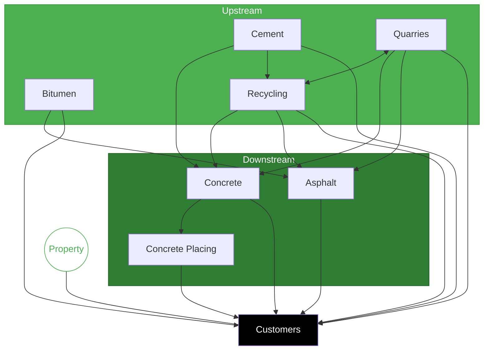
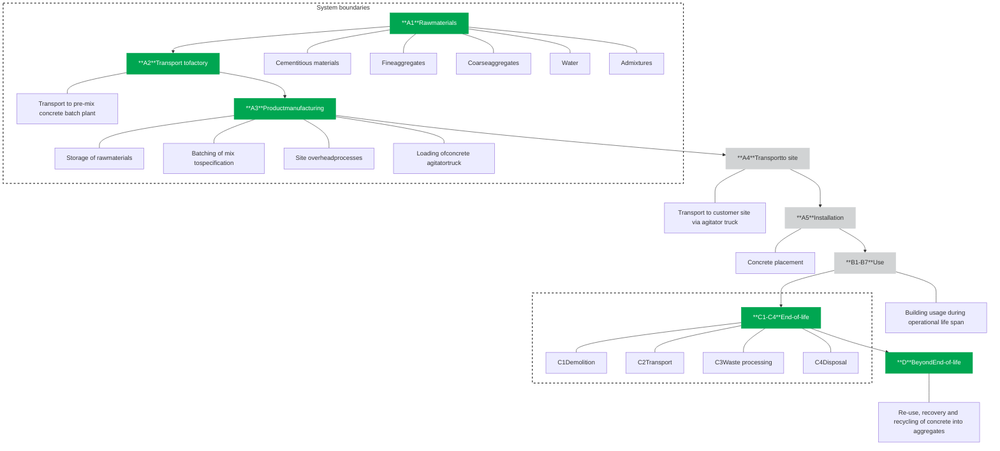

<PAGE>1<PAGE>
BORAL logo

Building
something
great

# Environmental Product Declaration

40MPa 20mm Enviro 50% SCM 100SL Conc

Melbourne

Photograph of a modern building at dusk with bright lights

**EPD HUB, HUB-5555**

Published on 26.02.2026, last updated on 26.02.2026, valid until 25.02.2031

ECO PLATFORM EPD VERIFIED logo EPD Hub logo One Click LCA logo

<PAGE>2<PAGE>
# Contents

**Environmental Product Declaration** ...................................................................................................................**1**

**General information** .............................................................................................................................................**3**
*Manufacturer and site* .............................................................................................................................................3
*EPD standards, scope and verification* ...................................................................................................................3
*Product specification* .............................................................................................................................................4
*Product characteristics* ..........................................................................................................................................4
*Environmental data summary* .................................................................................................................................4

**Life cycle assessment**...........................................................................................................................................**5**
*System boundaries* .................................................................................................................................................5
*Cut-off criteria* .......................................................................................................................................................5
*Validation of Data* .................................................................................................................................................5
*Allocation, estimates and assumptions* .................................................................................................................6
*Product & manufacturing sites grouping* ...............................................................................................................6
*Product raw material main composition* ................................................................................................................6
*Substances, REACH – very high concern*...............................................................................................................6
*Biogenic carbon content* ........................................................................................................................................6

**About Boral** ..........................................................................................................................................................**7**

**Product life-cycle**................................................................................................................................................**11**
*Manufacturing (A1-A3)* ........................................................................................................................................11
*Transport and installation (A4-A5)*.......................................................................................................................11
*Product use and maintenance (B1-B7)* ................................................................................................................11
*Product end-of-life (C1-C4, D)*............................................................................................................................11
*System Diagram* ..................................................................................................................................................12
*LCA software and bibliography* ...........................................................................................................................12

**Environmental impact data**................................................................................................................................**13**
*Core environmental impact indicators – EN 15804+A2, EF 3.1*...........................................................................13
*Additional environmental impact indicators – EN 15804+A2, EF 3.1*..................................................................14
*Use of natural resources* .....................................................................................................................................15
*End of life – Waste* ..............................................................................................................................................16
*End of life – Output flows*....................................................................................................................................17
*Environmental impacts – EN 15804+A1, CML / ISO 21930* .................................................................................17
*Additional indicator – GWP-GHG* ........................................................................................................................18

**Scenario documentation**....................................................................................................................................**19**

**Third-party verification statement** ....................................................................................................................**20**

<PAGE>3<PAGE>
# General information

## Manufacturer and site

| **Manufacturer**                     | Boral Limited                                       |
| ------------------------------------ | --------------------------------------------------- |
| **Address**                          | Level 3, Triniti 2, 39 Delhi Rd, North Ryde NSW, AU |
| **Contact details**                  | sustainability\@boral.com.au                        |
| **Website**                          | www\.boral.com.au                                   |
| **Place of production**              | Melbourne                                           |
| **Place(s) of raw material origin**  | Australia                                           |
| **Place(s) of installation and use** | Australia                                           |
| **Period for data**                  | FY25                                                |

## EPD standards, scope and verification

| **Program operator**   | EPD Hub, hub\@epdhub.com                                                                                                             |
| ---------------------- | ------------------------------------------------------------------------------------------------------------------------------------ |
| **Reference standard** | EN 15804:2012+A2:2019/AC:2021 and ISO 14025                                                                                          |
| **PCR**                | EPD Hub Core PCR version 1.2, 24 Mar 2025                                                                                            |
| **cPCR**               | EN 16757 Product Category Rules for concrete and concrete elements                                                                   |
| **Sector**             | Construction product                                                                                                                 |
| **Category of EPD**    | Third party verified EPD                                                                                                             |
| **Scope of the EPD**   | Cradle-to-gate (A1-3) with modules C1-4, D                                                                                           |
| **EPD author**         | Lewis Beard (Boral Construction Materials Ltd)                                                                                       |
| **EPD verification**   | Independent verification of this EPD and data, according to ISO 14025: \[ ] Internal verification \[x] External verification |
| **EPD verifier**       | Vera Durão, as an authorised verifier acting for EPD Hub Limited                                                                     |

<PAGE>4<PAGE>
# Environmental Product Declaration
IN ACCORDANCE WITH EN 15804+A2 & ISO 14025

## Product specification

| **Product name**            | 40MPa 20mm Enviro 50% SCM 100SL Conc                                                                                                                                                                                                                                                                                                                                                                                                                                                                                                                                                                                  |
| --------------------------- | --------------------------------------------------------------------------------------------------------------------------------------------------------------------------------------------------------------------------------------------------------------------------------------------------------------------------------------------------------------------------------------------------------------------------------------------------------------------------------------------------------------------------------------------------------------------------------------------------------------------- |
| **Concrete type**           | Ready-mix concrete                                                                                                                                                                                                                                                                                                                                                                                                                                                                                                                                                                                                    |
| **Product standards**       | AS 1379 Specification and supply of concrete                                                                                                                                                                                                                                                                                                                                                                                                                                                                                                                                                                          |
| **Product description**     | Boral’s ENVIROCRETE® concrete is a lower carbon concrete product which complies with AS 1379. It contains supplementary cementitious materials to reduce the portland cement content. ENVIROCRETE® concrete is available with two levels of portland cement reduction. ENVIROCRETE® 30% has a minimum portland cement reduction of 30% compared to the GBCA and ISC reference case and ENVIROCRETE® 40% has a minimum portland cement reduction of 40% when compared to the GBCA and ISC reference case. ENVIROCRETE® 30% and 40% are ideal for general applications where high-performance concrete is not required. |
| **A1-A3 Specific data (%)** | 99.5                                                                                                                                                                                                                                                                                                                                                                                                                                                                                                                                                                                                                  |

## Product characteristics

**Compressive strength class:**
S40

**Strength evaluation days:**
28 days

This EPD is intended for business-to-business and/or business-to-consumer communication. Life Cycle Assessment study has been performed in accordance with the requirements of EN 15804, EPD Hub PCR version 1.2 (24 Mar 2025) and JRC characterisation factors EF 3.1. The manufacturer has the sole ownership, liability, and responsibility for the EPD. EPDs within the same product category but from different programs may not be comparable. EPDs of construction products may not be comparable if they do not comply with EN 15804 and if they are not compared in a building context.

## Environmental data summary

| **Declared unit**                   | 1 cubic metre |
| ----------------------------------- | ------------- |
| **Declared unit mass, kg**          | 2338          |
| **GWP-total, A1-A3 (kg CO₂e)**      | 2.20E+02      |
| **GWP-fossil, A1-A3 (kg CO₂e)**     | 2.20E+02      |
| **Secondary material, inputs (%)**  | 0             |
| **Secondary material, outputs (%)** | 70            |
| **Total energy use, A1-A3 (kWh)**   | 318           |
| **Net freshwater use, A1-A3 (m³)**  | 4.97E+00      |

<PAGE>5<PAGE>
# Life cycle assessment

## System boundaries

This EPD covers the life-cycle modules listed in the following table.

| Product stage A1 | Product stage A2 | Product stage A3 | Assembly stage A4 | Assembly stage A5 | Use stage B1 | Use stage B2 | Use stage B3 | Use stage B4 | Use stage B5 | Use stage B6       | Use stage B7      | End of life stage C1   | End of life stage C2 | End of life stage C3 | End of life stage C4 | Beyond the system D | Beyond the system D | Beyond the system D |
| -------------------- | -------------------- | -------------------- | --------------------- | --------------------- | ---------------- | ---------------- | ---------------- | ---------------- | ---------------- | ---------------------- | --------------------- | -------------------------- | ------------------------ | ------------------------ | ------------------------ | ----------------------- | ----------------------- | ----------------------- |
| x                    | x                    | x                    | ND                    | ND                    | ND               | ND               | ND               | ND               | ND               | ND                     | ND                    | x                          | x                        | x                        | x                        | x                       | x                       | x                       |
| Raw materials        | Transport            | Manufacturing        | Transport             | Assembly              | Use              | Maintenance      | Repair           | Replacement      | Refurbishment    | Operational energy use | Operational water use | Deconstruction/ demolition | Transport                | Waste processing         | Disposal                 | Reuse                   | Recovery                | Recycling               |

Modules not declared = ND

## Cut-off criteria

The study does not exclude any modules or processes which are stated mandatory in the reference standard and the applied PCR. The study does not exclude any hazardous materials or substances. There is no neglected unit process more than 1% of total mass or energy flows. The module specific total neglected input and output flows also do not exceed 5% of energy usage or mass.

The production of capital equipment, construction activities, and infrastructure, maintenance and operation of capital equipment, personnel-related activities, energy and water use related to company management and sales activities are excluded.

## Validation of Data

Data collection for production, transport, and packaging was conducted using time and site-specific information, as defined in the general information section on page 1 and 2. Upstream process calculations rely on generic data as defined in the Bibliography section. Manufacturer-provided specific and generic data were used for the product’s manufacturing stage. The analysis was performed in One Click LCA EPD Generator, with the 'Cut-Off, EN 15804+A2' allocation method, and characterisation factors according to EN 15804:2012+A2:2019/AC:2021 and JRC EF 3.1.

<PAGE>6<PAGE>
## Allocation, estimates and assumptions

All allocations are done as per the reference standards and the applied PCR. In this study, allocation has been done in the following ways:

| Data type                          | Allocation        |
| ---------------------------------- | ----------------- |
| **Raw materials**                  | No allocation     |
| **Packaging materials**            | Not applicable    |
| **Ancillary materials**            | Allocated by mass |
| **Manufacturing energy and waste** | Allocated by mass |

## Product & manufacturing sites grouping

| **Type of grouping**                     | Multiple sites                                              |
| ---------------------------------------- | ----------------------------------------------------------- |
| **Grouping method**                      | Based on average results of product group - by total volume |
| **Variation in GWP-fossil for A1-A3, %** | Variation in GWP for modules A1-A3 is -0.5% to 1.7%         |

This EPD is declared as a single product manufactured at multiple sites in the Melbourne metropolitan region of Victoria. These sites are grouped together on the basis of having the same supply chain and major production steps. Results are averaged by production volume across the sites. There are 8 sites covered in this region: Deer Park, Tullamarine, Somerton, Sunbury, Wollert, Melton, West Melbourne, and West Melbourne (wet)

## Product raw material main composition

The product is a ready-mix concrete consisting of aggregates, cement, filler, admixtures, and water. Main material categories as per EPD Hub GPI are shown below:

| Raw material category   | Amount, mass- % | Material origin |
| ----------------------- | --------------- | --------------- |
| **Metals**              | 0               | -               |
| **Minerals**            | 100             | Australia       |
| **Fossil materials**    | 0               | -               |
| **Bio-based materials** | 0               | -               |

## Substances, REACH – very high concern

The product does not contain any REACH SVHC substances in amounts greater than 0.1 % (1000 ppm).

## Biogenic carbon content

This product does not contain any biogenic carbon content in amounts greater than 5%.

<PAGE>7<PAGE>
# About Boral

**Boral is Australia’s largest vertically-integrated construction materials company. That means we not only supply customers with outstanding raw materials like aggregate and sand, we also develop and produce advanced construction materials and solutions like low-carbon concretes and advanced asphalts.**

Our network includes prized quarry and cement infrastructure, bitumen, construction materials recycling, asphalt and concrete batching operations. We work year-round to help customers deliver high-profile civil works and major infrastructure projects, as well as key residential, commercial and industrial developments.

We employ about 7,500 employees and contractors working in research, production and business support across more than 360 locations nationwide.

For nearly 80 years, we’ve been building something great in Australia. From the surface of the Sydney Harbour Bridge to the walls of Melbourne’s Metro Tunnel, from the asphalt at Adelaide Airport right through to much of the concrete used in Brisbane’s Gateway Bridge and Perth’s Forrestville Airport Link, Boral has been making history around Australia.

Boral concrete has over 200 pre-mix concrete plants around Australia producing a wide range of concrete mixes in metropolitan and country areas. Boral concrete supplies pre-mix concrete to all segments of the construction industry including infrastructure, social, commercial and residential construction.

## Construction materials

Leading integrated network

# 360
Operating sites\*

| Business Unit      | WA | NT | SA | QLD | NSW/ACT | VIC | TAS |
| ------------------ | -- | -- | -- | --- | ------- | --- | --- |
| 209 Concrete       | 11 | 1  | 9  | 54  | 96      | 35  | 3   |
| 76 Quarries        | 6  | 1  | 9  | 17  | 25      | 13  | 5   |
| 41 Asphalt         | 1  | 1  | 2  | 16  | 11      | 10  | 1   |
| 17 Cement          |    |    | 1  | 2   | 11      | 3   |     |
| 14 Recycling       |    |    |    | 1   | 6       | 6   |     |
| 3 Concrete Placing |    |    |    | 1   | 2       |     |     |

\* Includes transport, fly ash and research and development sites.

<PAGE>8<PAGE>
# Our integrated network

Valuable upstream and downstream operations with market leadership.

**Boral moves ~50 million tonnes of products per year across its network**

Flowchart of Boral's integrated network showing the flow of materials from Upstream (Cement, Quarries, Bitumen, Recycling) to Downstream (Concrete, Asphalt, Concrete Placing) and finally to Customers, with Property as a separate entity.

<PAGE>9<PAGE>
# A lower carbon concrete product for every option

Boral’s range of lower carbon concrete products will help you achieve your sustainability, engineering and architectural goals.

**Boral Concrete’s Lower Carbon Concrete (LCC) products can be used for all types of structures including:**

* houses

* commercial buildings

* multi-residential buildings

* high-rise buildings

* civil projects, and

* infrastructure projects.

**Boral’s Lower Carbon Concrete (LCC) products include products with good early age strength and superior engineering properties.** They can be used for precast and post tensioned slabs so there is no compromise to the construction schedule and engineers can take advantage of the superior drying shrinkage properties.

By matching the engineering properties of each product with the structural requirements, the carbon footprint of the project can be reduced for the optimal cost.

Boral has three product ranges: ENVIROCRETE®, ENVIROCRETE® PLUS and ENVISIA®. ENVIROCRETE® concrete is a traditional lower carbon concrete product, Envirocrete® plus has better early age strength and drying shrinkage properties and Envisia® concrete has the best early age strength and drying shrinkage properties.

Traditional lower carbon concrete products have low early age strength and may have higher drying shrinkage which makes them less desirable for many applications. In particular, they are unsuitable for precast elements and post tensioned slabs.

ENVISIA® concrete also has a light colour and exhibits a very good appearance in an off–formwork finish.

Lower carbon concrete products
For all types of Structures

Photograph of a modern green building (One Central Park) with icons for Residential, Commercial, Multi-residential, High-rise, Civil, and Infrastructure

<PAGE>10<PAGE>
# Lower carbon concrete products

For all types of structures

Residential icon

Residential

Commercial icon

Commercial

Multi-residential icon

Multi-residential

High-rise icon

High-rise

Civil icon

Civil

Infrastructure icon

Infrastructure

## ENVIROCRETE® products

Are suitable for all general applications where good early age strength and low drying shrinkage are not required.

Photograph of a building project using ENVIROCRETE

* Low portland cement.
* Low embodied carbon.
* General applications.
* Suitable for projects targeting a GBCA1 or ISC2 rating.
* Low portland cement.
* Low embodied carbon.
* General applications.
* Suitable for projects targeting a GBCA1 or ISC2 rating.

## ENVIROCRETE® PLUS products

Have good early age strength and can be used for some post tensioned applications. They also have good drying shrinkage characteristics which will comply with the shrinkage requirements in most engineering specifications.

Photograph of a building project using ENVIROCRETE PLUS

* Low portland cement.
* Low embodied carbon.
* Low drying shrinkage.
* Good early age strength, suitable for most standard post tension applications.
* Suitable for projects targeting a GBCA1 or ISC2 rating.

## ENVISIA® products

Have excellent early age strength and drying shrinkage characteristics. They can be used for all standard post tensioned concrete applications and their low shrinkage characteristics provides engineers and architects with more design options. They have a light colour which provides architectural benefits, and they have excellent resistant to chloride ingress making them suitable for marine environments.

Photograph of a building project using ENVISIA

* Low portland cement.
* Low embodied carbon.
* Very low drying shrinkage.
* Good early age strength, suitable for all standard post tension applications.
* Very low drying shrinkage.
* Excellent resistance to chloride ingress.
* Light colour provides architectural benefits.
* Suitable for projects targeting a GBCA1 or ISC2 rating.

| Environmental properties              | Environmental properties | Environmental properties | Environmental properties |
| ------------------------------------- | ------------------------ | ------------------------ | ------------------------ |
| Reduction in Portland cement3,4,5     | 30% - 70%                | 45% - 70%                | 50% - 70%                |
| Reduction in embodied carbon⁶         | ● ● ○ ○                  | ● ● ● ○                  | ● ● ● ●                  |
| Engineering and durability properties |                          |                          |                          |
| Early age strength                    | \[yes]                   | ● ●                      | ● ● ●                    |
| Drying shrinkage                      | \[yes]                   | ● ● ●                    | ● ● ● ●                  |
| Durability in a marine environment    | \[yes]                   | ● ●                      | ● ● ● ●                  |

1 Green Building Council of Australia (GBCA). 2 Infrastructure Sustainability Council (ISC). 3 Using the reference case from the GBCA Design and As-Built v1.3 rating tool. 4 The portland cement reductions in the table do not apply to Tasmania. Please contact the Boral Tasmanian office. 5 For specific values contact the local Boral office. 6 The dots indicate the relative reduction in embodied carbon. The hollow dots represent the potential relative reduction in embodied carbon. Contact the local Boral office for specific embodied carbon values. Alternatively, they can be found in Boral’s Environmental Product Declarations which can be downloaded from boral.com.au/EPDs.

<PAGE>11<PAGE>
# Product life-cycle

## Manufacturing (A1-A3)

The environmental impacts considered for the product stage cover the manufacturing of raw materials used in the production. Also, fuels used by machines, and handling of waste formed in the production processes at the manufacturing facilities are included in this stage. The study also considers the material losses occurring during the manufacturing processes as well as losses during electricity transmission and transformation. A market-based approach is used in modelling the electricity mix utilised in the batch plant.

Ready-mix concrete production starts by transporting the binders, aggregates, and additives to the manufacturing site and storing them into closed silos and containers. The considered transportation impacts include exhaust emissions resulting from transportation of raw materials from suppliers to manufacturing facilities as well as the environmental impacts of the production of the fuel used. The manufacturing, maintenance and disposal of the vehicles as well as tyre and road wear during transportation have also been included. The transportation distances and methods are based on the known supply chain for this product using information collected from local Boral teams, including road, rail and shipping. Where multiple manufacturing sites are being grouped, distances are averaged across the sites.

The aggregates are dosed onto a scale and transferred to a concrete mixer. In the mixer, cement is added to the aggregates, after which the material is mixed dry. Water and additives are then added to the mixture, followed by wet mixing. After mixing, the concrete mass is unloaded from the mixer into the tank of the concrete agitator truck, which is transported to the construction site.

No packaging is included as the product is transported with mixer trucks.

## Transport and installation (A4-A5)

Installation includes the energy used for concrete application. This consists of the energy spent by a concrete mixer truck and a concrete pump.

Modules not declared.

## Product use and maintenance (B1-B7)

This EPD does not cover the use phase. Air, soil, and water impacts during the use phase have not been studied. Carbonation is not taken into account in this EPD.

Modules not declared.

## Product end-of-life (C1-C4, D)

At the end of its life, the concrete is assumed to be part of a concrete building that is demolished using machinery, consuming energy in the form of diesel (C1).

The concrete recovered after demolition is delivered 50 km by truck to the nearest construction waste treatment site (C2). It is assumed that 100% of the demolished concrete is transported to a site where this waste is processed by crushing the blocks to gravel. About 70% of concrete can be recycled this way (C3), with an assumption that non-reinforced concrete is being sorted (Gervasio, H. and Dimova, S., 2018. Model for Life Cycle Assessment (LCA) of buildings. European Commission, Joint Research Centre.). The remaining 30% of concrete is assumed to be sent to the landfill for disposal (C4). The crushed concrete received from waste treatment can be used as a replacement for virgin gravel or for raw materials in road construction (D). The process losses of the waste treatment plant are assumed to be negligible.

<PAGE>12<PAGE>
**Environmental Product Declaration**

IN ACCORDANCE WITH EN 15804+A2 & ISO 14025

# System Diagram

This system shows the system boundary with dashed lines and shows included modules in green, while excluded ones are in grey.

## LCA software and bibliography

The LCA and EPD have been prepared according to the reference standards and ISO 14040/14044. Ecoinvent v3.10.1 and One Click LCA databases were used as sources of environmental data. Allocation used in Ecoinvent 3.10.1 environmental data sources follow the methodology ‘allocation, cut-off, EN 15804+A2‘.

<PAGE>13<PAGE>
# Environmental impact data

The estimated impact results are only relative statements which do not indicate the end points of the impact categories, exceeding threshold values, safety margins or risks.

## Core environmental impact indicators – EN 15804+A2, EF 3.1

| Impact category         | Unit       | A1       | A2       | A3       | A1-A3    |
| ----------------------- | ---------- | -------- | -------- | -------- | -------- |
| GWP – total¹            | kg CO₂e    | 2.09E+02 | 6.12E+00 | 5.60E+00 | 2.20E+02 |
| GWP – fossil            | kg CO₂e    | 2.08E+02 | 6.11E+00 | 5.60E+00 | 2.20E+02 |
| GWP – biogenic          | kg CO₂e    | 8.04E-02 | 1.14E-02 | 7.60E-04 | 9.26E-02 |
| GWP – LULUC             | kg CO₂e    | 7.35E-02 | 4.71E-05 | 4.60E-04 | 7.40E-02 |
| Ozone depletion pot.    | kg CFC-₁₁e | 1.83E-06 | 1.01E-06 | 4.94E-08 | 2.89E-06 |
| Acidification potential | mol H⁺e    | 1.50E+00 | 2.51E-02 | 3.62E-02 | 1.56E+00 |
| EP-freshwater²          | kg Pe      | 3.89E-02 | 2.01E-04 | 9.11E-04 | 4.00E-02 |
| EP-marine               | kg Ne      | 3.73E-01 | 8.43E-03 | 7.62E-03 | 3.89E-01 |
| EP-terrestrial          | mol Ne     | 4.04E+00 | 9.42E-02 | 8.07E-02 | 4.21E+00 |
| POCP (“smog”)³          | kg NMVOCe  | 1.08E+00 | 3.17E-02 | 2.47E-02 | 1.13E+00 |
| ADP-minerals & metals⁴  | kg Sbe     | 3.23E-06 | 1.96E-05 | 2.07E-06 | 2.49E-05 |
| ADP-fossil resources    | MJ         | 9.34E+02 | 7.85E+01 | 6.79E+01 | 1.08E+03 |
| Water use⁵              | m³e depr.  | 2.26E+02 | 5.34E+01 | 3.69E+01 | 3.17E+02 |

<PAGE>14<PAGE>
| Impact category         | Unit       | C1       | C2       | C3        | C4        | D         |
| ----------------------- | ---------- | -------- | -------- | --------- | --------- | --------- |
| GWP – total             | kg CO₂e    | 4.45E+00 | 1.26E+01 | 7.16E+00  | 4.38E+00  | -1.28E+01 |
| GWP – fossil            | kg CO₂e    | 4.45E+00 | 1.26E+01 | 7.16E+00  | 4.38E+00  | -1.27E+01 |
| GWP – biogenic          | kg CO₂e    | 4.54E-04 | 2.85E-03 | -7.31E-04 | -1.39E-03 | -4.00E-02 |
| GWP – LULUC             | kg CO₂e    | 4.56E-04 | 5.63E-03 | 7.34E-04  | 2.50E-03  | -1.76E-02 |
| Ozone depletion pot.    | kg CFC-11e | 6.81E-08 | 1.86E-07 | 1.10E-07  | 1.27E-07  | -1.07E-06 |
| Acidification potential | mol H⁺e    | 4.01E-02 | 4.29E-02 | 6.46E-02  | 3.10E-02  | -8.33E-02 |
| EP-freshwater           | kg Pe      | 1.28E-04 | 9.80E-04 | 2.07E-04  | 3.60E-04  | -7.54E-04 |
| EP-marine               | kg Ne      | 1.86E-02 | 1.41E-02 | 3.00E-02  | 1.18E-02  | -1.80E-02 |
| EP-terrestrial          | mol Ne     | 2.04E-01 | 1.53E-01 | 3.28E-01  | 1.29E-01  | -2.35E-01 |
| POCP (“smog”)           | kg NMVOCe  | 6.08E-02 | 6.32E-02 | 9.79E-02  | 4.63E-02  | -6.04E-02 |
| ADP-minerals & metals   | kg Sbe     | 1.59E-06 | 3.51E-05 | 2.57E-06  | 6.96E-06  | -1.28E-04 |
| ADP-fossil resources    | MJ         | 5.82E+01 | 1.83E+02 | 9.37E+01  | 1.07E+02  | -1.89E+02 |
| Water use               | m³e depr.  | 1.45E-01 | 9.02E-01 | 2.34E-01  | 3.10E-01  | -2.52E+01 |

1) GWP = Global Warming Potential; 2) EP = Eutrophication potential. Required characterisation method and data are in kg P-eq. Multiply by 3,07 to get PO4e; 3) POCP = Photochemical ozone formation; 4) ADP = Abiotic depletion potential; 5) EN 15804+A2 disclaimer for Abiotic depletion and Water use and optional indicators except Particulate matter and Ionising radiation, human health. The results of these environmental impact indicators shall be used with care as the uncertainties on these results are high or as there is limited experience with the indicator.

## Additional environmental impact indicators – EN 15804+A2, EF 3.1

| Impact category          | Unit      | A1       | A2       | A3       | A1-A3    |
| ------------------------ | --------- | -------- | -------- | -------- | -------- |
| Particulate matter       | Incidence | 7.60E-06 | 4.36E-07 | 8.13E-07 | 8.85E-06 |
| Ionising radiation⁶      | kBq U235e | 2.93E-01 | 0.00E+00 | 7.09E-02 | 3.64E-01 |
| Ecotoxicity (freshwater) | CTUe      | 1.58E+02 | 2.12E+01 | 1.08E+01 | 1.90E+02 |
| Human toxicity, cancer   | CTUh      | 1.93E-08 | 1.59E-09 | 4.19E-10 | 2.14E-08 |
| Human tox. non-cancer    | CTUh      | 5.35E-07 | 6.16E-08 | 2.84E-08 | 6.25E-07 |
| SQP⁷                     | -         | 6.43E+02 | 1.84E+01 | 1.79E+01 | 6.80E+02 |

<PAGE>15<PAGE>
| Impact category          | Unit      | C1       | C2       | C3       | C4       | D         |
| ------------------------ | --------- | -------- | -------- | -------- | -------- | --------- |
| Particulate matter       | Incidence | 1.14E-06 | 1.26E-06 | 1.40E-05 | 7.06E-07 | -1.07E-06 |
| Ionising radiation       | kBq U235e | 2.58E-02 | 1.59E-01 | 4.15E-02 | 6.75E-02 | -3.01E+00 |
| Ecotoxicity (freshwater) | CTUe      | 3.20E+00 | 2.58E+01 | 5.16E+00 | 9.01E+00 | -2.27E+02 |
| Human toxicity, cancer   | CTUh      | 4.57E-10 | 2.08E-09 | 7.36E-10 | 8.07E-10 | -1.32E-08 |
| Human tox. non-cancer    | CTUh      | 7.24E-09 | 1.18E-07 | 1.17E-08 | 1.85E-08 | -2.42E-07 |
| SQP                      | -         | 4.08E+00 | 1.84E+02 | 6.56E+00 | 2.12E+02 | -1.82E+02 |

6) EN 15804+A2 disclaimer for Ionising radiation, human health. This impact category deals mainly with the eventual impact of low-dose ionising radiation on human health of the nuclear fuel cycle. It does not consider effects due to possible nuclear accidents, occupational exposure nor due to radioactive waste disposal in underground facilities. Potential ionising radiation from the soil, from radon and from some construction materials is also not measured by this indicator; 7) SQP = Land use related impacts/soil quality.

## Use of natural resources

| Impact category          | Unit | A1       | A2       | A3        | A1-A3    |
| ------------------------ | ---- | -------- | -------- | --------- | -------- |
| Renew. PER as energy⁸    | MJ   | 6.39E+01 | 8.93E-01 | 6.37E-01  | 6.54E+01 |
| Renew. PER as material   | MJ   | 0.00E+00 | 0.00E+00 | 0.00E+00  | 0.00E+00 |
| Total use of renew. PER  | MJ   | 6.39E+01 | 8.93E-01 | 6.37E-01  | 6.54E+01 |
| Non-re. PER as energy    | MJ   | 9.29E+02 | 8.24E+01 | 6.86E+01  | 1.08E+03 |
| Non-re. PER as material  | MJ   | 8.79E+00 | 0.00E+00 | -3.38E-01 | 8.45E+00 |
| Total use of non-re. PER | MJ   | 9.38E+02 | 8.24E+01 | 6.82E+01  | 1.09E+03 |
| Secondary materials      | kg   | 7.56E-03 | 0.00E+00 | 0.00E+00  | 7.56E-03 |
| Renew. secondary fuels   | MJ   | 6.58E-06 | 0.00E+00 | 7.41E-05  | 8.07E-05 |
| Non-ren. secondary fuels | MJ   | 0.00E+00 | 0.00E+00 | 0.00E+00  | 0.00E+00 |
| Use of net fresh water   | m³   | 3.66E+00 | 1.24E+00 | 6.98E-02  | 4.97E+00 |

<PAGE>16<PAGE>
| Impact category          | Unit | C1       | C2       | C3        | C4        | D         |
| ------------------------ | ---- | -------- | -------- | --------- | --------- | --------- |
| Renew. PER as energy     | MJ   | 3.69E-01 | 2.50E+00 | 5.93E-01  | 1.04E+00  | -1.87E+01 |
| Renew. PER as material   | MJ   | 0.00E+00 | 0.00E+00 | 0.00E+00  | 0.00E+00  | 0.00E+00  |
| Total use of renew. PER  | MJ   | 3.69E-01 | 2.50E+00 | 5.93E-01  | 1.04E+00  | -1.87E+01 |
| Non-re. PER as energy    | MJ   | 5.82E+01 | 1.83E+02 | 9.37E+01  | 1.07E+02  | -1.95E+02 |
| Non-re. PER as material  | MJ   | 0.00E+00 | 0.00E+00 | -5.91E+00 | -2.53E+00 | 5.91E+00  |
| Total use of non-re. PER | MJ   | 5.82E+01 | 1.83E+02 | 8.78E+01  | 1.05E+02  | -1.89E+02 |
| Secondary materials      | kg   | 0.00E+00 | 0.00E+00 | 0.00E+00  | 0.00E+00  | 0.00E+00  |
| Renew. secondary fuels   | MJ   | 6.32E-05 | 9.87E-04 | 1.02E-04  | 5.59E-04  | -1.51E-03 |
| Non-ren. secondary fuels | MJ   | 0.00E+00 | 0.00E+00 | 0.00E+00  | 0.00E+00  | 0.00E+00  |
| Use of net fresh water   | m³   | 3.85E-03 | 2.70E-02 | 6.19E-03  | 1.12E-01  | -5.85E-01 |

8) PER = Primary energy resources.

## End of life – Waste

| Impact category     | Unit | A1       | A2       | A3       | A1-A3    |
| ------------------- | ---- | -------- | -------- | -------- | -------- |
| Hazardous waste     | kg   | 2.90E-02 | 1.09E-04 | 2.97E-02 | 5.88E-02 |
| Non-hazardous waste | kg   | 4.97E+00 | 8.67E-01 | 7.77E-01 | 6.62E+00 |
| Radioactive waste   | kg   | 2.45E-04 | 5.01E-07 | 1.16E-05 | 2.57E-04 |

| Impact category     | Unit | C1       | C2       | C3       | C4       | D         |
| ------------------- | ---- | -------- | -------- | -------- | -------- | --------- |
| Hazardous waste     | kg   | 6.48E-02 | 3.09E-01 | 1.04E-01 | 1.19E-01 | -1.47E+00 |
| Non-hazardous waste | kg   | 8.83E-01 | 5.72E+00 | 1.42E+00 | 2.71E+00 | -2.73E+01 |
| Radioactive waste   | kg   | 6.32E-06 | 3.89E-05 | 1.02E-05 | 1.65E-05 | -3.76E-04 |

<page_number>16</page_number>

<PAGE>17<PAGE>
# End of life – Output flows

| Impact category               | Unit | A1       | A2       | A3       | A1-A3    |
| ----------------------------- | ---- | -------- | -------- | -------- | -------- |
| Components for re-use         | kg   | 0.00E+00 | 0.00E+00 | 0.00E+00 | 0.00E+00 |
| Materials for recycling       | kg   | 5.04E-06 | 0.00E+00 | 6.55E+01 | 6.55E+01 |
| Materials for energy recovery | kg   | 0.00E+00 | 0.00E+00 | 0.00E+00 | 0.00E+00 |
| Exported energy               | MJ   | 0.00E+00 | 0.00E+00 | 0.00E+00 | 0.00E+00 |
| Exported energy – Electricity | MJ   | 0.00E+00 | 0.00E+00 | 0.00E+00 | 0.00E+00 |
| Exported energy – Heat        | MJ   | 0.00E+00 | 0.00E+00 | 0.00E+00 | 0.00E+00 |

| Impact category               | Unit | C1       | C2       | C3       | C4       | D        |
| ----------------------------- | ---- | -------- | -------- | -------- | -------- | -------- |
| Components for re-use         | kg   | 0.00E+00 | 0.00E+00 | 0.00E+00 | 0.00E+00 | 0.00E+00 |
| Materials for recycling       | kg   | 0.00E+00 | 0.00E+00 | 1.64E+03 | 0.00E+00 | 0.00E+00 |
| Materials for energy recovery | kg   | 0.00E+00 | 0.00E+00 | 0.00E+00 | 0.00E+00 | 0.00E+00 |
| Exported energy               | MJ   | 0.00E+00 | 0.00E+00 | 0.00E+00 | 0.00E+00 | 0.00E+00 |
| Exported energy – Electricity | MJ   | 0.00E+00 | 0.00E+00 | 0.00E+00 | 0.00E+00 | 0.00E+00 |
| Exported energy – Heat        | MJ   | 0.00E+00 | 0.00E+00 | 0.00E+00 | 0.00E+00 | 0.00E+00 |

# Environmental impacts – EN 15804+A1, CML / ISO 21930

| Impact category      | Unit       | A1       | A2       | A3       | A1-A3    |
| -------------------- | ---------- | -------- | -------- | -------- | -------- |
| Global Warming Pot.  | kg CO₂e    | 2.09E+02 | 6.10E+00 | 5.57E+00 | 2.20E+02 |
| Ozone depletion Pot. | kg CFC₋₁₁e | 1.47E-06 | 7.97E-07 | 4.17E-08 | 2.31E-06 |
| Acidification        | kg SO₂e    | 1.00E+00 | 1.89E-02 | 2.98E-02 | 1.05E+00 |
| Eutrophication       | kg PO₄³⁻e  | 2.47E-01 | 4.06E-03 | 5.42E-03 | 2.56E-01 |
| POCP (“smog”)        | kg C₂H₄e   | 3.68E-02 | 7.62E-04 | 1.48E-03 | 3.90E-02 |
| ADP-elements         | kg Sbe     | 1.83E-06 | 1.34E-05 | 2.02E-06 | 1.73E-05 |
| ADP-fossil           | MJ         | 1.75E+02 | 8.24E+01 | 6.77E+01 | 3.25E+02 |

<PAGE>18<PAGE>
| Impact category      | Unit       | C1       | C2       | C3       | C4       | D         |
| -------------------- | ---------- | -------- | -------- | -------- | -------- | --------- |
| Global Warming Pot.  | kg CO₂e    | 4.42E+00 | 1.25E+01 | 7.12E+00 | 4.34E+00 | -1.58E+01 |
| Ozone depletion Pot. | kg CFC₋₁₁e | 5.40E-08 | 1.48E-07 | 8.69E-08 | 1.01E-07 | -1.09E-07 |
| Acidification        | kg SO₂e    | 2.82E-02 | 3.28E-02 | 4.55E-02 | 2.30E-02 | -7.57E-02 |
| Eutrophication       | kg PO₄³⁻e  | 6.60E-03 | 7.98E-03 | 1.06E-02 | 7.30E-03 | -1.49E-02 |
| POCP (“smog”)        | kg C₂H₄e   | 2.12E-03 | 2.92E-03 | 3.41E-03 | 2.17E-03 | -6.74E-03 |
| ADP-elements         | kg Sbe     | 1.55E-06 | 3.42E-05 | 2.50E-06 | 6.82E-06 | -8.64E-05 |
| ADP-fossil           | MJ         | 5.78E+01 | 1.80E+02 | 9.30E+01 | 1.06E+02 | -1.95E+02 |

## Additional indicator – GWP-GHG

| Impact category | Unit    | A1       | A2       | A3       | A1-A3    |
| --------------- | ------- | -------- | -------- | -------- | -------- |
| GWP-GHG⁹        | kg CO₂e | 2.09E+02 | 6.11E+00 | 5.60E+00 | 2.20E+02 |

| Impact category | Unit    | C1       | C2       | C3       | C4       | D         |
| --------------- | ------- | -------- | -------- | -------- | -------- | --------- |
| GWP-GHG         | kg CO₂e | 4.45E+00 | 1.26E+01 | 7.16E+00 | 4.38E+00 | -1.27E+01 |

9) This indicator includes all greenhouse gases excluding biogenic carbon dioxide uptake and emissions and biogenic carbon stored in the product. In addition, the characterisation factors for the flows – CH4 fossil, CH4 biogenic and Dinitrogen monoxide – were updated. This indicator is identical to the GWP-total of EN 15804:2012+A2:2019 except that the characterisation factor for biogenic CO2 is set to zero.

<PAGE>19<PAGE>
# Scenario documentation

## Manufacturing energy scenario documentation

Manufacturing energy scenario documentation – A3 (Energy data source)

1. Construction, specialized activities, demolition and site preparation, Market for diesel, burned in building machine, World, ecoinvent 3.10.1, 0.10 kgCO2e/MJ

2. Electricity, Electricity, consumption mix w/o renewables, Victoria, 2024, Australia, LCA study for country specific consumption mixes, OneClickLCA 2025, 1.14 kgCO2e/kWh

Electricity data source: Australian Energy Update 2024, published by the Department of Climate Change, Energy, the Environment and Water (DCCEEW)

## End of life scenario documentation

| **Collection process – kg collected separately**                    | 0                                                                |
| ------------------------------------------------------------------- | ---------------------------------------------------------------- |
| **Collection process – kg collected with mixed construction waste** | 2338                                                             |
| **Recovery process – kg for re-use**                                | 0                                                                |
| **Recovery process – kg for recycling**                             | 1.64E+03                                                         |
| **Recovery process – kg for energy recovery**                       | 0                                                                |
| **Disposal (total) – kg for final deposition**                      | 7.01E+02                                                         |
| **Scenario assumptions e.g. transportation**                        | Market for transport, freight, lorry >32 metric ton, EURO5; 50km |

<PAGE>20<PAGE>
# Third-party verification statement

EPD Hub declares that this EPD is verified in accordance with ISO 14025 by an independent, third-party verifier. The project report on the Life Cycle Assessment and the report(s) on features of environmental relevance are filed at EPD Hub. EPD Hub PCR and ECO Platform verification checklist are used.

EPD Hub is not able to identify any unjustified deviations from the PCR and EN 15804+A2 in the Environmental Product Declaration and its project report.

EPD Hub maintains its independence as a third-party body; it was not involved in the execution of the LCA or in the development of the declaration and has no conflicts of interest regarding this verification.

The company-specific data and upstream and downstream data have been examined as regards plausibility and consistency. The publisher is responsible for ensuring the factual integrity and legal compliance of this declaration.

## Verified tools

**Tool verifier**: Imane Uald Lamkaddam
**Tool verification validity**: 28 March 2025 - 27 March 2028

signature: Xinyuan Zhang

EPD Hub VERIFIED ISO 14025 logo

Xinyuan Zhang
**Program assistant**

The software used in creation of this LCA and EPD is verified by EPD Hub to conform to the procedural and methodological requirements outlined in ISO 14025:2010, ISO 14040/14044, EN 15804+A2, and EPD Hub Core Product Category Rules and General Program Instructions.

