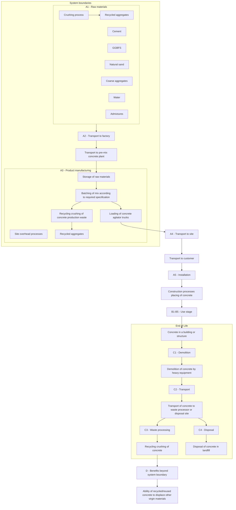
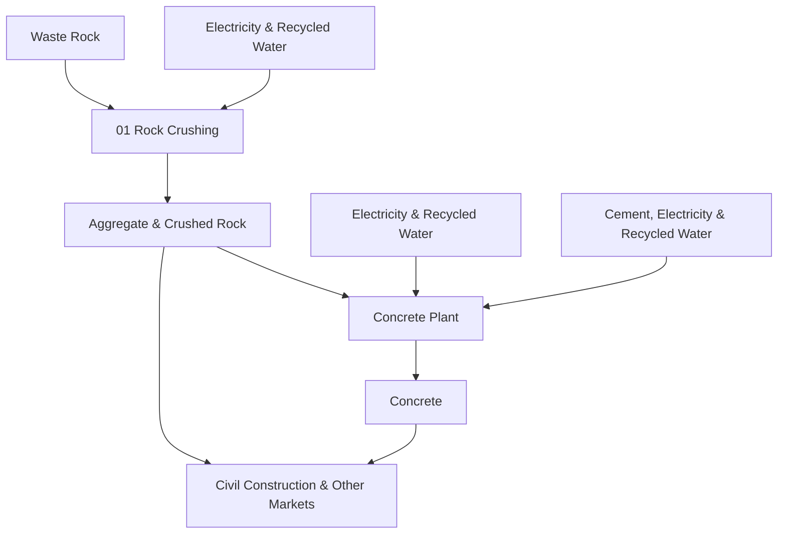

<PAGE>1<PAGE>
AURORA Environmental Product Declaration logo

# Environmental Product Declaration

In accordance with ISO 14025:2006 and EN 15804:2012+A2:2019/AC:2021

## AURORA CONSTRUCTION MATERIALS

### AR2520 pre-mixed concrete

manufactured at

**Rockbank**

Photograph of Aurora Construction Materials concrete mixer trucks at a facility

* **Programme**: The International EPD® System www.environdec.com
* **Programme operator**: EPD International AB
* **Regional Programme**: EPD Australasia www.epd-australasia.com
* **EPD Registration no. EPD-IES-0021754:001**
* **Version date: 2025-08-15**
* **Valid until: 2030-08-15**

EPD Australasia International EPD System logo

EPD of a single product from a manufacturer (from one location)
An EPD may be updated or depublished if conditions change.
To find the latest version of the EPD and to confirm its validity, see www.environdec.com

ECO PLATFORM EPD VERIFIED logo

<PAGE>2<PAGE>
# Contents

**General information** 1

**Information about EPD owner** 2

**Product information** 3

Technical compliance 3

Geographical scope 3

**Content declaration** 4

**LCA information** 5

Declared unit 5

Scope of the Environmental Product Declaration 5

Product stage (A1-A3) 7

End-of-life stage (C1-C4) 8

Resource recovery stage (D) 8

Background data 10

Data quality assessment 10

Cut-off criteria 11

Allocation 12

Key assumptions 12

Life cycle assessment (LCA) indicators 13

**Environmental performance** 15

Additional scenarios 19

**Abbreviations** 21

**Version history** 21

**References** 22

**Contact information** 23

> ### Disclaimer
> EPDs within the same product category but published in different EPD programmes, may not be comparable. For two EPDs to be comparable, they shall be based on the same PCR (including the same first-digit version number) or be based on fully-aligned PCRs or versions of PCRs; cover products with identical functions, technical performances and use (e.g. identical declared/functional units); have identical scope in terms of included life-cycle stages (unless the excluded life-cycle stage is demonstrated to be insignificant); apply identical impact assessment methods (including the same version of characterisation factors); and be valid at the time of comparison. For further information about comparability, see EN 15804 and ISO 14025.

<PAGE>3<PAGE>
AURORA logo

# General information

An Environmental Product Declaration (EPD) is a standardised way of quantifying the potential environmental impacts of a product or system. EPDs are produced according to a consistent set of rules – Product Category Rules (PCR) – that define the requirements within a given product category. These rules are a key part of ISO 14025 as they enable transparency and comparability between EPDs. This EPD is a “cradle-to-gate with modules C1-C4, D” declaration covering production and end-of-life life cycle stages.

This EPD is verified to be compliant with EN 15804. EPDs of construction products may not be comparable if they do not comply with EN15804. EPDs within the same product category but from different programs or utilising different PCR documents may not be comparable, see the disclaimer on the previous page. Aurora Construction Materials Epping Pty Ltd (Aurora), as the EPD owner, has the sole ownership, liability, and responsibility for the EPD.

| EPD Program Operator (Regional programme) | EPD Program OperatorEPD International ABBox 210 60, SE-100 31 Stockholm, Sweden,E-mail: support\@environdec.com | Regional programmeEPD Australasia LimitedAddress: 6 Cube Court Richmond 7020, New ZealandWeb: www\.epd-australasia.comEmail: info\@epd-australasia.com | EPD International logo |
| ----------------------------------------- | --------------------------------------------------------------------------------------------------------------- | ------------------------------------------------------------------------------------------------------------------------------------------------------ | ---------------------- |
| **EPD registration number:**              | EPD-IES-0021754:001                                                                                             |                                                                                                                                                        |                        |
| **Published:**                            | 2025-08-15                                                                                                      | **Valid until:**                                                                                                                                       | 2030-08-15 (5 years)   |
| **Reference year for data:**              | 2023-01-07 – 2024-06-30 (Note: the mix design is current at time of publication)                                |                                                                                                                                                        |                        |

| Product Category Rules (PCR) | **CEN standard EN 15804 served as the core Product Category Rules (PCR)**                                                                                                                                                                                                               |
| ---------------------------- | --------------------------------------------------------------------------------------------------------------------------------------------------------------------------------------------------------------------------------------------------------------------------------------- |
| PCR:                         | PCR 2019:14 Construction Products, Version 2.0.1, 2025-06-05 (valid until 2030-04-07)                                                                                                                                                                                                   |
| PCR review was conducted by: | The Technical Committee of the International EPD® System. See www\.environdec.com for a list of members. Review chair: Rob Rouwette \| start2see (chair), Noa Meron \| thinkstep-anz (co-chair). The review panel may be contacted via the Secretariat www\.environdec.com/contact. |
| c-PCR                        | c-PCR-003 (to 2019:14) Concrete and concrete elements, version 2025-04-08                                                                                                                                                                                                               |

| **Third-party verification:**                                                          | Independent third-party verification of the declaration and data, according to ISO 14025:2006, via: \[x] Individual EPD verification without a pre-verified LCA/EPD tool | PINDA LCT logo |
| -------------------------------------------------------------------------------------- | ---------------------------------------------------------------------------------------------------------------------------------------------------------------------------- | -------------- |
| **Third party verifier:** Approved by EPD Australasia Ltd                          | **Claudia A. Peña** PINDA LCT SpA Email: pinda.lct\@gmail.com                                                                                                        |                |
| **Procedure for follow-up of data during EPD validity involves third-party verifier:** | \[ ] Yes \[x] No                                                                                                                                                         |                |

<PAGE>4<PAGE>
AURORA logo

# Information about the EPD Owner

| **Declaration Owner**   | **Aurora Construction Materials Epping Pty. Ltd. (Aurora)** Suite 2 Level 1, 20 English Street Essendon Fields, VIC, 3041-Australia Web: www\.acm.com.au Email: orders\@acm.com.au Phone: +61 (03) 7037 5551 | AURORA logo                           |
| ----------------------- | -------------------------------------------------------------------------------------------------------------------------------------------------------------------------------------------------------------------------------- | ------------------------------------- |
| **LCA Accountability:** | **start2see Pty Ltd** Unit 8, 2-4 Kensington Rd, South Yarra, VIC 3141 Web: www\.start2see.com.au Email: Rob.Rouwette\@start2see.com.au                                                                              | START2SEE LIFE CYCLE ASSESSMENTS logo |

Aurora Construction Materials (Aurora) is a leading provider of sustainable aggregate, crushed rock and concrete products to the civil construction, residential and commercial building segments throughout Victoria.

Aurora’s ethos of ‘construction materials redefined’ seeks to capture our commitment to sustainability, recycling and waste minimisation. We participate in the circular economy. Aurora understands its environmental footprint and continuously finds ways to minimise it. Our processes use excavated rock, recycled water and proprietary admixture technology to provide valuable aggregate and concrete products with a reduced environmental footprint, compared to virgin materials.

We are a 100% Australian owned business that directly employs over 100 staff and utilises the services of over 300 local suppliers that support the local economies in which we operate.

We continue to look at alternative methods and products to improve our efficiency and reliance on virgin materials.

Over the last 18 years Aurora and its partners have invested nearly $2M in developing a carbon reduced alternative to traditional concrete, called ALTRA.

Aurora currently operates four sites around Melbourne, Victoria:

* Quarry and concrete operations at 335A O’Herns Road Epping, 3076
* Quarry and concrete operations at 2-50 Meskos Road, Rockbank, 3335
* Quarry operations at 61 Minton Street, Beveridge, 3753
* Concrete operations at 1470 Ballarto Road, Clyde, 3978.

<PAGE>5<PAGE>
AURORA logo

# Product information

Aurora specialises in manufacturing concrete and quarry materials, ranging in properties depending on application and requirements.

Aurora has a full range of decorative and standard concrete (general and premium); see our website for details.

* Concrete products consist of a mixture of cementitious binder, supplementary cementitious materials, aggregates, natural sand, water and admixtures.
* Quarry products include aggregates, crushed rock and filling materials made from “waste rock”.

This EPD covers AR2520 concrete manufactured by Aurora in Rockbank, Melbourne, Victoria. The product included in this EPD, its strength grade, density and application are shown below.

| Product code | Strength grade | Density     | Applications         |
| ------------ | -------------- | ----------- | -------------------- |
| AR2520       | 25MPa          | 2 270 kg/m³ | General use concrete |

## Technical Compliance

Aurora concrete products comply with relevant technical specifications as per AS 1379:2007 “Specification and supply of concrete”.

## Geographical scope

The processes in modules A1-A3 have been modelled to represent concrete production in Rockbank, near Melbourne, Australia. The raw materials are sourced from within Australia, and the end-of-life (module C) of the product has been modelled to represent Australia as well (based on the default scenario).

<PAGE>6<PAGE>
AURORA logo

# Content declaration

The product composition per declared unit (1 m³ of concrete) is presented in Table 1. For reasons of confidentiality, a range is provided.

Table 1: Product content

| Constituent                            | Mass (kg/m³)    | Post-consumer recycled material, mass % | Biogenic material, mass % of product | Biogenic material, kg C / declared unit |
| -------------------------------------- | --------------- | --------------------------------------- | ------------------------------------ | --------------------------------------- |
| Cement\*                               | 50 - 375        | 0%                                      | 0%                                   | 0                                       |
| Ground granulated blast furnace slag † | 30 - 300        | 0%                                      | 0%                                   | 0                                       |
| Recycled aggregates†                   | 750 - 1 000     | 0%                                      | 0%                                   | 0                                       |
| Recycled manufactured sand†            | 0 - 300         | 0%                                      | 0%                                   | 0                                       |
| Natural Sand †                         | 450 - 950       | 0%                                      | 0%                                   | 0                                       |
| Admixtures                             | 0 - 70          | 0%                                      | 0%                                   | 0                                       |
| Water                                  | 150 - 200       | 0%                                      | 0%                                   | 0                                       |
| **Total**                              | **2 270 kg/m³** | **0%**                                  | **0%**                               | **0**                                   |

\* *Aurora uses General Purpose cement. Cement contains traces of Chromium VI (hexavalent).*

† *Crystalline-silica (quartz) may be a constituent of sand, crushed stone, gravel, and blast furnace slag used in any particular concrete mix.*

In this LCA, slag is considered a secondary material.

The product, as supplied, is non-hazardous. The product included in this EPD does not contain any substances of very high concern as defined by European REACH regulation\* in concentrations >0.1% (m/m). Dust from this product is classified as Hazardous according to the Approved Criteria for Classifying Hazardous Substances 3rd Edition (NOHSC 2004). Concrete products are classified as non-dangerous goods according to the Australian Code for the Transport of Dangerous Goods by Road and Rail. When concrete products are cut, sawn, abraded or crushed, dust is created which contains crystalline silica, some of which may be respirable (particles small enough to go into the deep parts of the lung when breathed in), and which is hazardous. Exposure through inhalation should be avoided.

The product code for pre-mix concrete is UN CPC 375 (Articles of concrete, cement and plaster) and ANZSIC 20330 (Concrete – ready mixed – except dry mix).

\* *Regulation (EC) No 1907/2006 of the European Parliament and of the Council of 18 December 2006 concerning the Registration, Evaluation, Authorisation and Restriction of Chemicals.*

<PAGE>7<PAGE>
AURORA logo

# LCA information

## Declared unit

1 cubic metre (m³) of Premixed concrete with a 25MPa strength grade and identifying characteristics (as outlined in the Product information section). The declared unit is defined as the quantity ordered by the client.

The conversion factor to mass is equal to the density of the concrete: 2 270 kg/m³.

## Scope of the Environmental Product Declaration

This EPD covers the cradle-to-gate plus end-of-life life cycle stages (modules A1-A3, C1-C4, D). Construction and use stages have not been included as we cannot define a typical scenario for the range of Premixed concrete products. These impacts are best determined at project level.

The modules declared, geographical scope, share of specific data (in GWP-GHG indicator) and data variation are shown in Table 2.

Table 2: Scope of this EPD

| StagesModules         | Product Stage Raw Materials A1 | Product Stage Transport A2 | Product Stage Production A3 | Construction Stage Transport A4 | Construction Stage Installation A5 | Use Stage Use B1 | Use Stage Maintenance B2 | Use Stage Repair B3 | Use Stage Replacement B4 | Use Stage Refurbishment B5 | Use Stage Operational energy use B6 | Use Stage Operational water use B7 | End-of-life Stage Deconstruction/Demolition C1 | End-of-life Stage Transport C2 | End-of-life Stage Waste Processing C3 | End-of-life Stage Disposal C4 | Benefits beyond system boundaryD | Benefits beyond system boundary | Reuse, recovery, recycling potential |
| --------------------- | -------------------------------------- | ---------------------------------- | ----------------------------------- | --------------------------------------- | ------------------------------------------ | ------------------------ | -------------------------------- | --------------------------- | -------------------------------- | ---------------------------------- | ------------------------------------------- | ------------------------------------------ | ------------------------------------------------------ | -------------------------------------- | --------------------------------------------- | ------------------------------------- | -------------------------------- | ------------------------------- | ------------------------------------ |
|                       |                                        |                                    |                                     | Scenario                                |                                            | Scenario                 |                                  |                             |                                  |                                    |                                             |                                            | Scenario                                               |                                        |                                               |                                       | Scenario                         |                                 |                                      |
| Modules Declared      | X                                      | X                                  | X                                   | ND                                      | ND                                         | ND                       | ND                               | ND                          | ND                               | ND                                 | ND                                          | ND                                         | X                                                      | X                                      | X                                             | X                                     | X                                |                                 |                                      |
| Geography             | AU, GLO                                | AU                                 | AU                                  |                                         |                                            |                          |                                  |                             |                                  |                                    |                                             |                                            | AU                                                     | AU                                     | AU                                            | AU                                    | AU                               |                                 |                                      |
| Share of primary data | 36%                                    |                                    |                                     |                                         |                                            |                          |                                  |                             |                                  |                                    |                                             |                                            |                                                        |                                        |                                               |                                       |                                  |                                 |                                      |
| Variation products    | 0% (n/a)                               |                                    |                                     |                                         |                                            |                          |                                  |                             |                                  |                                    |                                             |                                            |                                                        |                                        |                                               |                                       |                                  |                                 |                                      |
| Variation sites       | 0% (n/a)                               |                                    |                                     |                                         |                                            |                          |                                  |                             |                                  |                                    |                                             |                                            |                                                        |                                        |                                               |                                       |                                  |                                 |                                      |

\* X = module is included in this study

\* ND = module is not declared. When a module is not accounted for, the stage is marked with “ND” (Not Declared).

\* ND is used when a typical scenario cannot be defined.

<PAGE>8<PAGE>
**Figure 1 – System boundary diagram of premixed concrete products**

<PAGE>9<PAGE>
AURORA logo

# Product Stage (A1-A3)

## Raw Materials – Module A1

Extraction and processing of raw materials results in environmental impacts from the use of energy and resources, as well as from process emissions and waste.

* Cement is produced from clinker (made from limestone) and gypsum.
* Aggregates are produced by ACM from waste rock (spalls). Natural sand is extracted from quarries.
* Supplementary Cementitious Materials (SCM): GGBFS (ground granulated blast furnace slag) is a rest product from steel production.
* Admixtures are specialised chemical formulations that are typically produced by blending selected ingredients.

## Transportation – Module A2

Raw materials are typically transported from suppliers to our site via (articulated) trucks. Transport of raw materials has been included in the LCA based upon actual transport modes and distances relevant to the site.

## Manufacturing – Module A3

Ready-mix concrete products are manufactured by mixing the raw materials in selected quantities for each mix design.

The "Construction process stage" and "Use stage" have been excluded from the life cycle assessment, as the ready-mix concrete can be used for a range of different applications for which the use scenarios are unknown. The impacts of these stages are best determined at project level.

<PAGE>10<PAGE>
AURORA logo

## End of life stage (C1-C4)

The end-of-life modules for pre-mix concrete are based on generic scenarios. The scenarios included are currently in use and are representative for one of the most probable alternatives.

Module C1 covers demolition of the concrete at the end of its service life. We have used the end-of-life scenario representative for Victorian building & demolition materials based on the National Waste Report 2022 (NWR 2022). This scenario implies that 84% of the concrete is recycled and the remaining 16% of the concrete is sent to landfill. Additional (module C3, C4 and D) results for alternative scenarios representing 100% recycling and 100% landfill are declared in Table 13 and Table 14.

Module C2 comprises the transport from the demolition site to a recycling centre or landfill site (80km). Module C3 encompasses the recycling process (i.e. crushing of concrete), while Module C4 represents disposal of concrete in a landfill site. The concrete in module C3 reaches end-of-waste status when it is crushed and stockpiled as "recycled crushed concrete" (RCC) aggregates.

We have used the default values from Table 4 in the PCR to model the end-of-life impacts for concrete with a density of 2 270 kg/m³.

Due to high uncertainty in the parameters and lack of data, CO2-uptake (carbonation) has not been included at end-of-life.

## Resource recovery stage (D)

Module D includes any benefits and loads from net flows leaving the product system (that have passed the end-of-waste state). For this EPD, any material collected for recycling and processed in Module C3, is considered to go through to Module D. We have assumed that Recycled Crushed Concrete aggregates (the output of module C3) replace virgin aggregates (crushed rocks) in module D.

Per cubic metre of concrete, module D credits the avoided impacts for 1 110 kg of crushed virgin aggregates. The net flow calculation is not affected by SCMs or admixtures.

Table 3: End-of-life scenario parameters

| Processes                                                   | Quantity per m³ of concrete                                                                            | Unit                                        |
| ----------------------------------------------------------- | ------------------------------------------------------------------------------------------------------ | ------------------------------------------- |
| Collection process specified by type                        | 2 270                                                                                                  | kg collected separately                     |
|                                                             | 0                                                                                                      | kg collected with mixed construction waste  |
| Transport from demolition site to recovery / disposal sites | 80                                                                                                     | km transport                                |
| Recovery system specified by type                           | 0                                                                                                      | kg for re-use                               |
|                                                             | 1 908                                                                                                  | kg for recycling                            |
|                                                             | 0                                                                                                      | kg for energy recovery                      |
| Disposal to landfill                                        | 362                                                                                                    | kg product or material for final deposition |
| Assumptions for scenario development                        | The default values from PCR 2019:14 (v2.0.1) table 4 have been used to model modules C1, C2, C3 and C4 |                                             |

<PAGE>11<PAGE>
AURORA logo

**Table 4: Default data for modelling modules C1, C2, C3 and C4**

| Module and processes                                                             | Quantity   | Energy carrier / transport means |
| -------------------------------------------------------------------------------- | ---------- | -------------------------------- |
| C1: Demolition/deconstruction of concrete/reinforced concrete                    | 23 kWh/m³  | diesel                           |
| C2: Transport (for products/materials not to be incinerated)                     | 80 km      | 16-32 tonne lorry (EURO 5)       |
| C3: Loading and unloading at sorting facility                                    | 4.1 kWh/m³ | diesel                           |
| C3: Mechanical sorting                                                           | 5.0 kWh/m³ | electricity                      |
| C3: Crushing of concrete                                                         | 4.5 kWh/m³ | diesel                           |
| C4: Compacting of inert construction waste for landfills (including backfilling) | 3.6 kWh/m³ | diesel                           |

Photograph of a concrete batching plant with green cement mixer trucks and a conveyor belt system

<PAGE>12<PAGE>
AURORA logo

# Background Data

Primary data covers the 2024 financial year and has been sourced from Aurora. Background data is predominantly sourced from EPDs, AusLCI and the AusLCI shadow database. Data for cement has been sourced from our supplier’s EPD (registration number S-P-05506) (Boral 2023). Data for admixtures has been sourced from EPDs published by EFCA (EFCA 2021a, 2021b, 2021c, 2021d). As a result, the vast majority of the environmental profile of our products is based on life cycle data less than three years old. Background data used is less than 10 years old.

Methodological choices have been applied in line with EN 15804:2012+A2:2019; deviations have been recorded.

# Data quality assessment

Table 5: Data quality assessment

| Process                                                               | Source type    | Source       | Reference year | Data category                | Share of primary data (GWP-GHG; A1-A3) |
| --------------------------------------------------------------------- | -------------- | ------------ | -------------- | ---------------------------- | -------------------------------------- |
| Manufacturing of concrete                                             | Collected data | EPD owner    | 2024           | Primary data                 | 0-1%                                   |
| Generation of electricity used in manufacturing of concrete           | Database       | AusLCI v1.42 | 2023           | Primary data                 | 0-1%                                   |
| Transport of raw materials to manufacturing site                      | Database       | EPD owner    | 2024           | Primary data                 | 1-8%                                   |
| Production of GP cement                                               | EPD            | Supplier EPD | 2023           | Primary data, Secondary data | 4-9%                                   |
| Production of GGBFS                                                   | EPD            | Supplier EPD | 2023           | Primary data, Secondary data | 2-25%                                  |
| Production of recycled aggregates and manufactured sand               | Collected data | EPD owner    | 2024           | Primary data                 | 1-3%                                   |
| Admixtures                                                            | EPD            | EFCA EPDs    | 2021           | Proxy data                   | 0%                                     |
| Other                                                                 | Database       | AusLCI v1.42 | 2023           | Secondary data               | 0%                                     |
| \*\*Total share of primary data\\\*, of GWP-GHG results for A1-A3\*\* |                |              |                |                              | **36%**                                |

\* The share of primary data is calculated based on GWP-GHG results. It is a simplified indicator for data quality that supports the use of more primary data, to increase the representativeness of and comparability between EPDs. Note that the indicator does not capture all relevant aspects of data quality and is not comparable across product categories.

<PAGE>13<PAGE>
AURORA logo

The EPD covers pre-mixed concrete from one plant in Rockbank, which provided energy and waste data for the concrete plant for the period July 2023 - June 2024. The mix designs, raw materials, and supply chain details are current (August 2025). The ingredients are mixed in the batching plant and sent to the customer as wet concrete. The EPD covers end-of-life in Australia, although the default factors from the PCR are used to model module C (see Table 4). Background data was sourced from EPDs and the AusLCI v1.42 database. Data quality was assessed according to EN 15804:2012+A2:2019, Annex E (Table E.1 - UN Environment Global Guidance on LCA database development). The use of very poor and poor data is disclosed in Table 6, together with fair data with more than 30% of impact on any core indicator.

Table 6: Data quality information

| Data set                 | Criteria     | Data quality level | Reason for level                 | Reason for using    | Relevance                             |
| ------------------------ | ------------ | ------------------ | -------------------------------- | ------------------- | ------------------------------------- |
| Production of admixtures | Geographical | Fair to good       | Proxy or Generic background data | Best available data | 30-60% of ADPm\&m                     |
|                          | Technical    | Very poor to Fair  |                                  |                     | 0-10% of other core impact indicators |

# Cut-off criteria

* The cut-off criteria applied are 1% of renewable and non-renewable primary energy usage, 1% of the total mass input of a process and 1% of environmental impacts.

* The contribution of capital goods (production equipment and infrastructure) and personnel is excluded, as these processes are non-attributable and they contribute less than 10% to GWP‑GHG.

Photograph of heavy machinery including a front-end loader and dump trucks at a concrete or quarry site

<PAGE>14<PAGE>
AURORA logo

# Allocation

The key processes that require allocation are:

* Production of concrete mixes: All shared processes are attributed to concrete products based on their volume.

* Blast Furnace Slag (BFS): BFS is a by-product from steelmaking. The supplier EPD used the AusLCI data for BFS ('Blast Furnace Slag allocation, at steel plant / AU U'), which contain impacts from pig iron production allocated to blast furnace slag using economic allocation. One tonne of slag equals the environmental impact of 0.0127 tonnes of pig iron. Drying and milling of slag is included in the supplier EPD based on their processes.

* Recycled aggregates, manufactured sand: Recycled aggregates and manufactured sand are obtained by processing rock spalls. The rock spalls are unwanted material that is removed from local construction projects and delivered to Aurora’s “quarries”. The disposing party pays Aurora for acceptance of this material. The end-of-waste state is therefore attained after the spalls are crushed and graded by size, at which point they fulfill the end-of-waste criteria. Crushing and grading of spalls is assigned to the disposing life cycle in line with the polluter-pays principle. The secondary materials are modelled with 50% of the diesel use of Aurora’s “quarry” site. (The other 50% is attributed to handling of incoming material – before the end-of-waste state is reached.)

Allocation approaches may have a material effect on concrete products containing ground granulated blast furnace slag and recycled aggregates.

# Key assumptions

* The concrete composition is provided by Aurora and has been accepted as is.

* Cement and admixture data are taken from supplier-specific and generic EPDs. This is expected to greatly improve the accuracy of Aurora’s EPD results.

* Additional environmental impact indicators are not declared in the admixture EPDs, which results in underreporting of these indicators.

* Allocation approaches may have a material effect on concrete products containing ground granulated blast furnace slag and recycled aggregates.

* For core processes, electricity has been modelled using adjusted AusLCI data to represent the estimated residual electricity grid mix in Victoria, Australia. This is done by removing renewables from the Australian Energy Statistics 2024 data (Table O3). The GWP-GHG of the electricity is 1.00 kg CO2e / kWh. The proxy residual grid mix is made up of brown coal (94.2%), natural gas (5.1%), and oil products (0.8%). Given the low contribution of electricity consumption to the GWP emissions, the selection of the electricity grid mix does not have a material impact on the results.

* For other processes, electricity has been modelled using a location-based approach, mostly based on Australian average electricity generation as per AusLCI.

* The end-of-life scenario is based on landfill and recycling rates for building and demolition materials in Victoria, as per the National Waste Report 2022 (NWR 2022), table 37.

* A minor amount of biogenic carbon may be present in admixtures. The proxy admixture data show a negative GWP-biogenic value, which ends up in module A1-A3 of our concrete EPD. Although any biogenic matter in the admixtures would be bound in the concrete matrix, it is release in module C3 as per the PCR requirements.

<PAGE>15<PAGE>
AURORA

# Life Cycle Assessment (LCA) indicators

An LCA serves as the foundation for this EPD. An LCA analyses the production systems of a product. It provides comprehensive evaluations of all upstream and downstream energy inputs and outputs. The results are provided in a form which covers a range of environmental impact categories.

**Table 7: Environmental indicators legend (EN 15804+A2)**

| Core indicators                                 | Acronym                    | Unit                         |
| ----------------------------------------------- | -------------------------- | ---------------------------- |
| Climate change – total                          | GWP-total                  | kg CO₂ equivalent            |
| Climate change – fossil                         | GWP-fossil                 | kg CO₂ equivalent            |
| Climate change – biogenic                       | GWP-biogenic               | kg CO₂ equivalent            |
| Climate change – land use and land use change   | GWP-luluc                  | kg CO₂ equivalent            |
| Ozone layer depletion                           | ODP                        | kg CFC-11 equivalent         |
| Acidification                                   | AP                         | mol H⁺ equivalent            |
| Eutrophication aquatic freshwater               | EP-freshwater              | kg P equivalent              |
| Eutrophication aquatic marine                   | EP-marine                  | kg N equivalent              |
| Eutrophication terrestrial                      | EP-terrestrial             | mol N equivalent             |
| Photochemical ozone formation                   | POCP                       | kg NMVOC equivalent          |
| Abiotic depletion potential – elements¹         | ADP minerals & metals      | kg Sb equivalent             |
| Abiotic depletion potential – fossil fuels¹     | ADP fossil                 | MJ, net calorific value      |
| Water use¹                                      | WDP                        | m³ world equivalent deprived |
| Additional indicators                           | Acronym                    | Unit                         |
| Global Warming Potential – Greenhouse gases     | GWP-GHG                    | kg CO₂ equivalent            |
| Particulate matter emissions                    | PM                         | disease incidence            |
| Ionising radiation, human health²               | IRP                        | kBq U235 equivalent          |
| Ecotoxicity (freshwater)¹                       | ETP-fw                     | CTUe                         |
| Human toxicity, cancer effects¹                 | HTP-c                      | CTUh                         |
| Human toxicity, non-cancer effects¹             | HTP-nc                     | CTUh                         |
| Land use related impacts / soil quality¹        | SQP                        | - (dimensionless)            |
| Additional GHG indicator                        | Acronym                    | Unit                         |
| \*\*Carbon footprint in line with IPCC AR5³\*\* | \*\*GWP-GHG (IPCC AR5)\*\* | \*\*kg CO₂ eq\*\*            |

1 *The results of this environmental impact indicator shall be used with care as the uncertainties on these results are high or as there is limited experience with the indicator.*

2 *This impact category deals mainly with the eventual impact of low dose ionizing radiation on human health of the nuclear fuel cycle. It does not consider effects due to possible nuclear accidents, occupational exposure nor due to radioactive waste disposal in underground facilities. Potential ionizing radiation from the soil, from radon and some construction materials, is also not measured by this indicator.*

3 *Note regarding various GWP indicators: GWP-total is calculated using the European Union’s Joint Research Centre’s characterisation factors (CFs) based on the “EF 3.1 package” for CFs to be used in the EU’s Product Environmental Footprint (PEF) framework. CFs listed by JRC are based on the IPCC AR6 method (IPCC 2021) and include indirect radiative forcing, which results in higher numerical Global Warming Potential (GWP) values than the CFs in the internationally accepted (IPCC 2013). The GWP-GHG indicator is identical to GWP-total except that the CFs for biogenic CO2 are set to zero. The GWP-GHG indicator in PCR 2019:14 v2.0.1 differs from the GWP-GHG in earlier (pre v1.3) PCR 2019:14 versions. The “GWP-GHG (IPCC AR5)” indicator is determined using the IPCC AR5 GWPs with a 100-year time horizon (IPCC 2013). This indicator is aligned with Australia’s greenhouse gas reporting frameworks.*

<PAGE>16<PAGE>
AURORA logo

Table 8: Legend for parameters describing resource use, waste and output flows

| Parameter                                                                                                  | Acronym | Unit  |
| ---------------------------------------------------------------------------------------------------------- | ------- | ----- |
| Parameters describing resource use                                                                         |         |       |
| Use of renewable primary energy excluding renewable primary energy resources used as raw materials         | PERE    | MJNCV |
| Use of renewable primary energy resources used as raw materials                                            | PERM    | MJNCV |
| Total use of renewable primary energy resources                                                            | PERT    | MJNCV |
| Use of non-renewable primary energy excluding non-renewable primary energy resources used as raw materials | PENRE   | MJNCV |
| Use of non-renewable primary energy resources used as raw materials                                        | PENRM   | MJNCV |
| Total use of non-renewable primary energy resources                                                        | PENRT   | MJNCV |
| Use of secondary material                                                                                  | SM      | kg    |
| Use of renewable secondary fuels                                                                           | RSF     | MJNCV |
| Use of non-renewable secondary fuels                                                                       | NRSF    | MJNCV |
| Use of net fresh water                                                                                     | FW      | m³    |
| Waste categories                                                                                           |         |       |
| Hazardous waste disposed                                                                                   | HWD     | kg    |
| Non-Hazardous waste disposed                                                                               | NHWD    | kg    |
| Radioactive waste disposed                                                                                 | RWD     | kg    |
| Output flows                                                                                               |         |       |
| Components for re-use                                                                                      | CRU     | kg    |
| Materials for recycling                                                                                    | MFR     | kg    |
| Materials for energy recovery                                                                              | MER     | kg    |
| Exported energy                                                                                            | EE      | MJ    |

Table 9: Legend for EN 15804+A1 indicators

| Indicator                                                        | Acronym | Unit                   |
| ---------------------------------------------------------------- | ------- | ---------------------- |
| Global warming potential                                         | GWP     | kg CO₂ equivalent      |
| Ozone layer depletion potential                                  | ODP     | kg CFC-11 equivalent   |
| Acidification potential                                          | AP      | kg SO₂ equivalent      |
| Eutrophication potential                                         | EP      | kg PO₄³⁻ equivalent    |
| Photochemical oxidation (Photochemical ozone creation) potential | POCP    | kg ethylene equivalent |
| Abiotic depletion potential - elements                           | ADPE    | kg Sb equivalent       |
| Abiotic depletion potential – fossil fuels                       | ADPF    | MJNCV                  |

<PAGE>17<PAGE>
AURORA logo

# Environmental performance

The following section presents the results for each Life Cycle Assessment module.

The results have been calculated using Simapro software v9.6.0.1, using characterisation factors based on the “EF 3.1 package” for characterisation factors to be used in the EU’s Product Environmental Footprint (PEF) framework.

Water flows have been disaggregated using the 36 ALCAS water catchments for which characterisation factors are available for both Pfister WSI and the AWARE method.

To separate the use of primary energy into energy used as raw material and energy used as energy carrier, Option B from Annex 3 of PCR 2019:14 has been applied.

Please consider the following mandatory statements when interpreting the results:

***“The estimated impact results are only relative statements, which do not indicate the end-points of the impact categories, exceeding threshold values, safety margins and/or risks”.***

*“The results of the end-of-life stage (modules C1-C4) should be considered when using the results of the product stage (modules A1-A3).”*

Photograph of an industrial concrete batching plant with green cement mixer trucks and conveyor belts

<PAGE>18<PAGE>
AURORA logo

Table 10: Environmental indicators EN 15804+A2, AR2520, per m3

| Environmental Indicator | Unit                  | Module A1-A3 | Module C1 | Module C2 | Module C3 | Module C4 | Module D  |
| ----------------------- | --------------------- | ------------ | --------- | --------- | --------- | --------- | --------- |
| Core Indicators         |                       |              |           |           |           |           |           |
| GWP-total               | kg CO₂-eq.            | 1.40E+02     | 1.20E+01  | 1.45E+01  | 8.03E+00  | 8.61E-01  | -9.79E+00 |
| GWP-fossil              | kg CO₂-eq.            | 1.40E+02     | 1.20E+01  | 1.45E+01  | 7.82E+00  | 8.61E-01  | -9.77E+00 |
| GWP-biogenic            | kg CO₂-eq.            | -2.40E-01    | 7.97E-04  | 8.98E-04  | 2.09E-01  | 6.95E-05  | -1.92E-02 |
| GWP-luluc               | kg CO₂-eq.            | 1.19E-02     | 5.76E-06  | 6.86E-06  | 3.63E-06  | 4.18E-07  | -1.51E-06 |
| ODP                     | kg CFC11-eq.          | 6.09E-06     | 1.92E-06  | 2.29E-06  | 9.88E-07  | 1.41E-07  | -3.34E-07 |
| AP                      | mol H+ eq.            | 1.01E+00     | 1.32E-01  | 1.28E-01  | 2.15E-02  | 2.06E-03  | -3.57E-02 |
| EP-freshwater           | kg P eq.              | 5.14E-04     | 1.60E-06  | 8.73E-07  | 5.80E-06  | 1.17E-07  | -7.03E-06 |
| EP-marine               | kg N eq.              | 1.85E-01     | 5.75E-02  | 4.02E-02  | 3.83E-03  | 3.71E-04  | -5.98E-03 |
| EP-terrestrial          | mol N eq.             | 2.05E+00     | 6.31E-01  | 4.40E-01  | 4.18E-02  | 4.05E-03  | -6.48E-02 |
| POCP                    | kg NMVOC eq.          | 5.15E-01     | 1.68E-01  | 1.07E-01  | 1.12E-02  | 1.09E-03  | -1.70E-02 |
| ADP minerals & metals¹  | kg Sb eq.             | 3.35E-06     | 1.42E-08  | 1.69E-08  | 1.94E-06  | 1.01E-09  | -1.43E-06 |
| ADP fossil¹             | MJ (NCV)              | 1.20E+03     | 1.68E+02  | 2.00E+02  | 1.12E+02  | 1.23E+01  | -1.40E+02 |
| WDP¹                    | m³ world eq. deprived | 5.32E+02     | 1.06E+00  | 1.26E+00  | 1.14E+00  | 7.74E-02  | -6.53E+01 |
| Additional indicators   |                       |              |           |           |           |           |           |
| GWP-GHG                 | kg CO₂-eq.            | 1.39E+02     | 1.20E+01  | 1.45E+01  | 7.83E+00  | 8.61E-01  | -9.79E+00 |
| PM                      | Disease incidence     | 6.83E-06     | 3.50E-06  | 7.18E-07  | 1.43E-07  | 1.09E-08  | -2.99E-07 |
| IRP²                    | kBq U235 eq.          | 3.21E-01     | 2.45E-04  | 2.91E-04  | 1.58E-03  | 1.78E-05  | -8.89E-04 |
| ETP-fw¹                 | CTUe                  | 4.83E+02     | 3.72E+01  | 4.41E+01  | 1.93E+01  | 2.67E+00  | -6.70E+00 |
| HTP-c¹                  | CTUh                  | 3.19E-08     | 4.65E-10  | 6.23E-11  | 1.64E-10  | 6.81E-12  | -4.25E-10 |
| HTP-nc¹                 | CTUh                  | 5.57E-07     | 2.48E-09  | 1.19E-09  | 1.07E-09  | 8.23E-11  | -2.68E-09 |
| SQP¹                    | -                     | 2.68E+02     | 8.05E-01  | 8.96E-01  | 2.12E+04  | 2.03E+01  | -2.01E+02 |
| Carbon footprint        |                       |              |           |           |           |           |           |
| GWP-GHG (IPCC AR5)      | kg CO₂ eq             | 139          | 12.0      | 14.5      | 7.83      | 0.861     | -9.8      |

<PAGE>19<PAGE>
AURORA logo

1 The results of this environmental impact indicator shall be used with care as the uncertainties on these results are high or as there is limited experience with the indicator.

2 This impact category deals mainly with the eventual impact of low dose ionizing radiation on human health of the nuclear fuel cycle. It does not consider effects due to possible nuclear accidents, occupational exposure nor due to radioactive waste disposal in underground facilities. Potential ionizing radiation from the soil, from radon and some construction materials, is also not measured by this indicator.

# Table 11: EN 15804+A2 parameters, AR2520, per m³

| Parameter | Unit  | Module A1-A3 | Module C1 | Module C2 | Module C3 | Module C4 | Module D  |
| --------- | ----- | ------------ | --------- | --------- | --------- | --------- | --------- |
| PERE      | MJNCV | 3.38E+01     | 2.60E-01  | 2.86E-01  | 1.93E+00  | 2.40E-02  | -5.38E+00 |
| PERM      | MJNCV | 2.89E-01     | 0.00E+00  | 0.00E+00  | -2.43E-01 | 0.00E+00  | 0.00E+00  |
| PERT      | MJNCV | 3.41E+01     | 2.60E-01  | 2.86E-01  | 1.69E+00  | 2.40E-02  | -5.38E+00 |
| PENRE     | MJNCV | 1.20E+03     | 1.68E+02  | 2.00E+02  | 1.12E+02  | 1.23E+01  | -9.43E+01 |
| PENRM     | MJNCV | 1.33E+00     | 0.00E+00  | 0.00E+00  | -1.11E+00 | 0.00E+00  | 0.00E+00  |
| PENRT     | MJNCV | 1.20E+03     | 1.67E+02  | 2.00E+02  | 1.11E+02  | 1.23E+01  | -9.43E+01 |
| SM        | kg    | 1.38E+03     | 0.00E+00  | 0.00E+00  | 0.00E+00  | 0.00E+00  | 0.00E+00  |
| RSF       | MJNCV | 3.19E+00     | 0.00E+00  | 0.00E+00  | 0.00E+00  | 0.00E+00  | 0.00E+00  |
| NRSF      | MJNCV | 0.00E+00     | 0.00E+00  | 0.00E+00  | 0.00E+00  | 0.00E+00  | 0.00E+00  |
| FW        | m³    | 2.02E+00     | 2.43E-02  | 2.89E-02  | 3.97E-02  | 1.78E-03  | -1.03E+00 |
| HWD       | kg    | 6.84E-06     | 0.00E+00  | 0.00E+00  | 0.00E+00  | 0.00E+00  | 0.00E+00  |
| NHWD      | kg    | 1.04E+00     | 7.69E-04  | 8.47E-04  | 5.46E-03  | 3.63E+02  | -1.59E-02 |
| RWD       | kg    | 2.00E-03     | 0.00E+00  | 0.00E+00  | 0.00E+00  | 0.00E+00  | 0.00E+00  |
| CRU       | kg    | 0.00E+00     | 0.00E+00  | 0.00E+00  | 0.00E+00  | 0.00E+00  | 0.00E+00  |
| MFR       | kg    | 2.23E+01     | 0.00E+00  | 0.00E+00  | 1.91E+03  | 0.00E+00  | 0.00E+00  |
| MER       | kg    | 0.00E+00     | 0.00E+00  | 0.00E+00  | 0.00E+00  | 0.00E+00  | 0.00E+00  |
| EE        | MJ    | 0.00E+00     | 0.00E+00  | 0.00E+00  | 0.00E+00  | 0.00E+00  | 0.00E+00  |

<PAGE>20<PAGE>
AURORA logo

Table 12: EN 15804+A1 indicators\*, AR2520, per m3

| Environmental Indicator | Unit        | Module A1-A3 | Module C1 | Module C2 | Module C3 | Module C4 | Module D  |
| ----------------------- | ----------- | ------------ | --------- | --------- | --------- | --------- | --------- |
| GWP                     | kg CO₂ eq   | 1.39E+02     | 1.20E+01  | 1.45E+01  | 7.81E+00  | 8.59E-01  | -6.56E+00 |
| ODP                     | kg CFC11 eq | 4.83E-06     | 1.52E-06  | 1.81E-06  | 7.81E-07  | 1.11E-07  | -1.78E-07 |
| AP                      | kg SO₂ eq   | 6.12E-01     | 9.39E-02  | 7.07E-02  | 1.36E-02  | 1.65E-03  | -7.57E-03 |
| EP                      | kg PO₄3- eq | 7.19E-02     | 1.93E-02  | 1.35E-02  | 1.33E-03  | 1.27E-04  | -1.40E-03 |
| POCP                    | kg C₂H₄ eq  | 3.50E-02     | 9.21E-03  | 4.57E-03  | 7.60E-04  | 8.24E-05  | -5.22E-04 |
| ADPE                    | kg Sb eq    | 1.12E-05     | 1.44E-08  | 1.71E-08  | 1.94E-06  | 1.03E-09  | -9.70E-07 |
| ADPF                    | MJNCV       | 1.20E+03     | 1.68E+02  | 2.00E+02  | 1.12E+02  | 1.23E+01  | -9.43E+01 |

\* Note: the indicators and characterisation methods are from EN 15804:2012+A1:2013, but other LCA rules (system boundaries, allocation, etc.) are according to EN 15804:2012+A2:2019; i.e., the results of the “A1 indicators” shall not be claimed to be compliant with EN 15804:2012+A1:2013.

<PAGE>21<PAGE>
# Additional scenarios

Table 13: Environmental indicators EN 15804+A2, 100% end-of-life scenarios, AR2520, per m3

| Environmental Indicator Core Indicators | Unit                  | Module C3 100% recycling | Module C4 100% recycling | Module D 100% recycling | Module C3 100% landfill | Module C4 100% landfill | Module D 100% landfill |
| ------------------------------------------- | --------------------- | ---------------------------- | ---------------------------- | --------------------------- | --------------------------- | --------------------------- | -------------------------- |
| GWP-total                                   | kg CO₂-eq.            | 6.56E+00                     | 0.00E+00                     | -9.79E+00                   | 0.00E+00                    | 1.13E+00                    | 2.32E+01                   |
| GWP-fossil                                  | kg CO₂-eq.            | 6.55E+00                     | 0.00E+00                     | -9.77E+00                   | 0.00E+00                    | 1.13E+00                    | 2.32E+01                   |
| GWP-biogenic                                | kg CO₂-eq.            | 8.74E-03                     | 0.00E+00                     | -1.92E-02                   | 0.00E+00                    | 7.51E-05                    | 4.56E-02                   |
| GWP-luluc                                   | kg CO₂-eq.            | 1.40E-06                     | 0.00E+00                     | -1.51E-06                   | 0.00E+00                    | 5.42E-07                    | 3.57E-06                   |
| ODP                                         | kg CFC11-eq.          | 4.36E-07                     | 0.00E+00                     | -3.34E-07                   | 0.00E+00                    | 1.81E-07                    | 7.92E-07                   |
| AP                                          | mol H+ eq.            | 4.47E-02                     | 0.00E+00                     | -3.57E-02                   | 0.00E+00                    | 1.24E-02                    | 8.47E-02                   |
| EP-freshwater                               | kg P eq.              | 2.52E-06                     | 0.00E+00                     | -7.03E-06                   | 0.00E+00                    | 1.51E-07                    | 1.67E-05                   |
| EP-marine                                   | kg N eq.              | 1.54E-02                     | 0.00E+00                     | -5.98E-03                   | 0.00E+00                    | 5.41E-03                    | 1.42E-02                   |
| EP-terrestrial                              | mol N eq.             | 1.68E-01                     | 0.00E+00                     | -6.48E-02                   | 0.00E+00                    | 5.94E-02                    | 1.54E-01                   |
| POCP                                        | kg NMVOC eq.          | 4.47E-02                     | 0.00E+00                     | -1.70E-02                   | 0.00E+00                    | 1.58E-02                    | 4.03E-02                   |
| ADP minerals & metals¹                      | kg Sb eq.             | 3.31E-09                     | 0.00E+00                     | -1.43E-06                   | 0.00E+00                    | 1.33E-09                    | 3.40E-06                   |
| ADP fossil¹                                 | MJ (NCV)              | 9.31E+01                     | 0.00E+00                     | -1.40E+02                   | 0.00E+00                    | 1.58E+01                    | 3.32E+02                   |
| WDP¹                                        | m³ world eq. deprived | 4.67E-01                     | 0.00E+00                     | -6.53E+01                   | 0.00E+00                    | 9.99E-02                    | 1.55E+02                   |
| Additional indicators                       |                       | 100% recycling               |                              |                             | 100% landfill               |                             |                            |
| GWP-GHG                                     | kg CO₂-eq.            | 6.56E+00                     | 0.00E+00                     | -9.79E+00                   | 0.00E+00                    | 1.13E+00                    | 2.32E+01                   |
| PM                                          | Disease incidence     | 9.12E-07                     | 0.00E+00                     | -2.99E-07                   | 0.00E+00                    | 3.29E-07                    | 7.09E-07                   |
| IRP²                                        | kBq U235 eq.          | 5.73E-05                     | 0.00E+00                     | -8.89E-04                   | 0.00E+00                    | 2.31E-05                    | 2.11E-03                   |
| ETP-fw¹                                     | CTUe                  | 8.78E+00                     | 0.00E+00                     | -6.70E+00                   | 0.00E+00                    | 3.50E+00                    | 1.59E+01                   |
| HTP-c¹                                      | CTUh                  | 2.98E-10                     | 0.00E+00                     | -4.25E-10                   | 0.00E+00                    | 4.38E-11                    | 1.01E-09                   |
| HTP-nc¹                                     | CTUh                  | 1.74E-09                     | 0.00E+00                     | -2.68E-09                   | 0.00E+00                    | 2.33E-10                    | 6.37E-09                   |
| SQP¹                                        | -                     | 1.07E+01                     | 0.00E+00                     | -2.01E+02                   | 0.00E+00                    | 7.58E-02                    | 4.77E+02                   |
| Carbon footprint                            |                       | 100% recycling               |                              |                             | 100% landfill               |                             |                            |
| GWP-GHG (IPCC AR5)                          | kg CO₂ eq             | 6.56E+00                     | 0.00E+00                     | -9.79E+00                   | 0.00E+00                    | 1.13E+00                    | 2.32E+01                   |

<PAGE>22<PAGE>
**Table 14: EN 15804+A2 parameters, 100% end-of-life scenarios, AR2520, per m³**

| Parameter | Unit  | Module C3 100% recycling | Module C4 100% recycling | Module D 100% recycling | Module C3 100% landfill | Module C4 100% landfill | Module D 100% landfill |
| --------- | ----- | ---------------------------- | ---------------------------- | --------------------------- | --------------------------- | --------------------------- | -------------------------- |
| PERE      | MJNCV | 3.95E+00                     | 0.00E+00                     | -6.71E+00                   | 0.00E+00                    | 2.44E-02                    | 7.01E+00                   |
| PERM      | MJNCV | -2.89E-01                    | 0.00E+00                     | 0.00E+00                    | 0.00E+00                    | 0.00E+00                    | 0.00E+00                   |
| PERT      | MJNCV | 3.66E+00                     | 0.00E+00                     | -6.71E+00                   | 0.00E+00                    | 2.44E-02                    | 7.01E+00                   |
| PENRE     | MJNCV | 9.31E+01                     | 0.00E+00                     | -1.18E+02                   | 0.00E+00                    | 1.58E+01                    | 1.23E+02                   |
| PENRM     | MJNCV | -1.33E+00                    | 0.00E+00                     | 0.00E+00                    | 0.00E+00                    | 0.00E+00                    | 0.00E+00                   |
| PENRT     | MJNCV | 9.17E+01                     | 0.00E+00                     | -1.18E+02                   | 0.00E+00                    | 1.58E+01                    | 1.23E+02                   |
| SM        | kg    | 0.00E+00                     | 0.00E+00                     | 0.00E+00                    | 0.00E+00                    | 0.00E+00                    | 0.00E+00                   |
| RSF       | MJNCV | 0.00E+00                     | 0.00E+00                     | 0.00E+00                    | 0.00E+00                    | 0.00E+00                    | 0.00E+00                   |
| NRSF      | MJNCV | 0.00E+00                     | 0.00E+00                     | 0.00E+00                    | 0.00E+00                    | 0.00E+00                    | 0.00E+00                   |
| FW        | m³    | 1.31E-02                     | 0.00E+00                     | -1.29E+00                   | 0.00E+00                    | 2.29E-03                    | 1.34E+00                   |
| HWD       | kg    | 0.00E+00                     | 0.00E+00                     | 0.00E+00                    | 0.00E+00                    | 0.00E+00                    | 0.00E+00                   |
| NHWD      | kg    | 1.17E-02                     | 0.00E+00                     | -1.98E-02                   | 0.00E+00                    | 2.27E+03                    | 2.07E-02                   |
| RWD       | kg    | 0.00E+00                     | 0.00E+00                     | 0.00E+00                    | 0.00E+00                    | 0.00E+00                    | 0.00E+00                   |
| CRU       | kg    | 0.00E+00                     | 0.00E+00                     | 0.00E+00                    | 0.00E+00                    | 0.00E+00                    | 0.00E+00                   |
| MFR       | kg    | 2.27E+03                     | 0.00E+00                     | 0.00E+00                    | 0.00E+00                    | 0.00E+00                    | 0.00E+00                   |
| MER       | kg    | 0.00E+00                     | 0.00E+00                     | 0.00E+00                    | 0.00E+00                    | 0.00E+00                    | 0.00E+00                   |
| EE        | MJ    | 0.00E+00                     | 0.00E+00                     | 0.00E+00                    | 0.00E+00                    | 0.00E+00                    | 7.71E+00                   |

<PAGE>23<PAGE>
AURORA logo

# Abbreviations

| Abbreviation | Definition                                                    |
| ------------ | ------------------------------------------------------------- |
| AusLCI       | Australian Life Cycle Inventory (database)                    |
| BFS / GGBFS  | blast furnace slag / ground granulated blast furnace slag     |
| CEN          | European Committee for Standardization                        |
| CPC          | Central Product Classification                                |
| EF           | Environmental Footprint                                       |
| EFCA         | European Federation of Concrete Admixtures Associations       |
| EN           | European Norm (Standard)                                      |
| EPD          | Environmental Product Declaration                             |
| GPI          | General Programme Instructions                                |
| ISO          | International Organization for Standardization                |
| kg           | kilogram                                                      |
| km           | kilometre                                                     |
| kWh          | kilo Watt hour                                                |
| LCA          | Life Cycle Assessment                                         |
| m³           | cubic metre                                                   |
| ND           | Not Declared                                                  |
| NWR          | National Waste Report                                         |
| OHS          | Operational Health and Safety                                 |
| PCR / c-PCR  | Product Category Rules / complimentary Product Category Rules |
| SCM          | Supplementary Cementitious Materials                          |
| SVHC         | Substances of Very High Concern                               |
| t            | tonne                                                         |
| UN           | United Nations                                                |

# Version history

| Version | Notes                                             |
| ------- | ------------------------------------------------- |
| 1       | Original version of the EPD, published 2025-08-15 |

<PAGE>24<PAGE>
# References

| AS 1379         | Specification and supply of concrete, prepared by Committee BD-049 Manufacture of Concrete, published on 20 September 2007 by Standards Australia, Sydney                                                                                                                                                          |
| --------------- | ------------------------------------------------------------------------------------------------------------------------------------------------------------------------------------------------------------------------------------------------------------------------------------------------------------------ |
| AusLCI 2023     | Australian Life Cycle Inventory database v1.42 published by the Australian Life Cycle Assessment Society, 2023                                                                                                                                                                                                     |
| Boral 2023      | EPD of Victorian Bulk Cement and Cementitious Products (Geographical scope: Victoria), EPD Australasia. EPD Declaration number S-P-05506, issued 2023-05-20 (version 1.0), based on EN 15804+A2, PCR 2019:14 (v1.11) and c-PCR-001; EPD owner: Boral.                                                              |
| c-PCR-003       | c-PCR-003 Concrete and concrete elements (EN 16757:2022), Product category rules for concrete and concrete elements, version 8 April 2025                                                                                                                                                                          |
| ECHA 2025       | European Chemicals Association, Candidate List of substances of very high concern for Authorisation, published in accordance with Article 59(10) of the REACH Regulation, Helsinki \| Accessed on 1 June 2025 from: \[https\://echa.europa.eu/candidate-list-table]\(https\://echa.europa.eu/candidate-list-table) |
| EFCA 2021a      | EPD of Air entrainers, IBU EPD Declaration number EPD-EFC-20210193-IBG1-EN, issued 2021-12-16, based on EN 15804 and PCR for concrete admixtures; EPD owner: EFCA - European Federation of Concrete Admixtures Associations                                                                                        |
| EFCA 2021b      | EPD of Set Accelerators, IBU EPD Declaration number EPD-EFC-20210194-IBG1-EN, issued 2021-12-16, based on EN 15804 and PCR for concrete admixtures; EPD owner: EFCA - European Federation of Concrete Admixtures Associations                                                                                      |
| EFCA 2021c      | EPD of Retarders, IBU EPD Declaration number EPD-EFC-20210195-IBG1-EN, issued 2021-12-16, based on EN 15804 and PCR for concrete admixtures; EPD owner: EFCA - European Federation of Concrete Admixtures Associations                                                                                             |
| EFCA 2021d      | EPD of Plasticizer and superplasticizer, IBU EPD Declaration number EPD-EFC-20210198-IBG2-EN, issued 2021-12-16, based on EN 15804 and PCR for concrete admixtures; EPD owner: EFCA - European Federation of Concrete Admixtures Associations                                                                      |
| Environdec 2025 | International EPD System, General Programme Instructions for the International EPD System, Version 5.0.1, 27 February 2025                                                                                                                                                                                         |
| EN 15804+A2     | EN 15804:2012+A2:2019/AC:2021, Sustainability of construction works – Environmental product declarations – Core rules for the product category of construction products, European Committee for Standardization (CEN), Brussels, August 2021                                                                       |
| EN 15804+A1     | EN 15804:2012+A1:2013, Sustainability of construction works – Environmental product declarations – Core rules for the product category of construction products, European Committee for Standardization (CEN), Brussels, November 2013                                                                             |
| EN 16757        | EN 16757:2022, Sustainability of construction works – Environmental product declarations - Product Category Rules for concrete and concrete elements, European Committee for Standardization (CEN), Brussels, October 2022                                                                                         |
| ISO 14025       | Environmental labels and declarations - Type III environmental declarations - Principles and procedures. International Organization for Standardization, Geneva, Switzerland, 2006                                                                                                                                 |
| ISO 14040       | Environmental management - Life cycle assessment - Principles and framework. International Organization for Standardization, Geneva, Switzerland, 2006                                                                                                                                                             |
| ISO 14044       | Environmental management - Life cycle assessment - Requirements and guidelines. International Organization for Standardization, Geneva, Switzerland, 2006                                                                                                                                                          |
| NOHSC 2004      | Australian Government, National Occupational Health and Safety Commission (NOHSC), Approved Criteria for Classifying Hazardous Substances, 3rd Edition, October 2004                                                                                                                                               |
| NWR 2022        | Blue Environment, National Waste Report 2022, prepared for The Department of Climate Change, Energy, the Environment and Water, Final version 1.2, 16 December 2022 (updated 10 February 2023)                                                                                                                     |
| PCR 2019:14     | Product category rules for Construction products (EN 15804:2012+A2:2019), registration number 2019:14, version 2.0.1, published on 5 June 2025.                                                                                                                                                                    |

<PAGE>25<PAGE>
We are a 100% Australian owned business.

We directly employ over 100 staff and utilise the services of over 300 local suppliers that support the local economies in which we operate.

Aerial photograph of a city skyline and industrial rail yards

Aurora logo and Contact information text

Suite 2 Level 1, 20 English Street
Essendon Fields, VIC 3041
13 22 61 (13 ACM 1)
orders@acm.com.au

*This publication provides general information only and is no substitute for professional engineering advice. No representations or warranties are made regarding the accuracy, completeness or relevance of the information provided. Users must make their own determination as to the suitability of this information or any Aurora product for their specific circumstances.*

*Aurora accepts no liability for any loss or damage resulting from any reliance on the information provided in this publication.*

© August 2025 Aurora Construction Materials Epping Pty Ltd (Aurora) ABN 61 605 039 254. All rights reserved.

<page_number>

23
</page_number>

