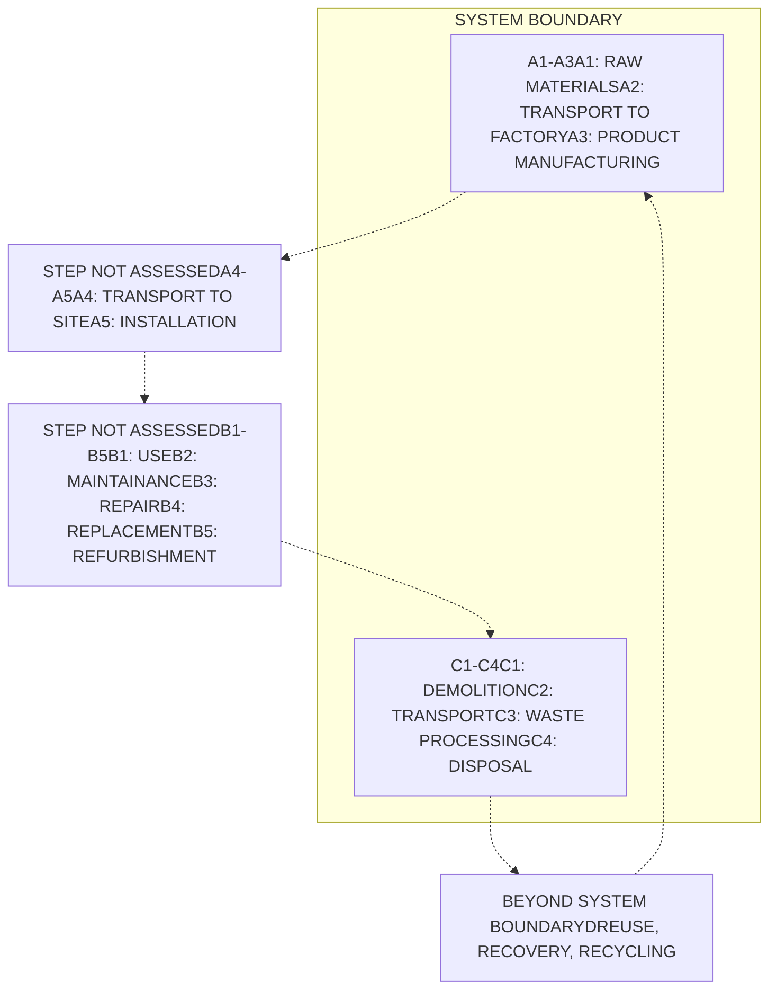

<PAGE>1<PAGE>
Photograph of a white Piave concrete mixer truck at a construction site

EPD THE INTERNATIONAL EPD SYSTEM logo

# PIAVE

AUSTRALASIA EPD ENVIRONMENTAL PRODUCT DECLARATION logo

# ENVIRONMENTAL PRODUCT DECLARATION

IN ACCORDANCE WITH ISO 14025:2006,

EN 15804:2012+A2:2019/AC:2021

## PREMIX CONCRETE – S32MPA GREENCRETE 70

Piave Premix Concrete Pty Ltd

**Programme operator**: The international EPD® system, www.environdec.com
**Regional operator**: EPD Australasia Ltd
**EPD registration number**: EPD-IES-23043
**Publication date**: 2025-03-31
**Valid until**: 2030-03-31
**Geographical scope**: Victoria
**Product-specific EPD of one product manufactured at one site.**

ECO PLATFORM EPD VERIFIED logo

An EPD should provide current information and may be updated if conditions change. The stated validity is therefore subject to the continued registration and publication at www.environdec.com.

<PAGE>2<PAGE>
EPD THE INTERNATIONAL EPD SYSTEM logo

AUSTRALASIA EPD ENVIRONMENTAL PRODUCT DECLARATION logo

# PROGRAMME INFORMATION AND VERTIFICATION

| Declaration Owner:       | Owner                | Piave Premix Concrete Pty Ltd                                                                                                                                      |
| ------------------------ | -------------------- | ------------------------------------------------------------------------------------------------------------------------------------------------------------------ |
|                          | Address              | 262 Salmon Street Port Melbourne VIC 3207                                                                                                                          |
|                          | Contact details      | info\@piave.com.au                                                                                                                                                 |
|                          | Website              | https\://www\.piave.com.au/                                                                                                                                        |
| EPD Programme Operator:  | EPD International AB | Box 210 60, SE-100 31 Stockholm, Sweden, Email: info\@environdec.com                                                                                           |
| Regional Programme:      | EPD Australasia Ltd  | Address: 315a Hardy Street Nelson 7010, New Zealand Web: www\.epd-australasia.com Email: info\@epd-australasia.com Phone: +61 2 8005 8206 (AU)     |
| EPD Produced By:         | Crema Constructions  | Address: 262 Salmon Street Port Melbourne, VIC 3207, Australia Web: www\.crema.com.au Email: info\@epd-australasia.com Phone: +61 3 9644 1101 (AU) |
| EPD Registration Number: |                      | EPD-IES-23043                                                                                                                                                      |
| Date of Publication:     |                      | 2025-03-31                                                                                                                                                         |
| Reference Year for Data: |                      | 2022-01-01 to 2022-12-31                                                                                                                                           |
| Version:                 |                      | 1.0                                                                                                                                                                |
| Valid Until:             |                      | 2030-03-31                                                                                                                                                         |
| Geographical Scope:      |                      | Victoria                                                                                                                                                           |

| PCR:                                                                                  | PCR 2019:14 Construction Products, Version 1.3.4, 2024-04-30 (valid until 2025-06-20), C-PCR-003 (to 2019:14) Concrete and concrete elements, version 2024-04-30                                                                                                            |
| ------------------------------------------------------------------------------------- | ------------------------------------------------------------------------------------------------------------------------------------------------------------------------------------------------------------------------------------------------------------------------------- |
| PCR Review was Conducted by:                                                          | The Technical Committee of the International EPD® System. See www\.environdec.com for a list of members. Most recent review chair: Claudia A. Peña, University of Concepción, Chile. The review panel may be contacted via the Secretariat www\.environdec.com/contact. |
| Product category rules                                                                | The CEN standard EN 15804 serves as the core PCR. In addition, the Int'l EPD System PCR 2019:14 Construction products, version 1.3.4 is used. c-PCR 003 Concrete and elements                                                                                                   |
| EPD Verifier                                                                          | Andrew D. Moore Life Cycle Logic Pty Ltd www\.lifecylelogic.com.au +61424320057 Andrew\@lifecyclelogic.com.au Life Cycle Logic logo  (External, Third party verifier approved by EPD Australasia and The International EPD System)                      |
| EPD verification                                                                      | Independent verification of this EPD and data, according to ISO 14025: \[ ] Internal verification \[x] External verification                                                                                                                                                |
| Procedure for follow-up of data during the EPD validity involves third-party verifier | \[ ] No \[x] Yes                                                                                                                                                                                                                                                            |

The manufacturer has the sole ownership, liability, and responsibility for the EPD. EPDs within the same product category but registered in different EPD programmes may not be comparable. For two EPDs to be comparable, they must be based on the same PCR (including the same version number) or be based on fully-aligned PCRs or versions of PCRs; cover products with identical functions, technical performances and use (e.g. identical declared/functional units); have equivalent system boundaries and descriptions of data; apply equivalent data quality requirements, methods of data collection, and allocation methods; apply identical cut-off rules and impact assessment methods (including the same version of characterisation factors); have equivalent content declarations; and be valid at the time of comparison.

EPDs of construction products may not be comparable if they do not comply with EN 15804.

<page_number>2</page_number>

<PAGE>3<PAGE>
# PRODUCT IDENTIFICATION

| \*\*Product name\*\*               | Premix Concrete – S32MPa GreenCrete 70                                                                           |
| ---------------------------------- | ---------------------------------------------------------------------------------------------------------------- |
| \*\*Additional label(s)\*\*        |                                                                                                                  |
| \*\*Product number / reference\*\* | S32MPa GreenCrete 70                                                                                             |
| \*\*Production Site:\*\*           | 262 Salmon Street Port Melbourne VIC 3207                                                                        |
| \*\*CPC code\*\*                   | UN CPC 375 (Articles of concrete, cement and plaster) ANZSIC 20330 (Concrete – ready mixed – except dry mix) |

Photograph of a worker operating a concrete mixer truck at an industrial site

<PAGE>4<PAGE>
# INTRODUCTION

**ABOUT PIAVE**

Piave was founded in 1993 by Anthony Schieven and Louis Crema, with a name coined by Loui’s father Beppi, inspired by the Piave river in Northern Italy.

Originally existing predominantly as a means to supply their construction company’s jobs, they built a plant in Port Melbourne, with Anthony managing the plant and Louis looking after finance and administration.

Piave now supplies a wide range of cementitious products used by the building and construction industry within Victoria.

Since its commencement we’ve set solid foundations for thousands of Melbourne buildings and homes. Now, still family-owned and run, a passionate new generation is propelling Piave into the future.

**OUR COMMITMENT**

We understand the crucial role the construction industry has to play in addressing our global carbon crisis, and are committed to playing our part in this journey, to ensure a brighter outlook for future generations.

**SCOPE**

This EPD covers premix concrete products for the Victorian metropolitan region. This EPD covers life cycle stages Cradle to gate with modules C1–C4 and module D (A1–A3 + C + D).

Photograph of a fleet of Piave concrete trucks parked in a row at a quarry or construction site

<PAGE>5<PAGE>
EPD THE INTERNATIONAL EPD® SYSTEM logo AUSTRALASIA EPD ENVIRONMENTAL PRODUCT DECLARATION logo

# PRODUCT INFORMATION

## PRODUCT DESCRIPTION

Concrete is prepared by mixing cement, coarse and fine aggregates, and water, with or without the addition of auxiliary agents and additives. The fresh concrete is placed on the building site or prefabricated in factory moulds, compacted, and hardened in the desired shape by the hydration of cement to form concrete.

## PRODUCT APPLICATION

Normal-class - designed for residential applications, low rise buildings, paving and driveways etc. Its specification and ordering have been simplified as far as practicable.
Special-class - allows the purchaser to incorporate into the project specification any special requirements for the project.

## PRODUCT STANDARDS

The concrete products within the EPD conform to AS 1379:2007 Specification and Supply of Concrete. General Australian Standard AS 1379 sets down a number of ways of specifying and ordering concrete to promote uniformity, efficiency and economy in production and delivery. It refers to two classes of concrete: normal-class and special-class.

Further information can be found at https://www.piave.com.au/.

## PRODUCT RAW MATERIAL COMPOSITION

| Material                  | Proportion (% m/m) | Post-consumer material, weight (%) | Renewable material, weight (%) |
| ------------------------- | ------------------ | ---------------------------------- | ------------------------------ |
| Sand                      | 0-85%              | 0%                                 | 0%                             |
| Aggregate                 | 0-91%              | 0%                                 | 0%                             |
| GP Cement                 | 2-18%              | 0%                                 | 0%                             |
| Ground Blast Furnace Slag | 0-11%              | 0%                                 | 0%                             |
| Silica Fume               | 0-1%               | 0%                                 | 0%                             |
| Water                     | 3-11%              | 0%                                 | 0%                             |
| Admixtures                | <0.4%              | 0%                                 | 0%                             |

The product mass and design mix details are provided in “Piave Premix Concrete Mix Designs-Final.xlsx” (2025-03-21).

## SUBSTANCES, REACH - VERY HIGH CONCERN

The product does not contain substances in the Candidate List of Substances of Very High Concern (SVHC) which exceeds the limits for registration with the European Chemicals Agency (i.e., if the substance constitute more than 0.1% of the weight of the product).

<PAGE>6<PAGE>
# PRODUCT LIFE-CYCLE

## MANUFACTURING AND PACKAGING (A1-A3)

The environmental impacts considered for the product stage cover the manufacturing of raw materials used in the production as well as packaging materials and other ancillary materials. Also, fuels used by machines, and handling of waste formed in the production processes at the manufacturing facilities are included in this stage. The study also considers the material losses occurring during the manufacturing processes as well as losses during electricity transmission.

Concrete production is the process of combining water, aggregates, cementitious binders and additives. These different ‘ingredients’ are transported from our suppliers to our specialised batching plant. Our batching plant stores the ingredients in cement silos, aggregate bins and admixture tanks. The plants use weigh scales and flow meters to accurately weigh the ingredients which are then mixed in an agitator truck.

## PRODUCT END OF LIFE (C1-C4, D)

BS EN 16757:2017 presents four end of life scenarios for concrete:

1. Disposal of concrete at a landfill site,

2. Reuse of recovered concrete elements in new construction works,

3. Use of concrete debris, e.g. In land restoration, or

4. Crushing/recycling of concrete:

a. Crushed concrete substitutes primary material without further processing, or

Scenarios 2, 3 and 4 can all result in benefits and loads outside the system boundary and thus should be considered in a whole-of-life building study or when comparing concrete products on a functional basis in line with BS EN 16757:2017.

## END OF LIFE SCENARIO DETAILS

| Scenario parameter                                 | Value  |
| -------------------------------------------------- | ------ |
| Collection process – kg collected separately       | 2400kg |
| Collection process – kg collected with mixed waste | 0kg    |
| Recovery process – kg for re-use                   | 0kg    |
| Recovery process – kg for recycling                | 2033kg |
| Recovery process – kg for energy recovery          | 0kg    |
| Disposal (total) – kg for final deposition         | 367kg  |
| Scenario assumptions e.g. transportation           | 50km   |

For concrete produced in Victoria, we have used the end-of-life scenario representative for Victorian building & demolition materials products based on the National Waste Report 2022 (NWR 2022). This scenario implies that 84.7% of the concrete is recycled and the remaining 15.3% of the concrete is sent to landfill.

We have modelled a single scenario for concrete with a density of 2 400 kg/m3. This is a conservative value for the concrete mixes covered by our EPDs. The impact of this simplification is much smaller than the impact of the scenario and data assumptions applied to the end-of-life modules.

The concrete collected for recycling reaches end-of-waste status when it is crushed and stockpiled as “recycled crushed concrete” (RCC) aggregates. Crushed concrete is assumed to substitute primary (quarried) material without needing further processing.

<PAGE>7<PAGE>
# MANUFACTURING PROCESS

## PIAVE CONCRETE

**PREMIX CONCRETE PRODUCTION PROCESSES, LIFECYCLE STAGES AND VISUALISATION OF SYSTEM BOUNDARIES**

<PAGE>8<PAGE>
# LIFE-CYCLE ASSESSMENT

## LIFE-CYCLE ASSESSMENT INFORMATION

**Period for data**: 2022-01-01 to 2022-12-31

## DECLARED AND FUNCTIONAL UNIT

**Declared unit**: 1m3 of Premix Concrete supplied to the client

**Mass per declared unit**: 2373 kg

## BIOGENIC CARBON CONTENT

The product contains no biogenic carbon and is delivered in bulk without packaging.

## SYSTEM BOUNDARY

|                        | Product stage A1 | Product stage A2 | Product stage A3 | Assembly stage A4 | Assembly stage A5 | Use stage B1 | Use stage B2 | Use stage B3 | Use stage B4 | Use stage B5 | Use stage B6       | Use stage B7      | End of life stage C1   | End of life stage C2 | End of life stage C3 | End of life stage C4 | Beyond the system boundaries D | Beyond the system boundaries D | Beyond the system boundaries D |
| ---------------------- | -------------------- | -------------------- | -------------------- | --------------------- | --------------------- | ---------------- | ---------------- | ---------------- | ---------------- | ---------------- | ---------------------- | --------------------- | -------------------------- | ------------------------ | ------------------------ | ------------------------ | ---------------------------------- | ---------------------------------- | ---------------------------------- |
|                        | x                    | x                    | x                    | ND                    | ND                    | ND               | ND               | ND               | ND               | ND               | ND                     | ND                    | x                          | x                        | x                        | x                        | x                                  | x                                  | x                                  |
|                        | Raw materials        | Transport            | Manufacturing        | Transport             | Assembly              | Use              | Maintenance      | Repair           | Replacement      | Refurbishment    | Operational energy use | Operational water use | Deconstruction /demolition | Transport                | Waste processing         | Disposal                 | Reuse                              | Recovery                           | Recycling                          |
| Geography              | AU                   | AU                   | AU                   | -                     | -                     | -                | -                | -                | -                | -                | -                      | -                     | -                          | -                        | -                        | -                        | -                                  | -                                  | -                                  |
| Share of Specific Data | >90%                 |                      |                      |                       |                       |                  |                  |                  |                  |                  |                        |                       |                            |                          |                          |                          |                                    |                                    |                                    |
| Variation - products   | NR                   |                      |                      |                       |                       |                  |                  |                  |                  |                  |                        |                       |                            |                          |                          |                          |                                    |                                    |                                    |
| Variation - Sites      | NR                   |                      |                      |                       |                       |                  |                  |                  |                  |                  |                        |                       |                            |                          |                          |                          |                                    |                                    |                                    |

Included in this study = X. Modules not declared = ND. Modules not relevant = NR

<PAGE>9<PAGE>
# CUT-OFF CRITERIA

The study does not exclude any modules or processes which are stated mandatory in the EN 15804:2012+A2:2019 and the applied PCR. The study does not exclude any hazardous materials or substances. The study includes all major raw material and energy consumption. All inputs and outputs of the unit processes, for which data is available for, are included in the calculation. There is no neglected unit process more than 1% of total mass or energy flows. The module specific total neglected input and output flows also do not exceed 5% of energy usage or mass.

The contribution of capital goods (production equipment and infrastructure) and personnel is excluded, as these processes are non-attributable and they contribute less than 10% to GWP‑GHG.

The contribution of the back ground processes have been included.

No flows were excluded on the basis of cut-off criteria.

# ALLOCATION, ESTIMATES AND ASSUMPTIONS

Allocation is required if some material, energy, and waste data cannot be measured separately for the product under investigation.

In this study, as per EN 15804, allocation is conducted in the following order;

1. Allocation should be avoided.

2. Allocation should be based on physical properties (e.g. mass, volume) when the difference in revenue is small.

3. Allocation should be based on economic values.

The key processes that require allocation are:

* Production of concrete mixes: All shared processes are attributed to concrete products based on their volume.

* With regards to inputs, it was assumed that silica fume is a waste product and therefore burden-free.

* Ground granulated blast furnace slag from steel blast furnace production was allocated economically.

* Electricity and diesel use at the plant are allocated to concrete on Volume (1m3) basis.

## Electricity

Electricity has been modelled for processes that Piave Premix controls using adjusted data to represent the estimated residual electricity grid mix in Victoria. This is done by removing renewables from the Australian Energy Statistics 2022 data (Table O3.2). The residual grid mix is made up of Coal (92.1%), natural gas (7.3%) and oil products (0.6%).

The reference year for the electricity dataset documented is 2022.

The allocations in the Ecoinvent 3.10 datasets used in this study follow the Ecoinvent system model ‘Allocation, cut-off, EN15804’.

<PAGE>10<PAGE>
## AVERAGES AND VARIABILITY

The results of the LCA are based on data from a single plant based in port Melbourne Victoria. There are no other plants that the environmental profiles of the concrete in this report relate to. Therefore the mandatory indicators stay well within the ±10% range as required by the PCR as they only relate to this one plant.

Photograph of a green semi-truck with trailers parked in a quarry, reflected in a puddle of water

<PAGE>11<PAGE>
EPD THE INTERNATIONAL EPD® SYSTEM logo AUSTRALASIA EPD ENVIRONMENTAL PRODUCT DECLARATION logo

# ENVIRONMENTAL IMPACT DATA

Please consider the following mandatory statements when interpreting the results:

The estimated impact results are only relative statements, which do not indicate the endpoints of the impact categories, exceeding threshold values, safety margins and/or risks. EN 15804 reference package based on EF 3.1 version has been used.

The use of the results of modules A1-A3 (A1-A5 for services) without considering the results of module C is discouraged.

Note: The results of the impact categories abiotic depletion of minerals and metals, land use, human toxicity (cancer), human toxicity, non-cancer and ecotoxicity (freshwater) may be highly uncertain in LCAs that include capital goods/infrastructure in generic datasets, in case infrastructure/capital goods contribute greatly to the total results. This is because the LCI data of infrastructure/capital goods used to quantify these indicators in currently available generic datasets sometimes lack temporal, technological and geographical representativeness. Caution should be exercised when using the results of these indicators for decision-making purposes.

## CORE ENVIRONMENTAL IMPACT INDICATORS – EN 15804+A2, PEF

| Impact category         | Unit         | A1-A3    | C1       | C2       | C3       | C4       | D         |
| ----------------------- | ------------ | -------- | -------- | -------- | -------- | -------- | --------- |
| GWP – total1)           | kg CO₂ eq    | 1.34E+02 | 5.67E+00 | 2.16E+01 | 1.25E+01 | 2.29E+00 | -1.61E+00 |
| GWP – fossil            | kg CO₂ eq    | 1.34E+02 | 5.67E+00 | 2.16E+01 | 1.25E+01 | 2.29E+00 | -1.61E+00 |
| GWP – biogenic          | kg CO₂ eq    | 0.00E+00 | 0.00E+00 | 4.34E-19 | 0.00E+00 | 0.00E+00 | 0.00E+00  |
| GWP – LULUC             | kg CO₂ eq    | 2.28E-02 | 5.65E-04 | 7.69E-03 | 1.28E-03 | 1.31E-03 | -1.72E-04 |
| Ozone depletion pot.    | kg CFC-11 eq | 7.54E-06 | 1.21E-06 | 4.31E-07 | 1.91E-07 | 6.64E-08 | -7.58E-16 |
| Acidification potential | mol H⁺eq     | 1.38E+00 | 5.89E-02 | 6.78E-02 | 1.12E-01 | 1.62E-02 | -2.87E-03 |
| EP-freshwater2)         | kg P eq      | 8.34E-03 | 1.88E-05 | 1.44E-03 | 3.60E-04 | 1.88E-04 | -5.33E-05 |
| EP-marine               | kg N eq      | 4.42E-01 | 2.61E-02 | 2.29E-02 | 5.22E-02 | 6.19E-03 | -1.38E-03 |
| EP-terrestrial          | mol N eq     | 4.88E+00 | 2.86E-01 | 2.49E-01 | 5.71E-01 | 6.76E-02 | -1.29E-02 |
| POCP (“smog”)3)         | kg NMVOC eq  | 1.31E+00 | 7.87E-02 | 1.07E-01 | 1.70E-01 | 2.42E-02 | -3.80E-03 |
| ADP-minerals & metals4) | kg Sb eq     | 3.34E-04 | 2.88E-06 | 6.97E-05 | 4.47E-06 | 3.64E-06 | -3.92E-08 |
| ADP-fossil resources    | MJ           | 1.62E+03 | 7.63E+01 | 3.05E+02 | 1.63E+02 | 5.62E+01 | -2.15E+01 |
| Water use5)             | m³ eq depr.  | 6.84E+02 | 2.05E-01 | 1.50E+00 | 4.07E-01 | 1.62E-01 | -2.66E+00 |

1) GWP = Global Warming Potential; 2) EP = Eutrophication potential. Required characterisation method and data are in kg P-eq. Multiply by 3,07 to get PO4e; 3) POCP = Photochemical ozone formation; 4) ADP = Abiotic depletion potential; 5) EN 15804+A2 disclaimer for Abiotic depletion and Water use and optional indicators except Particulate matter and Ionizing radiation, human health. The results of these environmental impact indicators shall be used with care as the uncertainties on these results are high or as there is limited experience with the indicator.

2) The OneClickLCA tool uses global characterisation factors for WDP and does not use the regionalised Australian catchment level data.

<PAGE>12<PAGE>
EPD THE INTERNATIONAL EPD® SYSTEM logo AUSTRALASIA EPD ENVIRONMENTAL PRODUCT DECLARATION logo

# ADDITIONAL (OPTIONAL) ENVIRONMENTAL IMPACT INDICATORS – EN 15804+A2, PEF

| Impact category          | Unit        | A1-A3    | C1       | C2       | C3       | C4       | D         |
| ------------------------ | ----------- | -------- | -------- | -------- | -------- | -------- | --------- |
| Particulate matter       | Incidence   | 8.99E-06 | 1.58E-06 | 1.74E-06 | 1.83E-05 | 3,70E-07 | -1,77E-08 |
| Ionizing radiation6)     | kBq U235 eq | 4.79E-01 | 3.51E-01 | 3.86E-01 | 7.22E-02 | 3,53E-02 | 0,00E+00  |
| Ecotoxicity (freshwater) | CTUe        | 6.94E+02 | 4.59E+01 | 3.96E+01 | 8.97E+00 | 4,72E+00 | -1,70E+01 |
| Human toxicity, cancer   | CTUh        | 4.95E-08 | 1.76E-09 | 3.67E-09 | 1.28E-09 | 4,22E-10 | -2,44E-10 |
| Human tox. non-cancer    | CTUh        | 1.31E-06 | 3.32E-08 | 1.92E-07 | 2.03E-08 | 9,70E-09 | -1,05E-08 |
| SQP7)                    | -           | 8.61E+02 | 9.92E+00 | 1.93E+02 | 1.14E+01 | 1,11E+02 | -6,46E+02 |

6) EN 15804+A2 disclaimer for Ionizing radiation, human health. This impact category deals mainly with the eventual impact of low dose ionizing radiation on human health of the nuclear fuel cycle. It does not consider effects due to possible nuclear accidents, occupational exposure nor due to radioactive waste disposal in underground facilities. Potential ionizing radiation from the soil, from radon and from some construction materials is also not measured by this indicator; 7) SQP = Land use related impacts/soil quality.

# END OF LIFE – WASTE

| Impact category          | Unit | A1-A3    | C1       | C2       | C3       | C4       | D         |
| ------------------------ | ---- | -------- | -------- | -------- | -------- | -------- | --------- |
| Renew. PER as energy8)   | MJ   | 4.04E+01 | 4.36E‐01 | 5.24E+00 | 1.03E+00 | 5.43E‐01 | ‐2.87E+00 |
| Renew. PER as material   | MJ   | 0.00E+00 | 0.00E+00 | 0.00E+00 | 0.00E+00 | 0.00E+00 | 0.00E+00  |
| Total use of renew. PER  | MJ   | 4.04E+01 | 4.36E‐01 | 5.24E+00 | 1.03E+00 | 5.43E‐01 | ‐2.87E+00 |
| Non-re. PER as energy    | MJ   | 1.67E+03 | 7.63E+01 | 3.05E+02 | 1.63E+02 | 5.62E+01 | ‐2.15E+01 |
| Non-re. PER as material  | MJ   | 0.00E+00 | 0.00E+00 | 0.00E+00 | 0.00E+00 | 0.00E+00 | 0.00E+00  |
| Total use of non-re. PER | MJ   | 1.67E+03 | 7.63E+01 | 3.05E+02 | 1.63E+02 | 5.62E+01 | ‐2.15E+01 |
| Secondary materials      | kg   | 2.10E+02 | 2.99E‐02 | 1.39E‐01 | 6.77E‐02 | 1.41E‐02 | ‐2.03E+00 |
| Renew. secondary fuels   | MJ   | 1.13E‐03 | 9.76E‐05 | 1.75E‐03 | 1.77E‐04 | 2.93E‐04 | 0.00E+00  |
| Non-ren. secondary fuels | MJ   | 0.00E+00 | 0.00E+00 | 0.00E+00 | 0.00E+00 | 0.00E+00 | 0.00E+00  |
| Use of net fresh water   | m³   | 2.96E+00 | 4.63E‐03 | 4.14E‐02 | 1.08E‐02 | 5.85E‐02 | ‐6.65E‐02 |

8) PER = Primary energy resources

<PAGE>13<PAGE>
# ENVIRONMENTAL INFORMATION DESCRIBING WASTE CATEGORIES

| Impact category     | Unit | A1-A3    | C1       | C2       | C3       | C4       | D         |
| ------------------- | ---- | -------- | -------- | -------- | -------- | -------- | --------- |
| Hazardous waste     | kg   | 1.23E+00 | 1.02E-01 | 4.37E-01 | 1.81E-01 | 6.21E-02 | -3.66E-10 |
| Non-hazardous waste | kg   | 2.32E+03 | 7.18E-01 | 9.18E+00 | 2.47E+00 | 3.67E+02 | -1.16E-01 |
| Radioactive waste   | kg   | 2.34E-03 | 5.37E-04 | 9.60E-05 | 1.77E-05 | 8.62E-06 | -1.73E-05 |

# END OF LIFE – OUTPUT FLOWS

| Impact category          | Unit | A1-A3    | C1       | C2       | C3       | C4       | D        |
| ------------------------ | ---- | -------- | -------- | -------- | -------- | -------- | -------- |
| Components for re-use    | kg   | 0.00E+00 | 0.00E+00 | 0.00E+00 | 0.00E+00 | 0.00E+00 | 0.00E+00 |
| Materials for recycling  | kg   | 2.58E-02 | 0.00E+00 | 0.00E+00 | 2.03E+03 | 0.00E+00 | 0.00E+00 |
| Materials for energy rec | kg   | 6.66E-06 | 0.00E+00 | 0.00E+00 | 0.00E+00 | 0.00E+00 | 0.00E+00 |
| Exported energy          | MJ   | 3.15E-02 | 0.00E+00 | 0.00E+00 | 0.00E+00 | 0.00E+00 | 0.00E+00 |

# ENVIRONMENTAL IMPACTS – GWP-GHG - THE INTERNATIONAL EPD SYSTEM

| Impact category | Unit      | A1-A3    | C1       | C2       | C3       | C4       | D         |
| --------------- | --------- | -------- | -------- | -------- | -------- | -------- | --------- |
| GWP-GHG10)      | kg CO₂ eq | 1.34E+02 | 5.67E+00 | 2.16E+01 | 1.25E+01 | 2.29E+00 | -1.61E+00 |

10) This indicator includes all greenhouse gases excluding biogenic carbon dioxide uptake and emissions and biogenic carbon stored in the product as defined by IPCC AR 5 (IPCC 2013). In addition, the characterisation factors for the flows - CH4 fossil, CH4 biogenic and Dinitrogen monoxide - were updated in line with the guidance of IES PCR 1.3.4 Annex 1. This indicator is identical to the GWP - total of EN 15804:2012+A2:2019 except that the characterization factor for biogenic CO2 is set to zero.

# CLASSIFICATION OF DISCLAIMERS TO THE DECLARATION OF CORE AND ADDITIONAL ENVIRONMENTAL IMPACT INDICATORS

| ILCD Classification | Indicator      | Disclaimer |
| ------------------- | -------------- | ---------- |
| ILCD Type 1         | GWP            | None       |
|                     | ODP            | None       |
|                     | PM             | None       |
| ILCD Type 2         | AP             | None       |
|                     | EP-Freshwater  | None       |
|                     | EP-Marine      | None       |
|                     | EP-Terrestrial | None       |
|                     | POCP           | None       |
|                     | IRP            | 1          |

<PAGE>14<PAGE>
| ILCD Type 3 | ADP-Minerals\&Metals | 2 |
| ----------- | -------------------- | - |
|             | ADP-Fossil           | 2 |
|             | WDP                  | 2 |
|             | ETP-fw               | 2 |
|             | HTP-c                | 2 |
|             | HTP-nc               | 2 |
|             | SQP                  | 2 |

Disclaimer 1 – This impact category deals mainly with the eventful impact of low dose ionizing radiation on human health of the nuclear fuel cycle. It does not consider effects due to possible nuclear accidents, occupational exposure nor due to radioactive waste disposal in underground facilities. Potential ionizing radiation from the soil, from radon and from some construction materials is also not measured by this indicator.

Disclaimer 2 – The results of this environmental impact indicator shall be used with care as the uncertainties on these results are high or as there is limited experience with this indicator.

<PAGE>15<PAGE>
EPD THE INTERNATIONAL EPD SYSTEM logo

AUSTRALASIA EPD ENVIRONMENTAL PRODUCT DECLARATION logo

# SCENARIO DOCUMENTATION

**Manufacturing energy scenario documentation**

| Scenario parameter                  | Value                                               |
| ----------------------------------- | --------------------------------------------------- |
| Electricity data source and quality | Sourced from retail bill and on site meter readings |
| Electricity CO2e / kWh              | 1.08 kg CO2e / kWh                                  |

# REFERENCES

ISO 14025:2010 Environmental labels and declarations — Type III environmental declarations. Principles and procedures.

ISO 14040:2006 Environmental management. Life cycle assessment. Principles and frameworks.

ISO 14044:2006 Environmental management. Life cycle assessment. Requirements and guidelines.

ecoinvent Centre. (2023). ecoinvent Database Version 3.10. Retrieved from [https://ecoinvent.org/ecoinvent-v3-10/](https://ecoinvent.org/ecoinvent-v3-10/)

One Click LCA. (n.d.). *One Click LCA database*. One Click LCA. Retrieved March 6, 2025, from [https://www.oneclicklca.com/](https://www.oneclicklca.com/)

EN 15804:2012+A2:2019/AC:2021, Sustainability of construction works — Environmental product declarations — Core rules for the product category of construction products, European Committee for Standardization (CEN), Brussels, August 2021.

UN CPC 375 (Articles of concrete, cement and plaster)

United Nations Statistical Commission. 2008. ‘Central Product Classification (CPC) Version 2.1’. version 2.1. United Nations. https://unstats.un.org/unsd/classifications/unsdclassifications.

c-PCR-003 Concrete and concrete elements (EN 16757:2022), Product category rules for concrete and concrete elements, version 2023-01-02

EPD International (2021). General Programme Instructions of the international EPD® system. Version 4.0. www.environdec.com.

ABS and Statistics New Zealand. 2006. ‘Australian and New Zealand Standard Industrial Classification (ANZSIC) 2006’. [https://www.abs.gov.au/AUSSTATS/abs@.nsf/DetailsPage/1292.02006%20(Revision%202.0)?OpenDocument](https://www.abs.gov.au/AUSSTATS/abs@.nsf/DetailsPage/1292.02006%20(Revision%202.0)?OpenDocument)?OpenDocument).

The LCA and EPD have been created using the One Click LCA Pre-verified EPD Generator, tool version 0.22.12, One Click LCA Ltd, approved 2024-01-05

Piave Premix Concrete Products LCA Background Report

IEPDS. 2024. ‘PCR 2019:14 Construction Products (EN 15804+A2) (v1.3.4)’. version 1.3.4. Sweden: The International EPD System. [https://environdec.com/pcr-library/with-documents](https://environdec.com/pcr-library/with-documents)

Standards Australia. (2007). *AS 1379: Specification and manufacture of concrete*. Standards Australia.

<page_number>

15
</page_number>

<PAGE>16<PAGE>
The International EPD System logo EPD Australasia logo

**Data references:**

Adbri. (2022). Environmental Product Declaration: Cement Products. EPD Australasia. Retrieved from [https://www.adbri.com.au/wp-content/uploads/2022/11/Adbri-Cement-EPD-2022_Press.pdf](https://www.adbri.com.au/wp-content/uploads/2022/11/Adbri-Cement-EPD-2022_Press.pdf)

Admixtures: Plasticizers and Superplasticizers (*EPD No. EPD-EFC-20210198-IBG1-EN*). Institut Bauen und Umwelt e.V. (IBU). Retrieved from [https://dnk.sika.com/dms/getdocument.get/27b4cc84-6112-4770-8dda-2fcb6d61ddb9/Sika_Plastiment_LA-55_en_EPD.pdf](https://dnk.sika.com/dms/getdocument.get/27b4cc84-6112-4770-8dda-2fcb6d61ddb9/Sika_Plastiment_LA-55_en_EPD.pdf)

Independent Cement and Lime Pty Ltd. (2023). Environmental Product Declaration: Ground Granulated Blast-Furnace Slag (GGBFS). EPD Australasia. Retrieved from [https://www.environdec.com/library/epd10955](https://www.environdec.com/library/epd10955)

Department of Climate Change, Energy, the Environment and Water. (2022). *National Waste Report 2022*. Retrieved from [https://www.dcceew.gov.au/sites/default/files/documents/national-waste-report-2022.pdf](https://www.dcceew.gov.au/sites/default/files/documents/national-waste-report-2022.pdf)

Boral. (2024). Environmental Product Declaration: Victoria Region Quarries and Recycling Products. EPD Australasia. Retrieved from [https://epd-australasia.com/wp-content/uploads/2024/02/SP10222-Boral-EPD_Vic-Quarries-Recycling_Feb24.pdf](https://epd-australasia.com/wp-content/uploads/2024/02/SP10222-Boral-EPD_Vic-Quarries-Recycling_Feb24.pdf)

Australian Government Department of Industry, Science, Energy and Resources. (2022). Australian Energy Statistics 2022: Table O3.2 – Electricity generation in Victoria, by fuel type, physical units, calendar year. Australian Energy Statistics. Retrieved from [https://www.energy.gov.au/sites/default/files/2022-04/Australian%20Energy%20Statistics%202022%20Table%20O%20-%20Publication%20version.pdf](https://www.energy.gov.au/sites/default/files/2022-04/Australian%20Energy%20Statistics%202022%20Table%20O%20-%20Publication%20version.pdf)

European Federation of Concrete Admixtures Associations a.i.s.b.l. (EFCA). (2021). *Environmental Product Declaration – Concrete*

