<PAGE>1<PAGE>
HOLCIM logo

# READY-MIX CONCRETE

## Environmental Product Declaration

**VIC - Melbourne Metro - ECOPact- VE322EAMF**

**In accordance with ISO 14025 and EN15804+A2**
**Programme:** The International EPD® System | www.environdec.com
**Programme operator:** EPD International AB
**Regional Programme:** EPD Australasia | www.epd-australasia.com
**Managed by:** Holcim Certified EPD Process
**EPD Process Certificate Number:** 04

**Accreditation Body:** Epsten Group, Inc.
**EPD Registration No.:** EPD-IES-20602:001
**Valid from:** 15/04/2025 | 15/04/2030
**Revision Date:** 15/04/2025
**Revision Number:** 1
**EPD Process Geographical Scope:** Australia

Photograph of two Holcim ECOPact concrete mixer trucks parked on grass in front of trees

AUSTRALASIA EPD ENVIRONMENTAL PRODUCT DECLARATION logo

EPD INTERNATIONAL EPD SYSTEM logo

ECO PLATFORM EPD VERIFIED logo

<PAGE>2<PAGE>
# Programme-related information and verification

| **EPD Owner**                    | Evan Smith Holcim (Australia) Pty Ltd Level 40, Northpoint Tower, 100 Miller St, North Sydney NSW 2060, Australia Web: www\.holcim.com.au Phone: +61 2 9412 6600                        | HOLCIM logo                                            |
| -------------------------------- | ------------------------------------------------------------------------------------------------------------------------------------------------------------------------------------------------------- | ------------------------------------------------------ |
| **Programme Operator**           | EPD International AB, Box 210 60, SE-100 31 Stockholm, Sweden, E-mail: info\@environdec.com                                                                                                 | EPD THE INTERNATIONAL EPD SYSTEM logo                  |
| **Regional Programme Operator**  | EPD Australasia Limited 315a Hardy Street Nelson 7010, New Zealand Web: www\.epd-australasia.com Email: info\@epd-australasia.com Phone: +61 2 8005 8206                                | AUSTRALASIA EPD ENVIRONMENTAL PRODUCT DECLARATION logo |
| **EPD Produced by**              | Jonas Bengtsson, Sazal Kundu & Weiqi Xing Edge Environment Pty Ltd Level 3, Greenhouse, 180 George Street, Sydney NSW 2000 Australia Web: www\.edgeimpact.global Phone: +61 2 9438 0100 | edge impact logo                                       |
| **EPD Process Certified by**     | Epsten Group Suite 2600, 101 Marietta St NW, Atlanta, Georgia 30303, USA Web: www\.epstengroup.com                                                                                              | epstengroup logo                                       |
| **EPD Registration Number**      | EPD-IES-20602:001                                                                                                                                                                                       |                                                        |
| **Valid From**                   | 15/04/2025                                                                                                                                                                                              |                                                        |
| **Revision Number**              | 1                                                                                                                                                                                                       |                                                        |
| **Valid Until**                  | 15/04/2030                                                                                                                                                                                              |                                                        |
| **Product group classification** | UN CPC 375 (Articles of concrete, cement and plaster)                                                                                                                                                   |                                                        |
| **Geographical Scope**           | Australia                                                                                                                                                                                               |                                                        |
| **Reference Year for Data**      | 2022 Plant Data, 2025 Mix/Materials Data                                                                                                                                                                |                                                        |

**CEN standard EN 15804:2012+A2:2019/AC:2021 served as the core Product Category Rules (PCR)**

| **Product category rules**                                                                         | PCR 2019:14 Construction Products, Version 1.3.4, 2024-04-30 c-PCR-003 Concrete and Concrete Elements, 2024-04-30                                                                                                                                                                  |
| -------------------------------------------------------------------------------------------------- | -------------------------------------------------------------------------------------------------------------------------------------------------------------------------------------------------------------------------------------------------------------------------------------- |
| **PCR review was conducted by**                                                                    | The Technical Committee of the International EPD System. See www\.environdec.com for a list of members. Review chair: Claudia A. Peña, University of Concepción, Chile. The review panel may be contacted via the Secretariat www\.environdec.com/contact                              |
| **Independent third-party verification of the declaration and data, according to ISO 14025:2006:** | \[x] EPD process certification\\\* \\\*For EPD Process Certification, an accredited certification body certifies and reviews the management process and verifies EPDs published on a regular basis. For details about third-party verification procedure of the EPDs, see the GPI. |
| **Process certification**                                                                          | Epsten Group, Inc., Megan Blizzard, is an approved certification body accountable for third-party verification. Third-party verifier is accredited by: A2LA, Certificate #3142.03 \[signature: Kathnin Amteatrs]                                                                       |

**Programme-related information and verification:**

The EPD owner has the sole ownership, liability, and responsibility for the EPD. EPDs within the same product category but registered in different EPD programmes, or not compliant with EN 15804, may not be comparable. For two EPDs to be comparable, they must be based on the same PCR (including the same version number) or be based on fully-aligned PCRs or versions of PCRs; cover products with identical functions, technical performances and use (e.g. identical declared/functional units); have equivalent system boundaries and descriptions of data; apply equivalent data quality requirements, methods of data collection, and allocation methods; apply identical cut-off rules and impact assessment methods (including the same version of characterisation factors); have equivalent content declarations; and be valid at the time of comparison. For further information about comparability, see EN 15804 and ISO 14025.

<PAGE>3<PAGE>
Aerial view of a modern walkway surrounded by lush tropical vegetation

# TABLE OF CONTENTS

Introduction.........................................................................................................................................5

About Holcim......................................................................................................................................5

A first for ready-mix concrete in Australia.............................................................................................5

LCA Information..................................................................................................................................7

EPD Product Description and Use...................................................................................................11

Environmental Performance.............................................................................................................14

Other life cycle stages not included in this EPD...............................................................................19

References.......................................................................................................................................20

| Revision Number | Revision Date | Description of Changes |
| --------------- | ------------- | ---------------------- |
| 1               | 15/04/2025    |                        |

<PAGE>4<PAGE>
# INTRODUCTION

Currently, the building environment account for 39% of global CO2 emissions, with construction materials comprising 11% of global CO2 emissions (World Green Building Council). By 2030, the embodied carbon of all construction materials needs to be at least 40% lower. By 2050, all new construction materials need to be net zero (World Green Building Council).

EPDs include data on a product's life cycle impacts, such as its carbon footprint, energy consumption, and resource use. This transparency empowers stakeholders to make informed selections of products.

Environmental Product Declarations (EPDs) play a crucial role in promoting transparency and sustainability in the construction industry. By providing comprehensive and standardised information about the environmental performance of products, EPDs enable informed decision-making among stakeholders, including architects, engineers, builders, and consumers.

EPDs also serve as valuable tools for benchmarking environmental performance and driving the decarbonation of construction materials. Demand for low carbon products backed by an EPD drives and rewards the decarbonisation of the entire supply chain.

As a result, EPDs will play a key role in our mission to decarbonise construction materials and the built environment.

# ABOUT HOLCIM

Holcim Australia is a leading supplier of construction materials in Australia, dating back to 1901. Today Holcim continues to supply essential construction materials including aggregates, sand, ready-mix concrete, engineered precast concrete and prestressed concrete solutions to a range of customers and projects throughout Australia.

Sustainability is at the core of our strategy, with our industry’s first 2050 net-zero targets, endorsed by the Science Based Targets initiative (SBTi).

Holcim operates right across the Australian continent supplying concrete from a network of concrete plants, quarries, precast and concrete pipe places, and mobile and on-site project facilities.

Globally, Holcim is 63,000 people around the world who are passionate about building progress for people and the planet through four business segments: Cement, Ready-Mix Concrete, Aggregates and Solutions & Products.

# A FIRST FOR READY-MIX CONCRETE IN AUSTRALIA

In 2019, Holcim published the first EPD for ready-mix concrete. This was an Australian first for ready-mix concrete and covered Holcim’s Normal-class concrete range across Australia. The EPD had 147 datasets for normal-class concrete that representative of over 4,000 mix designs. The EPD also provided Special-class concrete data for a major Infrastructure Sustainability and Green Star building project. This EPD heralded the introduction of rigorously verified life cycle impact data, setting a new benchmark in transparency and accountability within the Australian construction sector.

To achieve EPD Process Certification, Holcim integrated Life Cycle Assessment (LCA) processes and procedures into its Management Systems. We then undergo ongoing rigorous third-party verification in accordance with internationally recognized ISO standards and guidelines.

Fast forward to 2021, Holcim achieved Process EPD Certification, a first not just within the concrete industry but across all sectors in Australia. This certification empowers Holcim to develop and register EPDs on demand for ready-mix concrete.

This EPD has been developed using our EPD Process Certification with production occurring at the following sites.

<PAGE>5<PAGE>
# READY-MIX CONCRETE

Diagram showing the process of aggregate production: Load and Haul, Crushing and Screening, and Stockpiling and Distribution.

Diagram showing the concrete production process: Material Handling and Storage, and Batching.

## Summary of properties and classes

Concrete is prepared by mixing cement, coarse and fine aggregates, and water, with or without the addition of auxiliary agents and additives. The fresh concrete is placed on the building site or prefabricated in factory moulds, compacted and hardened in the desired shape by the hydration of cement to form concrete.

General Australian Standard AS 1379 sets out ways of specifying and ordering concrete to promote uniformity, efficiency and economy in production and delivery. It refers to two classes of concrete: normal-class and special-class.

* **Normal-class** – designed for everyday applications such as residential and commercial foundations, driveways and footpaths.

* **Special-class** – typically supplied to major construction projects from high rise buildings, dams and spillways, roads, bridges to public works infrastructure etc.

Special-class concrete is typically specified in accordance with the technical parameters and performance requirements, which can include high-strength/high-performances concrete, high durability, or marine application, post-tensioned, high-pumpability, super workable, piling concrete, architectural off-form finishes and other decorative applications.

<PAGE>6<PAGE>
# LCA INFORMATION

Ready-mix & LCA

## Declared Unit

1 m³ of ready-mix concrete.

## Scope

The scope of this EPD is cradle to gate (modules A1-A3) with options, modules A4-A5, modules C1-C4 and module D.

## Reference Service Life (RSL)

The RSL is not specified as the scope of Holcim’s operational control is from cradle to delivery.

## Time Representativeness

The plant data for the LCA is based on 2022 calendar year production data. The mix data for the LCA is based on 2025 calendar year production data.

## Databases and LCA Software Used

SimaPro® LCA software (v 9.5) was used for the LCA modelling which developed the LCA Calculator, used as per the certified EPD Process. It uses background data with the following preferences:

1. Product specific EPDs for cements, admixtures, pigments and fibres

2. The Australian National Life Cycle Inventory Database (AusLCI v1.42) (2023)

3. Ecoinvent 3.9.1 (2023).

The environmental impacts modelled from the existing EPDs do not include impacts for EN15804+A1, and the additional Green Star (v1.3) impact categories included in the environmental impact tables. These indicators are modelled separately based on generic processes. The following impact categories were calculated manually for the foreground data:

* Use of renewable primary energy resources used as raw materials

* Use of non-renewable primary energy excluding non-renewable primary energy resources used as raw materials

* Use of secondary material

* Use of renewable secondary fuels

* Use of non-renewable secondary fuels

## Allocation

Allocation was necessary to proportion inputs and outputs to intermediate flows at the quarry and processes at the batching plant level. As much as possible, intermediate flows were allocated physically based on weight (quarries) or based on m² of concrete (at the batching plant). At the quarry level, whenever physical allocation was not possible, economic allocation was carried out based on Holcim’s internal cost system. Regarding inputs, it was assumed that fly ash and silica fumes are waste products and therefore burden-free. Ground granulated blast furnace slag from steel blast furnace production was allocated economically. Please refer to the “Recycled Material” section for further detail.

## Cut-Off Criteria

In accordance with the PCR 2019:14, the following system boundaries are applied to manufacturing equipment and employees:

* Environmental impact from infrastructure, construction, production equipment, and tools that are not directly consumed in the production process are not accounted for in the LCI. Capital equipment and buildings typically account for less than a few percent of nearly all LCIs and this is usually smaller than the error in the inventory data itself. For this project, it is assumed that capital equipment makes a negligible contribution to the impacts as per Frischknecht et al. (2007) with no further investigation.

* Personnel-related impacts, such as transportation to and from work, are also not accounted for in the LCI. The impacts of employees are also excluded from inventory impacts on the basis that if they were not employed for this production or service function, they would be employed for another. It is very hard to decide what proportion of the impacts from their whole lives should count towards their employment. For this project, the impacts of employees are excluded.

Based on this guidance, no energy or mass flows, except packaging of materials were excluded. All materials required for manufacturing are delivered via trucks and ships without packaging.

## Address and Contact Information

Holcim (Australia) Pty Ltd
Level 40, Northpoint Tower, 100 Miller St,
North Sydney, NSW 2060, Australia
Web: www.holcim.com.au
Phone: +61 2 9412 6600

<PAGE>7<PAGE>
### Data Quality

Data quality was assessed in terms of geographic and temporal representativeness. All data sources were scored good or very good.

Background data sources were also assessed with respect to their timeliness, with all data sources being updated within the 10 years required under PCR 2019:14.

| Module | Input/outputs             | Sub-processes                        | Data source & LCA Factor                                                             | Temporal scope            | Geographic scope                                      | Quality   |            |           |
| ------ | ------------------------- | ------------------------------------ | ------------------------------------------------------------------------------------ | ------------------------- | ----------------------------------------------------- | --------- | ---------- | --------- |
|        |                           | Cement                               | Supplier data and EPD factors                                                        | 2022                      | All states                                            | Very good |            |           |
|        | Cementitious materials    | Supplementary cementitious materials | Supplier data and Ecoinvent factors                                                  | 2022                      | National                                              | Good      |            |           |
|        |                           | Electricity                          | Invoices and AusLCI factors                                                          | 2022                      | All states                                            | Very good |            |           |
|        |                           | Coarse                               |                                                                                      | Diesel                    | Invoices and Ecoinvent factors                        | 2022      | All states | Very good |
|        | aggregate                 | LPG                                  | Invoices and Ecoinvent factors                                                       | 2022                      | All states                                            | Very good |            |           |
|        |                           | Pollutants                           | National Pollution Inventory (NPI) data and Ecoinvent factors                        | 2022                      | All states                                            | Very good |            |           |
|        | Manufactured              | Mains water                          | Invoices and Ecoinvent factors                                                       | 2022                      | All states                                            | Very good |            |           |
| A1     | sand                      | Water – other sources                | Metered and Ecoinvent factors                                                        | 2022                      | All states                                            | Very good |            |           |
|        |                           | Fine                                 |                                                                                      | Water discharge from site | Metered and Ecoinvent factors                         | 2022      | All states | Very good |
|        | aggregate                 | Explosives                           | Supplier data and Ecoinvent factors                                                  | 2022                      | All states                                            | Very good |            |           |
|        |                           | Gravel                               | Production data                                                                      | 2022                      | All states                                            | Very good |            |           |
|        | Other aggregates          | Recycled aggregates                  | Ecoinvent database                                                                   | 2023                      | National                                              | Good      |            |           |
|        | Admixture                 | Admixtures                           | Supplier data and Ecoinvent factors                                                  | 2023                      | National                                              | Good      |            |           |
|        | Oxide                     | Oxides                               | Invoices and Ecoinvent / EPD factors                                                 | 2023                      | National                                              | Good      |            |           |
|        | Fibre                     | Plastic and steel fibres             | Invoices and Ecoinvent / EPD factors                                                 | 2023                      | National                                              | Good      |            |           |
| A2     | Raw material transport    | Background data used to model        | Holcim and supplier actual transport distances and loads per trip and AusLCI factors | 2022                      | All states                                            | Very good |            |           |
|        |                           | Electricity                          | Invoices and Ecoinvent factors                                                       | 2022                      | All states                                            | Very good |            |           |
|        |                           | Diesel                               | Invoices and Ecoinvent factors                                                       | 2022                      | All states                                            | Very good |            |           |
|        |                           | Mains water                          | Water meters, with utility invoices as a back-up and Ecoinvent factors               | 2022                      | All states                                            | Very good |            |           |
|        |                           | Concrete                             |                                                                                      | Water – other sources     | Estimate based on water balance and Ecoinvent factors | 2022      | All states | Very good |
| A3     | batching plant            | Water discharge from site            | Estimate based on Holcim site performance metrics and Ecoinvent factors              | 2022                      | All states                                            | Very good |            |           |
|        |                           | Lubricating oil                      | Invoices and Ecoinvent factors                                                       |                           | National                                              | Good      |            |           |
|        |                           | Conveyor belt                        |                                                                                      | 2023                      |                                                       |           |            |           |
|        | Concrete mix designs      | Background data used to model        | Holcim internal technical database containing mix designs                            | 2022                      | All states                                            | Very good |            |           |
| A4     | Distribution              | Background data used to model        | Actual transport data and Ecoinvent factors                                          | 2022                      | All states                                            | Very good |            |           |
|        |                           | Electricity                          |                                                                                      |                           |                                                       |           |            |           |
| A5     | Installation              | Diesel                               | Typical scenario & Ecoinvent factors                                                 | 2023                      | National                                              | Good      |            |           |
|        |                           | Water                                |                                                                                      |                           |                                                       |           |            |           |
| C1     | Deconstruction            | Excavation                           | Typical scenario & Ecoinvent factors                                                 | 2023                      | National                                              | Good      |            |           |
| C2     | Transport                 | Background data used to model        | Typical scenario & Ecoinvent factors                                                 | 2023                      | National                                              | Good      |            |           |
| C3     | Waste processing          | Concrete recycling                   | Typical scenario & Ecoinvent factors                                                 | 2023                      | National                                              | Good      |            |           |
| C4     | Final disposal            | Inert waste landfilling              | Typical scenario & Ecoinvent factors                                                 | 2023                      | National                                              | Good      |            |           |
| D      | Benefits and loads beyond | Crushed gravel                       | Typical scenario & Ecoinvent factors                                                 | 2023                      | National                                              | Good      |            |           |

| Module | Input/outputs             | Sub-processes                        | Data source & LCA Factor                                                             | Temporal scope            | Geographic scope                                      | Quality   |            |           |
| ------ | ------------------------- | ------------------------------------ | ------------------------------------------------------------------------------------ | ------------------------- | ----------------------------------------------------- | --------- | ---------- | --------- |
|        |                           | Cement                               | Supplier data and EPD factors                                                        | 2022                      | All states                                            | Very good |            |           |
|        | Cementitious materials    | Supplementary cementitious materials | Supplier data and Ecoinvent factors                                                  | 2022                      | National                                              | Good      |            |           |
|        |                           | Electricity                          | Invoices and AusLCI factors                                                          | 2022                      | All states                                            | Very good |            |           |
|        |                           | Coarse                               |                                                                                      | Diesel                    | Invoices and Ecoinvent factors                        | 2022      | All states | Very good |
|        | aggregate                 | LPG                                  | Invoices and Ecoinvent factors                                                       | 2022                      | All states                                            | Very good |            |           |
|        |                           | Pollutants                           | National Pollution Inventory (NPI) data and Ecoinvent factors                        | 2022                      | All states                                            | Very good |            |           |
|        | Manufactured              | Mains water                          | Invoices and Ecoinvent factors                                                       | 2022                      | All states                                            | Very good |            |           |
| A1     | sand                      | Water – other sources                | Metered and Ecoinvent factors                                                        | 2022                      | All states                                            | Very good |            |           |
|        |                           | Fine                                 |                                                                                      | Water discharge from site | Metered and Ecoinvent factors                         | 2022      | All states | Very good |
|        | aggregate                 | Explosives                           | Supplier data and Ecoinvent factors                                                  | 2022                      | All states                                            | Very good |            |           |
|        |                           | Gravel                               | Production data                                                                      | 2022                      | All states                                            | Very good |            |           |
|        | Other aggregates          | Recycled aggregates                  | Ecoinvent database                                                                   | 2023                      | National                                              | Good      |            |           |
|        | Admixture                 | Admixtures                           | Supplier data and Ecoinvent factors                                                  | 2023                      | National                                              | Good      |            |           |
|        | Oxide                     | Oxides                               | Invoices and Ecoinvent / EPD factors                                                 | 2023                      | National                                              | Good      |            |           |
|        | Fibre                     | Plastic and steel fibres             | Invoices and Ecoinvent / EPD factors                                                 | 2023                      | National                                              | Good      |            |           |
| A2     | Raw material transport    | Background data used to model        | Holcim and supplier actual transport distances and loads per trip and AusLCI factors | 2022                      | All states                                            | Very good |            |           |
|        |                           | Electricity                          | Invoices and Ecoinvent factors                                                       | 2022                      | All states                                            | Very good |            |           |
|        |                           | Diesel                               | Invoices and Ecoinvent factors                                                       | 2022                      | All states                                            | Very good |            |           |
|        |                           | Mains water                          | Water meters, with utility invoices as a back-up and Ecoinvent factors               | 2022                      | All states                                            | Very good |            |           |
|        |                           | Concrete                             |                                                                                      | Water – other sources     | Estimate based on water balance and Ecoinvent factors | 2022      | All states | Very good |
| A3     | batching plant            | Water discharge from site            | Estimate based on Holcim site performance metrics and Ecoinvent factors              | 2022                      | All states                                            | Very good |            |           |
|        |                           | Lubricating oil                      | Invoices and Ecoinvent factors                                                       |                           | National                                              | Good      |            |           |
|        |                           | Conveyor belt                        |                                                                                      | 2023                      |                                                       |           |            |           |
|        | Concrete mix designs      | Background data used to model        | Holcim internal technical database containing mix designs                            | 2022                      | All states                                            | Very good |            |           |
| A4     | Distribution              | Background data used to model        | Actual transport data and Ecoinvent factors                                          | 2022                      | All states                                            | Very good |            |           |
|        |                           | Electricity                          |                                                                                      |                           |                                                       |           |            |           |
| A5     | Installation              | Diesel                               | Typical scenario & Ecoinvent factors                                                 | 2023                      | National                                              | Good      |            |           |
|        |                           | Water                                |                                                                                      |                           |                                                       |           |            |           |
| C1     | Deconstruction            | Excavation                           | Typical scenario & Ecoinvent factors                                                 | 2023                      | National                                              | Good      |            |           |
| C2     | Transport                 | Background data used to model        | Typical scenario & Ecoinvent factors                                                 | 2023                      | National                                              | Good      |            |           |
| C3     | Waste processing          | Concrete recycling                   | Typical scenario & Ecoinvent factors                                                 | 2023                      | National                                              | Good      |            |           |
| C4     | Final disposal            | Inert waste landfilling              | Typical scenario & Ecoinvent factors                                                 | 2023                      | National                                              | Good      |            |           |
| D      | Benefits and loads beyond | Crushed gravel                       | Typical scenario & Ecoinvent factors                                                 | 2023                      | National                                              | Good      |            |           |

<PAGE>8<PAGE>
# System Diagram

The processes included in the LCA are presented in a process diagram in the figure below.

```mermaid
graph TD
    subgraph A1 [A1]
        direction TB
        subgraph Holcim_Operations [Holcim operations system boundary]
            subgraph Coarse_Aggregate_Site [Coarse aggregate and manufactured sand site]
                Gravel --> Quarrying1[Quarrying]
                Diesel1[Diesel] --> Quarrying1
                Explosives --> Quarrying1
                Water1[Water] --> Quarrying1
                Quarrying1 --> Emissions1[Emissions]
                Quarrying1 --> Wastewater1[Wastewater]
                Quarrying1 --> Waste1[Waste]

                Diesel2[Diesel] --> OnSiteTransport1[On-site transport]
                OnSiteTransport1 --> Emissions2[Emissions]

                Electricity1[Electricity] --> Processing1[Processing]
                Processing1 --> AggregatesConcrete1[Aggregates for concrete]
                AggregatesConcrete1 --> CoarseAggConcrete[Coarse aggregate for concrete]
                AggregatesConcrete1 --> ManufacturedSand[Manufactured sand]

                Diesel3[Diesel] --> AggregatesNotConcrete1[Aggregates not for concrete]
                AggregatesNotConcrete1 --> CoarseAggNotConcrete[Coarse aggregate not for concrete]

                Waste2[Waste]
                Emissions3[Emissions]
                Wastewater2[Wastewater]
            end

            subgraph Natural_Sand_Site [Natural sand site]
                Sand --> Quarrying2[Quarrying]
                Diesel4[Diesel] --> Quarrying2
                Water2[Water] --> Quarrying2
                Quarrying2 --> Emissions4[Emissions]
                Quarrying2 --> Wastewater3[Wastewater]
                Quarrying2 --> Waste3[Waste]

                Diesel5[Diesel] --> OnSiteTransport2[On-site transport]
                OnSiteTransport2 --> Emissions5[Emissions]

                Electricity2[Electricity] --> Processing2[Processing]
                Diesel6[Diesel] --> Processing2
                Processing2 --> AggregatesConcrete2[Aggregates for concrete]
                AggregatesConcrete2 --> FineAggConcrete[Fine aggregate for concrete]

                AggregatesNotConcrete2[Aggregates not for concrete] --> FineAggNotConcrete[Fine aggregate not for concrete]

                Waste4[Waste]
                Emissions6[Emissions]
                Wastewater4[Wastewater]
            end
        end

        subgraph Raw_Material_Extraction [Raw material extraction]
            RME[Raw material extraction]
            subgraph Cement_Plant [Cement plant]
                Cement_Mfg[Cement manufacturing]
            end
            subgraph Industrial_Plant [Industrial plant]
                Secondary_Materials[Secondary materials manufacturing]
            end
            subgraph Quarry [Quarry]
                Virgin_Aggregate[Virgin aggregate manufacturing]
            end
            subgraph Chemical_Plant [Chemical plant]
                Admixture_Oxide[Admixture and oxide production]
            end
            subgraph Reinforcing_Fibre [Reinforcing fibre manufacturing]
                Fibre_Mfg[Fibre manufacturing]
            end
            subgraph Ice_Plant [Ice manufacturing plant]
                Ice_Mfg[Ice manufacturing]
            end
        end
    end

    Personnel_Impacts[Personnel impacts]
    Capital_Goods[Capital goods]

    A1 --> A2[A2]
    A2 --> Transport1[Transport by rigid truck and rail]
    A2 --> Transport2[Transport by rigid truck, rail, and/or freight ship]

    subgraph A3 [A3]
        subgraph Batching_Plant [Concrete batching plant]
            Coarse_Agg[Coarse aggregate] --> Storage
            Natural_Sand[Natural sand] --> Storage
            Man_Sand[Manufactured sand] --> Storage
            Storage --> Mixing
            
            Electricity3[Electricity] --> Mixing
            Diesel7[Diesel] --> Mixing
            Water3[Water] --> Mixing
            Conveyor_Belts[Conveyor belts] --> Mixing
            Lubricating_Oil[Lubricating oil] --> Mixing
            
            Cement --> Mixing
            SCMs --> Mixing
            Other_Aggs[Other aggregates] --> Mixing
            Admixtures --> Mixing
            Oxides --> Mixing
            Fibres --> Mixing
            Ice --> Mixing
            
            Mixing --> RMC[Ready-mix concrete]
            RMC --> Non_Haz_Waste[Non-hazardous waste]
        end
    end

    subgraph A4_A5 [A4 - A5]
        Transport3[Transport by rigid truck] --> Installation
        Waste_Concrete[Waste concrete] --> Installation
        Wastewater5[Wastewater] --> Installation
        Electricity4[Electricity] --> Installation
        Diesel8[Diesel] --> Installation
        Water4[Water] --> Installation
    end

    subgraph C [C]
        Diesel9[Diesel] --> Deconstruction
        Deconstruction --> Transport4[Transport]
        Transport4 --> Waste_Processing[Waste processing]
        Waste_Processing --> Final_Disposal[Final disposal]
    end

    subgraph D [D]
        Benefits[Benefits from recycling and reuse]
    end

    CoarseAggConcrete --> Transport1
    ManufacturedSand --> Transport1
    FineAggConcrete --> Transport2
    Cement_Mfg --> Transport2
    Secondary_Materials --> Transport2
    Virgin_Aggregate --> Transport2
    Admixture_Oxide --> Transport2
    Fibre_Mfg --> Transport2
    Ice_Mfg --> Transport2

    Transport1 --> Coarse_Agg
    Transport1 --> Natural_Sand
    Transport1 --> Man_Sand
    Transport2 --> Cement
    Transport2 --> SCMs
    Transport2 --> Other_Aggs
    Transport2 --> Admixtures
    Transport2 --> Oxides
    Transport2 --> Fibres
    Transport2 --> Ice

    RMC --> Transport3
    Installation --> Deconstruction
    Final_Disposal --> Benefits
```

<PAGE>9<PAGE>
# Description of System Boundaries and Excluded Lifecycle Stages

The scope of the LCA and EPD is from cradle to gate (A1-A3) with options, modules A4-A5, modules C1-C4 and module D. The following life cycle stages have not been declared, as they are deemed not applicable for Holcim’s ready-mix concrete ranges: Material emissions from usage (B1); Maintenance (B2); Repair (B3); Replacement (B4); Refurbishment (B5); Operational energy use (B6), and Operational water use (B7).

| Product Stage Raw Material Supply Module | Product Stage Transport A1 | Product Stage Manufacturing A2 | Construction Stage Transport A3 | Construction Stage Construction/installation process A4 | Usage Stage Use A5 | Usage Stage Maintenance incl. transport B1 | Usage Stage Repair incl. transport B2 | Usage Stage Replacement incl. transport B3 | Usage Stage Refurbishment incl. transport B4 | Usage Stage Operational Energy Use B5 | Usage Stage Operational Water Use B6 | End of Life Stage De-construction & demolition B7 | End of Life Stage Transport C1 | End of Life Stage Re-use recycling C2 | End of Life Stage Final Disposal C3 | Benefits & loads for the next product system Reuse, Recovery Recycling potential C4 | Benefits & loads for the next product system Reuse, Recovery Recycling potential D |
| ------------------------------------------------ | ---------------------------------- | -------------------------------------- | --------------------------------------- | --------------------------------------------------------------- | -------------------------- | -------------------------------------------------- | --------------------------------------------- | -------------------------------------------------- | ---------------------------------------------------- | --------------------------------------------- | -------------------------------------------- | --------------------------------------------------------- | -------------------------------------- | --------------------------------------------- | ------------------------------------------- | ------------------------------------------------------------------------------------------- | ------------------------------------------------------------------------------------------ |
| Modules declared                                 | X                                  | X                                      | X                                       | X                                                               | X                          | ND                                                 | ND                                            | ND                                                 | ND                                                   | ND                                            | ND                                           | ND                                                        | X                                      | X                                             | X                                           | X                                                                                           | X                                                                                          |
| Geography                                        | AU & GLO                           | AU                                     | AU                                      | AU                                                              | AU                         | -                                                  | -                                             | -                                                  | -                                                    | -                                             | -                                            | -                                                         | AU                                     | AU                                            | AU                                          | AU                                                                                          | AU                                                                                         |
| Share of specific data                           | 63.8 %                             |                                        |                                         | -                                                               | -                          | -                                                  | -                                             | -                                                  | -                                                    | -                                             | -                                            | -                                                         | -                                      | -                                             | -                                           | -                                                                                           | -                                                                                          |
| Variation – products                             | 0%                                 |                                        |                                         | -                                                               | -                          | -                                                  | -                                             | -                                                  | -                                                    | -                                             | -                                            | -                                                         | -                                      | -                                             | -                                           | -                                                                                           | -                                                                                          |
| Variation – sites                                | 0%                                 |                                        |                                         | -                                                               | -                          | -                                                  | -                                             | -                                                  | -                                                    | -                                             | -                                            | -                                                         | -                                      | -                                             | -                                           | -                                                                                           | -                                                                                          |

## Upstream processes

The upstream processes include those involved in Module A1 – Raw material supply. This module includes:

* Extraction, transport and manufacturing of raw materials.

* Generation of electricity from primary and secondary energy resources, also including their extraction, refining and transport for Modules A1 and A3.

## Core Processes

The core processes include those involved in Module A2 and Module A3, including:

* External transportation of materials to the core processes and internal transport.

* Manufacturing of concrete (excluding mixing, which occurs in the mixing truck and is considered part of the A4 module).

* Treatment of waste and wastewater generated from the manufacturing processes.

## Downstream Processes

The downstream processes include those involved in Module A4 to D, including:

* Distribution of concrete mixes.

* Installation of the ready-mix concrete on the site.

* Wastage of construction products (This is accounted for in module A5. This includes waste concrete on site).

* Transport of equipment and use of materials for deconstruction at the end of life.

* Transport of waste generated at the end of life.

* Treatment of waste generated at the end of life.

## Other Environmental Information

Other environmental information includes process involved in Module D. This module indicates the environmental benefits from reuse, recovery, and recycling of deconstructed concrete.

<PAGE>10<PAGE>
# EPD PRODUCT DESCRIPTION AND USE

**VIC - Melbourne Metro - ECOPact- VE322EAMF**

A detailed breakdown of the functional properties of the ready-mix concrete included in this EPD are provided below. Product environmental information should only be compared with consideration of the product’s requisite function.

| Strength (MPa) | Mix Code  | Mix Description                             | Applications / intended use |
| -------------- | --------- | ------------------------------------------- | --------------------------- |
| 32.0           | VE322EAMF | S32\@56D 20mm 120SL ECOPactMAX FIB CONC | General                     |

| Production Sites | Production Sites | Production Sites | Production Sites | Production Sites | Production Sites | Production Sites  | Production Sites  | Production Sites | Production Sites | Production Sites | Production Sites | Production Sites | Production Sites | Production Sites |
| ---------------- | ---------------- | ---------------- | ---------------- | ---------------- | ---------------- | ----------------- | ----------------- | ---------------- | ---------------- | ---------------- | ---------------- | ---------------- | ---------------- | ---------------- |
| Laverton         | Truganina        | Footscray        | Epping           | Keilor           | Preston          | Oaklands Junction | Melbourne Airport | Bayswater        | Springvale       | Lyndhurst        | Seaford          | Pakenham         | Hastings         | Rosebud          |

## Content Declaration

The gross weight of this declared material is 2,400 kg per cubic meter makes up a minimum of 99% of the products covered by this EPD. The following table provides a summary of the materials included in Holcim ready-mix concrete and their relative composition by weight.

| Material                             | % by weight | Post-consumer recycled material, weight % of product | Biogenic material, weight-% of product | Biogenic material, kg C/m³ |
| ------------------------------------ | ----------- | ---------------------------------------------------- | -------------------------------------- | -------------------------- |
| General purpose cement               | 5 - 21      | 0.0                                                  | 0.0                                    | 0.0                        |
| Aggregate                            | 67 - 84     | 0.0                                                  | 0.0                                    | 0.0                        |
| Supplementary cementitious materials | 0 - 11      | 0.0                                                  | 0.0                                    | 0.0                        |
| Water                                | 11.6 - 12   | 0.0                                                  | 0.0                                    | 0.0                        |
| Admixtures                           | 0.0         | 0.0                                                  | 0.0                                    | 0.0                        |

Holcim Ready-mix concrete is classified as Non-Dangerous Goods according to the Australian Code for the Transport of Dangerous Goods by Road and Rail. The safety data sheet for pre-mixed concrete lists all associated hazard phrases. None of the products contain one or more substances that are listed in the “Candidate List of Substances of Very High Concern for authorisation”. According to the PCR 2019:14, if one or more substances of the “Candidate List of Substances of Very High Concern (SVHC) for authorisation” are present in a product and their total content exceeds 0.1% of the weight of the product, they need to be reported.

<PAGE>11<PAGE>
# Packaging

Holcim ready-mix concrete is delivered in bulk with no packaging.

# Recycled Material

BS EN 16757:2017 specifically lists the following materials relevant to the study as co-products:
* Fly ash,
* Ground granulated blast furnace slag; and
* Silica fume.

As such, the above materials are considered as co-products of their production process and the impacts for their production process are allocated according to PCR 2019:14 Construction Products and Construction Services (co-produced goods, multi-output allocation).

Default background data from LCA databases was used to model the above co-products:

* Fly ash: AusLCI process for fly ash treats it as a waste material and only includes transport impacts.
* Ground granulated blast furnace slag: the AusLCI process for slag is allocated based on economic value, as the product has a significant economic value at the point of collection.
* Silica fume: the ecoinvent process for silica fume treat it as a waste material and only includes transport impacts.

The allocation approach of the AusLCI LCA database was adopted as a default for secondary data and processes (e.g. secondary fuel in cement production). The AusLCI dataset conforms to EN 15804 when applying allocation to its various processes and sub-processes.

# Cradle to Gate (Modules A1 – A3)

Raw materials for producing Holcim’s ready-mix concrete include cementitious materials, aggregates, admixtures, oxides, fibres, water, and ice. These raw materials are generally transported from various locations around Australia, China, Indonesia, and Europe. The raw materials are stored in silos, hoppers, ground bins or tanks. The materials are feed to batching plant hopper with calibrated scale. Then all the raw materials are discharged via a chute into the ready-mix concrete truck. Water is then weighed, or volume metered and discharged into the mixer truck through the same charging tank.

Holcim’s ready-mix concrete is manufactured across ACT, NSW, QLD, SA, VIC, and WA, Australia. State-specific electricity mix available in the AusLCI database is used to model electricity in the foreground processes. The AusLCI dataset was last updated in 2023.

| State    | Energy source in electricity mix                                                     | GWP-GHG(kg CO₂eq./kWh) |
| -------- | ------------------------------------------------------------------------------------ | ---------------------- |
| NSW\&ACT | Black coal (75%), photovoltaic (17%), natural gas (3%), hydropower (3%), others (2%) | 0.72                   |
| QLD      | Black coal (71%), natural gas (12%), photovoltaic (8%), oil (4%), others (5%)        | 0.80                   |
| SA       | Wind power (61%), natural gas (34%), photovoltaic (4%), others (1%)                  | 0.30                   |
| VIC      | Natural gas (44%), brown coal (41%), wind power (8%), hydropower (3%), others (4%)   | 0.84                   |
| WA       | Natural gas (65%), wind power (26%), black coal (8%), others (1%)                    | 0.57                   |

# Gate to Site (Module A4)

Distribution is dependent on the market requirements of ready-mix concrete products. All Holcim ready-mix concrete products transported in Australia is by EURO5 28t – 32t trucks. The transport distances from manufacturing gate to the site is 12.22 km. The product weight for 1m³ ready-mix concrete is the sum of weights from all raw material inputs.

<PAGE>12<PAGE>
| Vehicle      | Fuel use (L/tkm) | Fuel type | Carrying capacity | Density of products | Average load factor | Volume capacity utilization factor |
| ------------ | ---------------- | --------- | ----------------- | ------------------- | ------------------- | ---------------------------------- |
| EURO 5 Truck | 1.97E-02         | Diesel    | 28 t – 32 t       | 2,400 kg/m³         | 50%                 | <1                                 |

## Installation (Module A5)

As Holcim does not have operational control over the installation of ready-mix concrete at the construction site, assumptions for construction inputs and installation waste are made based on industrial expertise and experience, and the GCCA tool. The inputs account for the pouring of concrete from a ready-mix truck and pump, excluding any pre-installation activities such as site work and forms. The concrete slabs are then manually finished, and no additional inputs are required to be modelled.

| Construction inputs and waste       | Value    | Unit |
| ----------------------------------- | -------- | ---- |
| Concrete losses that go to landfill | 3.00E+00 | %    |
| Water use                           | 6.69E+02 | L    |
| Electricity use                     | 2.78E+00 | kWh  |
| Diesel, in building machine         | 1.67E+00 | L    |
| Wastewater                          | 6.69E-01 | L    |

## Deconstruction and End of Life (Modules C1 – C4)

EN 15804 (chapter 7.2.3.3) and applicable PCRs discourage the use of the results of modules A1-A3 & (A1-A5 for services) without considering the results of module C.

Following the supply of ready-mix concrete products, Holcim has no control over the end-of-life fate for their products. The recommended cradle to gate environmental profile will be based on the most common scenario as the majority of construction products are generally deconstructed and transported for recycling. The following assumptions have been used in this study to model deconstruction and end of life scenarios of Holcim’s ready-mix concrete:

* Deconstruction is modelled as the physical process of drilling and removing the concrete. Hydraulic excavator is assumed as the operating tool for deconstruction. This process is based on ecoinvent v3.9.1 (2023) database and the diesel used is extracted from the process.

* 100% of the products (2,400 kg) are assumed to be separately collected during deconstruction.

* 25 km delivery distance to landfilling as well as reprocessing facility is assumed for waste collection process since there was no primary data available.

* Assume 80% of the product is reprocess / recycled as Module C3. This is based on the 2022 National Waste Report (DCCEEW, 2023).

* The remaining waste concrete undergoes inert waste landfill as Module C4.

| Module                | Parameter              | Value    | Unit |
| --------------------- | ---------------------- | -------- | ---- |
| C1 – Deconstruction   | Diesel                 | 1.31E-01 | L    |
| C2 – Transportation   | Distance to processing | 2.50E+01 | km   |
| C3 – Waste processing | Concrete recycling     | 1.92E+03 | kg   |
| C4 – Final disposal   | Inert waste landfill   | 4.80E+02 | kg   |

## Benefits and loads beyond the system boundary (Module D)

The recycling and recovery rate of waste concrete is 80% based on the National Waste Report rate (DCCEEW, 2023). The end-of-life recyclers process the waste concrete into a recycled aggregate, which can be replaced with virgin coarse aggregate for a range of applications depending on the products performance requirements.

<PAGE>13<PAGE>
# ENVIRONMENTAL PERFORMANCE

The environmental impacts considered in this EPD are listed in the table below. EN 15804 reference package based on EF 3.1 (Environmental Footprint) or a later version has been used. All further tables from this point will contain abbreviation only.

| Impact Category                                                                                                         | Abbreviation     | Measurement Unit            |
| ----------------------------------------------------------------------------------------------------------------------- | ---------------- | --------------------------- |
| Potential Environmental Impact indicators                                                                               |                  |                             |
| Total global warming potential                                                                                          | GWP – T          | kg CO₂ equivalents (GWP100) |
| Global warming potential (fossil)                                                                                       | GWP – F          | kg CO₂ equivalents (GWP100) |
| Global warming potential (biogenic)                                                                                     | GWP – B          | kg CO₂ equivalents (GWP100) |
| Global warming potential (land use/ land transformation)                                                                | GWP – Luluc      | kg CO₂ equivalents (GWP100) |
| Ozone depletion potential                                                                                               | ODP              | kg CFC 11 equivalents       |
| Acidification potential                                                                                                 | AP               | mol H+ eq.                  |
| Eutrophication – aquatic freshwater                                                                                     | EP – freshwater  | kg P equivalent             |
| Eutrophication – aquatic marine                                                                                         | EP – marine      | kg N equivalent             |
| Eutrophication – terrestrial                                                                                            | EP – terrestrial | mol N equivalent            |
| Photochemical ozone creation potential                                                                                  | POCP             | kg NMVOC equivalents        |
| Abiotic depletion potential (elements)\*                                                                                | ADPE             | kg Sb equivalents           |
| Abiotic depletion potential (fossil fuels)\*                                                                            | ADPF             | MJ net calorific value      |
| Water Depletion Potential\*                                                                                             | WDP              | m³ equivalent deprived      |
| Resource use indicators                                                                                                 |                  |                             |
| Use of renewable primary energy excluding renewable primary energy resources used as raw materials                      | PERE             | MJ, net calorific value     |
| Use of renewable primary energy resources used as raw materials                                                         | PERM             | MJ, net calorific value     |
| Total use of renewable primary energy resources (primary energy and primary energy resources used as raw materials)     | PERT             | MJ, net calorific value     |
| Use of non-renewable primary energy excluding non-renewable primary energy resources used as raw materials              | PENRE            | MJ, net calorific value     |
| Use of non-renewable primary energy resources used as raw materials                                                     | PENRM            | MJ, net calorific value     |
| Total use of non-renewable primary energy resources (primary energy and primary energy resources used as raw materials) | PENRT            | MJ, net calorific value     |
| Use of secondary material                                                                                               | SM               | kg                          |
| Use of renewable secondary fuels                                                                                        | RSF              | MJ, net calorific value     |
| Use of non-renewable secondary fuels                                                                                    | NRSF             | MJ, net calorific value     |
| Use of net fresh water                                                                                                  | FW               | m³                          |

<PAGE>14<PAGE>
| Impact Category                                                                 | Abbreviation  | Measurement Unit            |
| ------------------------------------------------------------------------------- | ------------- | --------------------------- |
| **Waste categories and Output flows indicators**                                |               |                             |
| Hazardous waste disposed                                                        | HWD           | kg                          |
| Non-hazardous waste disposed                                                    | NHWD          | kg                          |
| Radioactive waste disposed/stored                                               | RWD           | kg                          |
| Components for reuse                                                            | CFR           | kg                          |
| Materials for recycling                                                         | MFR           | kg                          |
| Materials for energy recovery                                                   | MFEE          | kg                          |
| Exported energy                                                                 | EE - e        | MJ per energy carrier       |
| Exported energy, thermal                                                        | EE - t        | MJ per energy carrier       |
| **Additional environmental impact indicators**                                  |               |                             |
| Global warming potential, excluding biogenic uptake, emissions and storage      | GWP-GHG       | kg CO₂ equivalents (GWP100) |
| Global warming potential, aligned with the IPCC 2013 Fifth Assessment Report \* | GWP-GHG (AR5) | kg CO₂ equivalents (GWP100) |
| Particulate matter                                                              | PM            | disease incidence           |
| Ionising radiation – human health                                               | IRP           | kBq U-235 eq                |
| Eco-toxicity (freshwater)\*                                                     | ETP-fw        | CTUe                        |
| Human toxicity potential – cancer effects\*                                     | HTP-c         | CTUh                        |
| Human toxicity potential – non cancer effects\*                                 | HTP-nc        | CTUh                        |
| Soil quality\*                                                                  | SQP           | dimensionless               |
| **Potential environmental Impact Indicators (EN15804+A1)**                      |               |                             |
| Global warming (GWP100a) – A1                                                   | GWP (A1)      | kg CO₂ equivalents          |
| Ozone layer depletion (ODP) – A1                                                | ODP (A1)      | kg CFC-11 equivalents       |
| Acidification – A1                                                              | AP (A1)       | kg SO₂ equivalents          |
| Eutrophication – A1                                                             | EP (A1)       | kg PO₄³⁻ equivalents        |
| Photochemical oxidation – A1                                                    | POCP (A1)     | kg C₂H₄ equivalents         |
| Abiotic depletion – A1                                                          | ADPE (A1)     | kg Sb equivalents           |
| Abiotic depletion (fossil fuels) – A1                                           | ADPF (A1)     | MJ, net calorific value     |
| Global warming (GWP100a) – A1                                                   | GWP (A1)      | kg CO₂ equivalents          |
| **Additional Greenstar v1.3 Indicators**                                        |               |                             |
| Human Toxicity cancer Green Star                                                | HTc (GS)      | CTUh                        |
| Human Toxicity non-cancer Green Star                                            | HTnc (GS)     | CTUh                        |
| Land use Green Star                                                             | LU (GS)       | kg C deficit equivalents    |
| Ionising radiation Green Star                                                   | IR (GS)       | kBq U-235 equivalents       |
| Particulate Matter Green Star                                                   | PM (GS)       | kg PM2.5 equivalents        |
| WSI Green Star                                                                  | WSI (GS)      | m³ equivalents              |

\*Disclaimer – The results of these environmental impact indicators shall be used with care as the uncertainties on these results are high or as there is limited experience with the indicator.

\*\*Disclaimer – This impact category deals mainly with the eventual impact of low dose ionizing radiation on human health of the nuclear fuel cycle. It does not consider effects due to possible nuclear accidents, occupational exposure nor due to radioactive waste disposal in underground facilities. Potential ionizing radiation from the soil, from radon and from some construction materials is also not measured by this indicator.

\*\*\* - GWP-GHG (IPCC AR5) is an additional GWP100 indicator that is aligned with the Intergovernmental Panel on Climate Change (IPCC) 2013 Fifth Assessment Report (AR5) (IPCC 2013), national greenhouse gas reporting frameworks in Australia and New Zealand and previous versions of the Construction Products PCR (PCR2019:14v1.11). It excludes biogenic carbon and indirect radiative forcing.

<PAGE>15<PAGE>
# VIC - Melbourne Metro - ECOPact- VE322EAMF

The use of results of modules A1-A3 or A1-A5, without considering the results of module C may mislead the communication and decision-making. The estimated impact results are only relative statements, which do not indicate the endpoints of the impact categories, exceeding threshold values, safety margins and/or risks.

PRIMARY ENVIRONMENTAL INDICATORS (in accordance with EN 15804:2012+A2:2019) – 1m³ of ready-mix concrete

| Abbreviation | Unit          | A1-A3     | A4       | A5        | C1        | C2       | C3        | C4        | D        |
| ------------ | ------------- | --------- | -------- | --------- | --------- | -------- | --------- | --------- | -------- |
| GWP-Total    | kg CO2 eq.    | 105       | 2.05     | 8.81      | 0.532     | 3.99     | 7.61      | 1.28      | -15.7    |
| GWP-Fossil   | kg CO2 eq.    | 104       | 2.05     | 8.79      | 0.532     | 3.99     | 7.60      | 1.28      | -15.7    |
| GWP-Biogenic | kg CO2 eq.    | 0.781     | 0.000153 | 0.0240    | 0.0000409 | 0.000299 | 0.00704   | 0.000230  | -0.0216  |
| GWP-Luluc    | kg CO2 eq.    | 0.0184    | 9.54E-7  | 0.000263  | 0.0000227 | 1.86E-6  | 3.50E-6   | 0.0000626 | -0.0139  |
| ODP          | kg CFC 11 eq. | 1.97E-6   | 3.18E-7  | 1.06E-7   | 7.69E-9   | 6.21E-7  | 9.54E-7   | 1.85E-8   | -1.12E-7 |
| AP           | mol H+ eq.    | 0.771     | 0.0130   | 0.0691    | 0.00501   | 0.0254   | 0.0208    | 0.0116    | -0.0851  |
| EP-F         | kg PO43- eq.  | 0.00714   | 2.08E-7  | 0.0000531 | 3.67E-6   | 4.05E-7  | 0.0000362 | 0.0000371 | -0.00500 |
| EP-M         | kg P eq.      | 0.171     | 0.00302  | 0.0295    | 0.00235   | 0.00590  | 0.00370   | 0.00526   | -0.0225  |
| EP-T         | kg N eq.      | 2.08      | 0.0338   | 0.321     | 0.0256    | 0.0659   | 0.0404    | 0.0571    | -0.235   |
| POCP         | mol N eq.     | 0.560     | 0.00833  | 0.0937    | 0.00750   | 0.0162   | 0.0108    | 0.0171    | -0.0741  |
| ADPE         | kg NMVOC eq.  | 0.0000504 | 2.34E-9  | 2.65E-7   | 2.15E-8   | 4.56E-9  | 1.87E-6   | 4.94E-8   | -1.69E-6 |
| ADPF         | kg Sb eq.     | 931       | 27.6     | 109       | 6.85      | 53.9     | 102       | 16.0      | -193     |
| WDP          | MJ            | 40.9      | 0.178    | 46.5      | 0.00908   | 0.347    | 2.33      | 0.0222    | -26.1    |

RESOURCE USE PARAMETERS (in accordance with EN 15804:2012+A2:2019) – 1m³ of ready-mix concrete

| Abbreviation | Unit  | A1-A3 | A4      | A5    | C1       | C2       | C3     | C4       | D      |
| ------------ | ----- | ----- | ------- | ----- | -------- | -------- | ------ | -------- | ------ |
| PERE         | MJNCV | 41.2  | 0.0398  | 2.84  | 0.0118   | 0.0118   | 1.86   | 0.0712   | -16.8  |
| PERM         | MJNCV | 0     | 0       | 0     | 0        | 0        | 0      | 0        | 0      |
| PERT         | MJNCV | 41.2  | 0.0398  | 2.84  | 0.0118   | 0.0118   | 1.86   | 0.0712   | -16.8  |
| PENRE        | MJNCV | 931   | 27.6    | 109   | 6.85     | 6.85     | 102    | 16.0     | -193   |
| PENRM        | MJNCV | 0     | 0       | 0     | 0        | 0        | 0      | 0        | 0      |
| PENRT        | MJNCV | 931   | 27.6    | 109   | 6.85     | 6.85     | 102    | 16.0     | -193   |
| SM           | kg    | 286   | 0       | 0     | 0        | 0        | 0      | 0        | 0      |
| RSF          | MJNCV | 0     | 0       | 0     | 0        | 0        | 0      | 0        | 0      |
| NRSF         | MJNCV | 0     | 0       | 0     | 0        | 0        | 0      | 0        | 0      |
| FW           | m3    | 0.840 | 0.00411 | 0.593 | 0.000346 | 0.000346 | 0.0368 | 0.000837 | -0.635 |

<PAGE>16<PAGE>
WASTE CATEGORIES AND OUTPUT FLOWS (in accordance with EN 15804:2012+A2:2019) – 1m³ of ready-mix concrete

| Abbreviation | Unit | A1-A3     | A4      | A5       | C1        | C2        | C3        | C4       | D         |
| ------------ | ---- | --------- | ------- | -------- | --------- | --------- | --------- | -------- | --------- |
| HWD          | kg   | 0.00241   | 6.56E-6 | 0.000545 | 0.0000460 | 0.0000128 | 0.0000305 | 0.000103 | -0.000466 |
| NHWD         | kg   | 0.884     | 0.00125 | 69.0     | 0.000513  | 0.00244   | 0.104     | 460      | -0.679    |
| RWD          | kg   | 0.0000577 | 1.70E-9 | 4.00E-6  | 2.64E-7   | 3.32E-9   | 5.95E-7   | 9.47E-7  | -0.000435 |
| CRU          | kg   | 0         | 0       | 0        | 0         | 0         | 0         | 0        | 0         |
| MFR          | kg   | 0.00371   | 0       | 0        | 0         | 0         | 0         | 0        | 0         |
| MFRE         | kg   | 0         | 0       | 0        | 0         | 0         | 0         | 0        | 0         |
| EE - e       | MJ   | 0         | 0       | 0        | 0         | 0         | 0         | 0        | 0         |
| EE - t       | MJ   | 0         | 0       | 0        | 0         | 0         | 0         | 0        | 0         |

ADDITIONAL ENVIRONMENTAL IMPACT INDICATORS (in accordance with EN 15804:2012+A2:2019) – 1m³ of ready-mix concrete

| Abbreviation  | Unit              | A1-A3     | A4        | A5       | C1       | C2        | C3      | C4       | D        |
| ------------- | ----------------- | --------- | --------- | -------- | -------- | --------- | ------- | -------- | -------- |
| GWP-GHG       | kg CO2 eq.        | 105       | 2.05      | 8.81     | 0.532    | 3.99      | 7.61    | 1.28     | -15.7    |
| GWP-GHG (AR5) | kg CO2 eq.        | 110       | 2.02      | 8.65     | 0.521    | 3.95      | 7.56    | 1.25     | -15.2    |
| PM            | disease incidence | 0.0000667 | 1.98E-7   | 1.76E-6  | 1.41E-7  | 3.86E-7   | 1.38E-7 | 3.20E-7  | -1.27E-6 |
| IRP           | kBq U-235 eq      | 100.0     | 0.0000483 | 0.0191   | 0.00132  | 0.0000942 | 0.00422 | 0.00439  | -1.79    |
| ETP-fw        | CTUe              | 274       | 8.04      | 34.3     | 2.80     | 15.7      | 27.0    | 6.25     | -31.4    |
| HTP-c         | CTUh              | 7.38E-8   | 6.86E-11  | 4.05E-10 | 2.01E-11 | 1.34E-10  | 1.26E-9 | 7.11E-11 | -1.55E-9 |
| HTP-nc        | CTUh              | 2.47E-6   | 4.90E-9   | 3.34E-8  | 2.33E-9  | 9.55E-9   | 3.93E-8 | 1.11E-8  | -1.11E-7 |
| SQP           | dimensionless     | 103       | 0.124     | 9.64     | 0.0119   | 0.242     | 20488   | 19.0     | -125     |

ADDITIONAL ENVIRONMENTAL IMPACT INDICATORS (in accordance with EN 15804:2012+A1:2013) – 1m³ of ready-mix concrete

| Abbreviation | Unit         | A1-A3     | A4      | A5      | C1       | C2      | C3      | C4      | D        |
| ------------ | ------------ | --------- | ------- | ------- | -------- | ------- | ------- | ------- | -------- |
| GWP (A1)     | kg CO2 eq.   | 109       | 2.02    | 8.63    | 0.520    | 3.94    | 7.55    | 1.24    | -15.2    |
| ODP (A1)     | kg CFC ¹¹eq. | 1.97E-6   | 3.18E-7 | 1.06E-7 | 7.69E-9  | 6.21E-7 | 9.54E-7 | 1.85E-8 | -1.12E-7 |
| AP (A1)      | kg SO2 eq.   | 0.771     | 0.0130  | 0.0691  | 0.00501  | 0.0254  | 0.0208  | 0.0116  | -0.0851  |
| EP (A1)      | kg PO43- eq. | 0.0926    | 0.00123 | 0.0102  | 0.000805 | 0.00240 | 0.00198 | 0.00189 | -0.0230  |
| POCP (A1)    | kg C2H4 eq.  | 0.560     | 0.00833 | 0.0937  | 0.00750  | 0.0162  | 0.0108  | 0.0171  | -0.0741  |
| ADPE (A1)    | kg SO2 eq.   | 0.0000504 | 2.34E-9 | 2.65E-7 | 2.15E-8  | 4.56E-9 | 1.87E-6 | 4.94E-8 | -1.69E-6 |
| ADPF (A1)    | MJ           | 931       | 27.6    | 109     | 6.85     | 53.9    | 102     | 16.0    | -193     |

<PAGE>17<PAGE>
# ADDITIONAL GREEN STAR (V1.3) IMPACT INDICATORS – 1m³ of ready-mix concrete

| Abbreviation | Unit             | A1-A3     | A4        | A5       | C1       | C2        | C3       | C4       | D         |
| ------------ | ---------------- | --------- | --------- | -------- | -------- | --------- | -------- | -------- | --------- |
| HTc (GS)     | CTUh             | 2.95E-9   | 1.33E-11  | 1.30E-10 | 3.31E-12 | 2.60E-11  | 1.22E-10 | 1.27E-11 | -2.81E-10 |
| HTnc (GS)    | CTUh             | 5.98E-10  | 4.15E-12  | 6.60E-11 | 2.39E-13 | 8.10E-12  | 4.92E-11 | 6.15E-13 | -8.94E-12 |
| LU (GS)      | kg C deficit eq. | 4.28      | 0.00186   | 0.262    | 0.00592  | 0.00362   | 2179     | 1.36     | -392      |
| IR (GS)      | kBq U235 eq.     | 0.247     | 0.0000483 | 0.0192   | 0.00132  | 0.0000943 | 0.00422  | 0.00440  | -1.79     |
| PM (GS)      | kg PM2.5 eq.     | 0.0000667 | 1.98E-7   | 1.76E-6  | 1.41E-7  | 3.86E-7   | 1.38E-7  | 3.20E-7  | -1.27E-6  |
| WSI (GS)     | m3               | 1.67      | 0.00582   | 2.23     | 0.000430 | 0.0113    | 0.102    | 0.000977 | -0.835    |

<PAGE>18<PAGE>
# OTHER LIFE CYCLE STAGES NOT INCLUDED IN THIS EPD

While the LCA study and EPD only consider the cradle to gate (modules A1-A3) with options modules A4-A5, modules C1-C4 and module D of the environmental impacts of Holcim’s ready-mix concrete, practitioners using the EPD for the purpose of whole-of-life building studies or the functional comparison of different building products on a whole-of-life basis will consider concrete’s other life cycle stages. Some of the environmental impacts of benefits associated with other life cycle stages not included in this EPD are described in the following sections.

## Lifetime absorption of CO₂

Carbonation is a natural process whereby concrete absorbs carbon dioxide (CO₂) from the atmosphere through a chemical reaction between the CO₂ in the ambient air and hydration products within the concrete (CaOH₂). Ready-mix concrete can be subject to carbonation from the use stage onward (i.e. after construction and curing). From a life cycle impact accounting perspective, this process can also be referred to as ‘reabsorption’, since the CO₂ emitted during the cement manufacturing process can be partly offset by the lifetime absorption of CO₂, therefore reducing the net CO₂ emissions associated with concrete over its lifetime.

The carbonisation process is a commonly known process in building design and is typically taken into consideration by engineers when specifying special-class concrete.

The total amount of CO₂ absorption during the life cycle of concrete is subject to a range of factors and varies over time. The calculation has been standardised in the British and European Standard BS EN 16757:2017 *Sustainability of construction works – Environmental Product Declarations – Product Category Rules for concrete and concrete elements*. It is recommended that practitioners make use of this standard when conducting whole-of-life building studies and if the building materials include substantial amounts of concrete. Please note that CO₂ absorption has not been considered in this EPD and is not reflected in the EPD results tables.

Aerial photograph of the Apple Park campus in Cupertino, California, showing the circular main building surrounded by green space and mountains in the background.

<PAGE>19<PAGE>
# REFERENCES

AusLCI. (2023) AusLCI Database – v1.42. Retrieved from AusLCI: www.auslci.com.au/

Australasian EPD Programme. (2017). Guidance on the use of INA in EPDs.

Australasian EPD Programme. (2018). Guidance on the use of background LCI data.

Australasian EPD Programme. (2024). Instructions of the Australasian EPD Programme V4.2.

Australian Life Cycle Inventory Database Initiative (AusLCI). (2023). Guidelines for Data Development for an Australian Life Cycle Inventory Database, Data Standard.

British Standards Institution. (2019). Sustainability of construction works. Environmental product declarations. Core rules for the product category of construction products, BS EN 15804:2012+A2:2019. British Standards Institution.

British Standards Institution. (2017). Sustainability of construction works – Environmental product declarations – Product Category Rules for concrete and concrete elements, BS EN 16757:2017. British Standards Institution.

Department of Climate Change, Energy, the Environment and Water. (2023). National Waste Report 2022. Retrieved from [https://www.dcceew.gov.au/environment/protection/waste/national-waste-reports/2022](https://www.dcceew.gov.au/environment/protection/waste/national-waste-reports/2022).

Ecoinvent Centre. (2023). Ecoinvent version 3.9.1 database. Zurich: ETH, Agroscope, EMPA, EPFL, PSI. Retrieved from www.ecoinvent.org.

EPD International. (2024). General Programme Instructions (GPI) for the International EPD System V5.0. Retrieved from www.envirodec.com.

EPD International. (2024). Product Category Rules for Construction Products and Construction Services, PCR2019:14 v1.3.4. Stockholm: EPD International.

European Committee for Standardization. (2022). Sustainability of construction works - Environmental product declarations - Product Category Rules for concrete and concrete elements, EN 16757:2022. European Committee for Standardization.

ISO. (2006). Environmental labels and declarations – Type III environmental declarations – Principles and procedures, ISO 14025:2006. Geneva: International Organization for Standardization.

ISO. (2006). Environmental management – Life cycle assessment – Principles and framework, ISO 14040:2006. Geneva: International Organization for Standardization.

ISO. (2018). Environmental management. Life cycle assessment. Requirements and guidelines, ISO 14044:2006+A1:2018. Geneva: International Organization for Standardization.

Green Building Council of Australia. (2022). An upfront conversation about upfront carbon. Retrieved from GBCA: [https://new.gbca.org.au/news/gbca-news/upfront-conversation-about-upfront-carbon/](https://new.gbca.org.au/news/gbca-news/upfront-conversation-about-upfront-carbon/)

Man Yu, Thomes Wiedmann, Robert Crawford, Catriona Tait, ‘The Carbon Footprint of Australia’s Construction Sector’, Procedia Engineering, Volume 180, 2017, Pages 211-220, ISSN 1877-7058, ([http://www.sciencedirect.com/science/article/pii/S1877705817316879](http://www.sciencedirect.com/science/article/pii/S1877705817316879))

World Green Building Council. (2019). Bringing embodied carbon upfront. Retrieved from World Green Building Council: [https://worldgbc.org/advancing-net-zero/embodied-carbon/](https://worldgbc.org/advancing-net-zero/embodied-carbon/)

<PAGE>20<PAGE>
HOLCIM logo

<mark>Contact your Holcim representative today for more information.</mark>

**Customer Service Centre 131 188**

**Holcim (Australia) Pty Ltd**

**Level 40/100 Miller St,**

**North Sydney NSW 2060, Australia**

**Phone 02 9412 6600**

**ABN 87 099 732 297**

www.holcim.com.au

This publication supersedes all previous literature on this subject. As the specifications and details contained in this publication may change, please check with Holcim Customer Service for confirmation of current issue. This publication provides general information only and is no substitute for professional technical engineering advice. Users must make their own determination as to the suitability of this information or any Holcim product for their specific circumstances. Holcim accepts no liability for any loss or damage resulting from their specific circumstances. Holcim accepts no liability for a loss or damage resulting from any reliance on the information provided in this publication. Holcim is a registered trademark of Holcim Ltd.

© 2025 Holcim (Australia) Pty Ltd ABN 87 732 297. All rights reserved.
This guide or any part of it may not be reproduced without prior written consent of Holcim.

